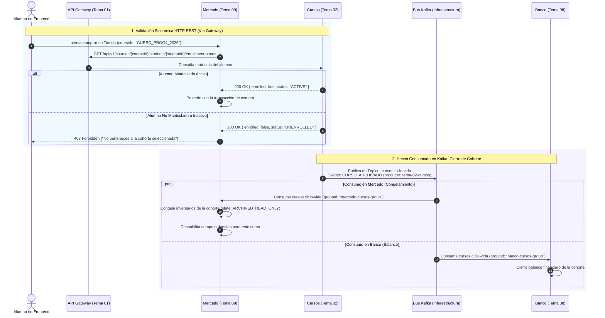

# Protocolo de Integración — Mercado (Tema 09) & Cursos y Matrícula (Tema 02)
## Consulta Sincrónica de Matrícula y Suscripción Asíncrona a `cursos.ciclo-vida` (Kafka)

---

## 1. Resumen Ejecutivo del Flujo y Doctrina Kafka

El módulo de **Cursos (Tema 02)** representa la autoridad máxima sobre la estructura académica universitaria (materias, comisiones/cohortes, docentes designados y matrícula de estudiantes).

En la arquitectura de microservicios:
1. **Consulta Sincrónica Previa (Vía API Gateway):** Cuando un alumno intenta comprar o equipar un ítem, Mercado debe comprobar de forma inmediata y bloqueante que el estudiante esté formalmente matriculado y activo en esa cohorte (`GET /enrollment-status`).
2. **Hechos Consumados Asíncronos (Vía Bus Kafka):** Cuando ocurre un hito administrativo (cierre de cuatrimestre o baja de un alumno), Cursos emite un hecho consumado en su tópico `cursos.ciclo-vida`.
3. **Múltiples Suscriptores en Paralelo:** Mercado (`groupId = "mercado-cursos-group"`), Banco (`groupId = "banco-cursos-group"`) y Notificaciones (`groupId = "notificaciones-group"`) consumen el evento en paralelo sin acoplamiento.
4. **Ubicación del Inventario:** El inventario vive **exclusivamente en Mercado (Tema 09)** particionado por la clave compuesta `(student_id, course_id)`. Cursos no gestiona ítems.

---

## 2. Diagrama de Secuencia Sincrónico y Asincrónico



---

## 3. Especificación Técnica de Contratos

### 3.1 Verificación Sincrónica de Matrícula (Mercado → Cursos vía Gateway)

* **Endpoint en Cursos:** `GET /api/v1/courses/{courseId}/students/{studentId}/enrollment-status`
* **Headers:** `X-Caller-Service: tema-09-mercado`

#### Respuesta de Cursos:
* **Código:** `200 OK`
* **Payload JSON:**
  ```json
  {
    "courseId": "CURSO_PROG4_2026",
    "studentId": "usr-4821",
    "enrolled": true,
    "status": "ACTIVE",
    "enrolledAt": "2026-03-01T10:00:00Z"
  }
  ```

---

### 3.2 Hechos Consumados en Kafka (`cursos.ciclo-vida`)

Cursos emite hechos consumados con la **envoltura estándar obligatoria**:

#### A. Evento `CURSO_ARCHIVADO` (Fin de Cuatrimestre)
* **Tópico Kafka:** `cursos.ciclo-vida`
* **Clave de Partición (`partitionKey`):** `CURSO_PROG4_2026`
* **Contrato Estándar JSON:**
  ```json
  {
    "eventId": "9b1deb4d-3b7d-4bad-9bdd-2b0d7b3dcb6d",
    "eventType": "CURSO_ARCHIVADO",
    "timestamp": "2026-07-15T23:59:59Z",
    "producer": "tema-02-cursos",
    "payload": {
      "courseId": "CURSO_PROG4_2026",
      "academicYear": 2026,
      "period": "1C",
      "closedByTeacherId": "prof-1002",
      "reason": "SEMESTER_FINALIZED"
    }
  }
  ```

#### Acciones ejecutadas en Mercado:
1. Pasa todos los registros de `student_inventory` de ese `courseId` a estado inmutable `ARCHIVED_READ_ONLY`.
2. Bloquea la creación de nuevas órdenes de compra en la tienda para ese curso.

---

#### B. Evento `ALUMNO_DESMATRICULADO` (Baja de Estudiante)
* **Tópico Kafka:** `cursos.ciclo-vida`
* **Clave de Partición (`partitionKey`):** `usr-4821`
* **Contrato Estándar JSON:**
  ```json
  {
    "eventId": "5f4dcc3b-5aa7-4ecd-85a2-97b7b120f269",
    "eventType": "ALUMNO_DESMATRICULADO",
    "timestamp": "2026-04-10T14:30:00Z",
    "producer": "tema-02-cursos",
    "payload": {
      "courseId": "CURSO_PROG4_2026",
      "studentId": "usr-4821",
      "reason": "STUDENT_DROPOUT"
    }
  }
  ```

#### Acciones ejecutadas en Mercado:
1. Congela los ítems de ese estudiante para esa cohorte en `ARCHIVED_READ_ONLY` para auditoría histórica.
2. Si tenía ítems equipados en slots activos, los desequipa automáticamente para que no sean consumidos por Desafíos.

---

## 4. Inspección Interactiva de Cada Paso del Flujo (Drill-Down)

A continuación se detalla qué realiza exactamente cada paso de la interacción entre **Mercado (Tema 09)** y **Cursos / Cohortes (Tema 02)**. Haz clic sobre cualquier paso para desplegar su especificación completa:

<details>
<summary><b>Paso 1: Aislamiento Estricto de Inventario y Catálogo por Cohorte</b></summary>

#### ¿Qué se hace en este paso?
* **Emisor:** Mercado & Inventario (Tema 09).
* **Receptor:** Base de Datos PostgreSQL de Mercado.
* **Protocolo:** Persistencia Local Particionada.
* **Lógica de Dominio:**
  1. El inventario **no es global** a nivel alumno. Cada registro de inventario, slot equipado y orden de compra pertenece estrictamente a la tupla `(student_id, course_id)`.
  2. Un escudo o poción adquirida en *"Programación 4 (2K04)"* no puede ser utilizado en *"Sistemas Operativos"*.
  3. Los docentes configuran ofertas y cupos de subastas específicos para su respectiva comisión.
* **Definición de Esquema en PostgreSQL (Mercado):**
  ```sql
  CREATE TABLE student_inventory (
      inventory_item_id VARCHAR(64) PRIMARY KEY,
      student_id VARCHAR(64) NOT NULL,
      course_id VARCHAR(64) NOT NULL,
      item_code VARCHAR(32) NOT NULL,
      state VARCHAR(16) NOT NULL, -- AVAILABLE, EQUIPPED, CONSUMED, ARCHIVED
      charges INT DEFAULT 1,
      CONSTRAINT uq_student_course_slot UNIQUE (student_id, course_id, inventory_item_id)
  );
  ```
* **Manejo de Errores:** Toda petición hacia Mercado que carezca de `courseId` es rechazada inmediatamente con `400 Bad Request { "error": "COURSE_ID_REQUIRED" }`.
</details>

<details>
<summary><b>Paso 2: Validación Sincrónica de Matriculación & Estado (Mercado → Cursos)</b></summary>

#### ¿Qué se hace en este paso?
* **Emisor:** Mercado & Inventario (Tema 09).
* **Receptor:** Microservicio Cursos (Tema 02) vía API Gateway (Tema 01).
* **Protocolo:** HTTP REST Sincrónico (`GET /api/v1/courses/{courseId}/students/{studentId}/enrollment-status`).
* **Lógica:**
  1. Al recibir una orden de compra o equipamiento, Mercado comprueba en tiempo real si el estudiante pertenece formalmente a la cohorte.
  2. Verifica que el estado de la matrícula sea `ACTIVE` y que el curso no se encuentre suspendido o archivado.
  3. Si la verificación es satisfactoria, Mercado procede con la lógica transaccional.
* **Contrato de Respuesta de Cursos:**
  ```json
  {
    "courseId": "CURSO_PROG4_2026",
    "studentId": "usr-4821",
    "enrolled": true,
    "courseStatus": "ACTIVE",
    "role": "STUDENT"
  }
  ```
* **Manejo de Errores:** Si Cursos responde que el alumno no está matriculado o está dado de baja, Mercado bloquea la operación retornando `403 Forbidden { "error": "NOT_ENROLLED_IN_COURSE" }`.
</details>

<details>
<summary><b>Paso 3: Emisión de Hecho Consumado: CURSO_ARCHIVADO en Kafka (Cursos → Bus)</b></summary>

#### ¿Qué se hace en este paso?
* **Emisor:** Microservicio Cursos (Tema 02).
* **Canal:** Apache Kafka, tópico `cursos.ciclo-vida`.
* **Clave de Partición (`partitionKey`):** `CURSO_PROG4_2026`.
* **Protocolo:** Asincrónico de Hecho Consumado.
* **Lógica:**
  1. Al cerrarse el cuatrimestre y firmarse las actas de examen, el docente o administrador archiva el curso en el panel de Cursos.
  2. Cursos no llama individualmente a los otros módulos; publica el hecho consumado en su tópico de dominio.
* **Contrato Estándar JSON:**
  ```json
  {
    "eventId": "b8a91c34-7123-4567-89ab-cdef01234567",
    "eventType": "CURSO_ARCHIVADO",
    "timestamp": "2026-07-15T23:59:59Z",
    "producer": "tema-02-cursos",
    "payload": {
      "courseId": "CURSO_PROG4_2026",
      "cohortCode": "2K04",
      "academicPeriod": "2026-1C",
      "closedByTeacherId": "prof-1002",
      "reason": "SEMESTER_COMPLETED",
      "archivedAt": "2026-07-15T23:59:59Z"
    }
  }
  ```
</details>

<details>
<summary><b>Paso 4: Congelamiento de Inventarios & Cierre de Mercado (Kafka → Mercado)</b></summary>

#### ¿Qué se hace en este paso?
* **Emisor:** Bus Central Kafka (`cursos.ciclo-vida`).
* **Receptor:** Mercado & Inventario (Tema 09, `groupId = "mercado-cursos-group"`).
* **Protocolo:** Consumidor Asincrónico de Ciclo de Vida.
* **Lógica:**
  1. Mercado recibe el evento `CURSO_ARCHIVADO`.
  2. Transiciona todos los ítems de ese `courseId` a estado inmutable `ARCHIVED_READ_ONLY`.
  3. Cierra la tienda para ese curso (impide nuevas compras directas o subastas).
  4. Los alumnos pueden continuar viendo su historial de consumos y medallas ganadas, pero no pueden gastar ni equipar ítems en una cursada cerrada.
* **Base de Datos (Mercado):**
  ```sql
  UPDATE student_inventory 
  SET state = 'ARCHIVED', updated_at = NOW() 
  WHERE course_id = 'CURSO_PROG4_2026' AND state = 'AVAILABLE';

  UPDATE market_courses_state 
  SET is_active = false, archived_at = NOW() 
  WHERE course_id = 'CURSO_PROG4_2026';
  ```
* **Idempotencia:** Si el evento se reentrega por rebalanceo de Kafka, Mercado verifica que el curso ya está archivado y descarta la operación repetida sin efectos colaterales.
</details>

