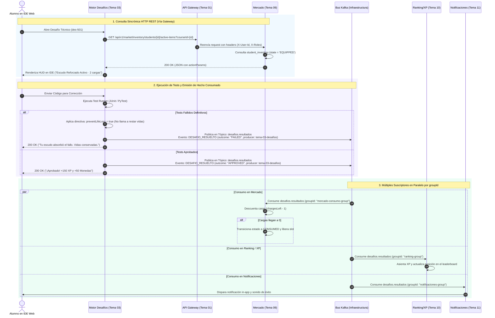

# Protocolo de Integración — Mercado (Tema 09) & Motor de Desafíos (Tema 03)
## Consulta Sincrónica de Equipamiento y Suscripción Asíncrona a `desafios.resultados` (Kafka)

---

## 1. Resumen Ejecutivo del Flujo y Doctrina Kafka

La interacción entre **Mercado (Tema 09)** y **Desafíos (Tema 03)** ilustra con precisión la separación entre lo sincrónico y lo asincrónico:

1. **Fase 1: Consulta Sincrónica Previa (Vía API Gateway):**  
   Al abrir un ejercicio de código en el IDE web, el servicio de Desafíos consulta de inmediato a Mercado para obtener la directiva ejecutable de los ítems equipados por el alumno en esa cohorte. Como el IDE necesita bloquear la UI y dibujar el HUD ("Escudo Activo: 2 cargas") antes de que el alumno empiece a escribir código, **esta comunicación es sincrónica vía HTTP REST**.
2. **Fase 2: Hecho Consumado Asíncrono (Vía Bus Kafka):**  
   Cuando el evaluador de tests finaliza la corrección, Desafíos no llama individualmente a cada servicio. Simplemente **emite un hecho consumado** (`DESAFIO_RESUELTO` o `INTENTO_DESAFIO_EVALUADO`) en el tópico de su dominio: `desafios.resultados`.
3. **Múltiples Suscriptores en Paralelo (`groupId`):**  
   Al publicarse el evento en `desafios.resultados`, múltiples servicios consumen en paralelo sin acoplarse:
   - **Tema 09 (Mercado) [`groupId = "mercado-consumo-group"`]:** Lee si se consumió un escudo o buff y descuenta las cargas en `student_inventory`.
   - **Tema 10 (Ranking/XP) [`groupId = "ranking-group"`]:** Suma el XP y las monedas al historial del alumno.
   - **Tema 11 (Notificaciones) [`groupId = "notificaciones-group"`]:** Dispara la campanita y las alertas in-app.

---

## 2. Diagrama de Secuencia



---

## 3. Especificación Técnica de Contratos

### 3.1 Consulta Sincrónica de Equipamiento Activo (Desafíos → Mercado vía Gateway)

* **Método:** `GET /api/v1/market/inventory/students/{studentId}/active-items?courseId={courseId}`
* **Headers:**
  - `X-User-Id: usr-4821`
  - `X-Caller-Service: tema-03-desafios`

#### Payload Retornado por Mercado (Executable Directive Pattern)
```json
{
  "studentId": "usr-4821",
  "courseId": "CURSO_PROG4_2026",
  "snapshotTimestamp": "2026-09-09T16:15:00Z",
  "totalEquipped": 2,
  "activeItems": [
    {
      "inventoryItemId": "inv-item-8801",
      "itemCode": "SHIELD_T2",
      "name": "Escudo Reforzado",
      "family": "SHIELD",
      "tier": 2,
      "verb": "ABSORB_FAILURE",
      "chargesLeft": 2,
      "initialCharges": 2,
      "triggerCondition": "ON_FAILED_TEST_ATTEMPT",
      "actionParams": {
        "preventLifeLoss": true,
        "preventStreakLoss": false,
        "consumeChargesPerEvent": 1,
        "studentMessage": "Tu Escudo Reforzado absorbió el fallo técnico. No has perdido vidas."
      }
    },
    {
      "inventoryItemId": "inv-item-9942",
      "itemCode": "XP_BOOST_T1",
      "name": "Tónico de Concentración",
      "family": "XP",
      "tier": 1,
      "verb": "XP_MULTIPLIER",
      "chargesLeft": 1,
      "initialCharges": 1,
      "triggerCondition": "ON_APPROVED_ATTEMPT",
      "actionParams": {
        "multiplierFactor": 1.25,
        "appliesTo": "BASE_XP",
        "consumeChargesPerEvent": 0,
        "expiresAt": "2026-09-09T17:15:00Z",
        "studentMessage": "Bono de concentración activo: +25% de XP adicional otorgado."
      }
    }
  ]
}
```

---

### 3.2 Hecho Consumado en Kafka: `DESAFIO_RESUELTO` (Desafíos → Bus Kafka)

Al terminar la evaluación, Desafíos publica el evento en la **envoltura estándar obligatoria**:

* **Tópico Kafka:** `desafios.resultados`
* **Clave de Partición (`partitionKey`):** `usr-4821`
* **Contrato Estándar JSON:**
  ```json
  {
    "eventId": "3fa85f64-5717-4562-b3fc-2c963f66afa6",
    "eventType": "DESAFIO_RESUELTO",
    "timestamp": "2026-09-09T16:16:30Z",
    "producer": "tema-03-desafios",
    "payload": {
      "attemptId": "att-772910",
      "studentId": "usr-4821",
      "courseId": "CURSO_PROG4_2026",
      "challengeId": "des-501",
      "outcome": "FAILED",
      "score": 45,
      "baseXp": 0,
      "baseCoins": 0,
      "consumedItems": [
        {
          "inventoryItemId": "inv-item-8801",
          "itemCode": "SHIELD_T2",
          "verb": "ABSORB_FAILURE",
          "chargesDeducted": 1,
          "effectApplied": "LIFE_LOSS_PREVENTED"
        }
      ]
    }
  }
  ```

---

### 3.3 Procesamiento en Mercado (Consumidor con `groupId = "mercado-consumo-group"`)

1. **Idempotencia:** Mercado almacena los `attemptId` procesados en tabla para evitar descontar cargas dobles ante reintentos de Kafka.
2. **Deducción de Cargas:**
   ```sql
   UPDATE student_inventory 
   SET charges_left = charges_left - 1, 
       updated_at = NOW() 
   WHERE inventory_item_id = 'inv-item-8801';
   ```
3. **Agotamiento del Ítem:**
   Si `charges_left = 0`, el ítem transiciona automáticamente:
   ```sql
   UPDATE student_inventory 
   SET state = 'CONSUMED', 
       updated_at = NOW() 
   WHERE inventory_item_id = 'inv-item-8801';
   ```
4. **Emisión de Auditoría:** Mercado publica el hecho en su propio tópico `mercado.inventario`:
   ```json
   {
     "eventId": "7c9e6679-7425-40de-944b-e07fc1f90ae7",
     "eventType": "ITEM_CONSUMIDO",
     "timestamp": "2026-09-09T16:16:31Z",
     "producer": "tema-09-mercado",
     "payload": {
       "inventoryItemId": "inv-item-8801",
       "studentId": "usr-4821",
       "courseId": "CURSO_PROG4_2026",
       "itemCode": "SHIELD_T2",
       "chargesRemaining": 1,
       "newState": "EQUIPPED"
     }
   }
   ```

---

## 4. Matriz Canónica de los 16 Consumibles y su Efecto en Desafíos

| Código | Nombre | Familia | Tier | Precio | Verbo Backend | Cargas / Duración | Efecto en Runner de Desafíos |
| :--- | :--- | :--- | :--- | :--- | :--- | :--- | :--- |
| `SHIELD_T1` | Escudo de Aprendiz | SHIELD | T1 | 200 mon | `ABSORB_FAILURE` | 1 carga | Absorbe 1 fallo de test; previene descuento de vida |
| `SHIELD_T2` | Escudo Reforzado | SHIELD | T2 | 500 mon | `ABSORB_FAILURE` | 2 cargas | Absorbe hasta 2 fallos sucesivos de tests |
| `SHIELD_T3` | Escudo Baluarte TDD | SHIELD | T3 | 1.000 mon | `ABSORB_FAILURE` | 3 cargas | Soporta 3 iteraciones en rojo en ejercicios TDD |
| `SHIELD_T4` | Baluarte Titánico | SHIELD | T4 | 2.000 mon | `ABSORB_FAILURE` | 5 cargas | 5 fallos absorbidos en entregas integradoras |
| `SHIELD_T5` | Égida Imperial | SHIELD | T5 | 4.000 mon | `ABSORB_FAILURE` | 8 cargas | Blindaje para 8 fallos en exámenes parciales |
| `XP_BOOST_T1` | Tónico de Concentración | XP | T1 | 200 mon | `XP_MULTIPLIER` | 60 min | +25% de XP al aprobar entregas durante 1h |
| `XP_BOOST_T2` | Elixir de Sabiduría | XP | T2 | 500 mon | `XP_MULTIPLIER` | 120 min | +50% de XP al aprobar entregas durante 2h |
| `XP_BOOST_T3` | Elixir Hiperexperiencia | XP | T3 | 1.000 mon | `XP_MULTIPLIER` | 240 min | Doble XP (x2.0) durante 4 horas |
| `XP_BOOST_T4` | Tomo del Doble Titán | XP | T4 | 2.000 mon | `XP_MULTIPLIER` | 480 min | Multiplica XP por x2.5 durante 8 horas |
| `XP_BOOST_T5` | Corona de Omnisciencia | XP | T5 | 4.000 mon | `XP_MULTIPLIER` | 1440 min | Triplica el XP (x3.0) durante 24 horas |
| `COIN_BOOST_T1`| Amuleto de Cobre | COIN | T1 | 200 mon | `COIN_MULTIPLIER`| 3 entregas | +25% de Monedas en las próximas 3 aprobaciones |
| `COIN_BOOST_T2`| Imán de Monedas | COIN | T2 | 500 mon | `COIN_MULTIPLIER`| 5 entregas | +50% de Monedas en las próximas 5 aprobaciones |
| `COIN_BOOST_T3`| Bolsa de Rendimiento | COIN | T3 | 1.000 mon | `COIN_MULTIPLIER`| 8 entregas | Doble de Monedas (x2.0) en 8 aprobaciones |
| `COIN_BOOST_T4`| Pacto Cashback Bancario| COIN | T4 | 2.000 mon | `COIN_MULTIPLIER`| 12 entregas | Multiplica Monedas por x2.5 en 12 entregas |
| `COIN_BOOST_T5`| Cofre Fiduciario Cohorte| COIN | T5 | 4.000 mon | `COIN_MULTIPLIER`| 20 entregas | Triplica Monedas (x3.0) en 20 aprobaciones |
| `LIFE_POTION` | Poción de Vida Extra | LIFE | T2 | 300 mon | `GRANT_LIFE` | Instantáneo | Acreditación inmediata. No entra al runner. |

---

## 5. Inspección Interactiva de Cada Paso del Flujo (Drill-Down)

A continuación se detalla qué realiza exactamente cada paso de la interacción entre **Mercado (Tema 09)** y **Motor de Desafíos (Tema 03)** / **Runner (Tema 05)**. Haz clic sobre cualquier paso para desplegar su especificación completa:

<details>
<summary><b>Paso 1: Solicitud Sincrónica de Snapshot de Ítems Activos (Desafíos → Gateway → Mercado)</b></summary>

#### ¿Qué se hace en este paso?
* **Emisor:** Motor de Desafíos (Tema 03).
* **Receptor:** Mercado & Inventario (Tema 09) vía API Gateway (Tema 01).
* **Protocolo:** HTTP REST Sincrónico (`GET /api/v1/market/inventory/students/{studentId}/active-items?courseId={courseId}`).
* **Justificación de Sincronismo:** El frontend del editor IDE web necesita pintar inmediatamente el Heads-Up Display (HUD) con los buffos y escudos activos (ej: *"Escudo Activo: 2 cargas"*, *"Multiplicador XP x1.25"*) antes de que el alumno ejecute el primer test.
* **Lógica en Mercado:**
  1. Extrae cabeceras de servicio `X-Caller-Service: tema-03-desafios` e identidad.
  2. Consulta la tabla `student_inventory` filtrando por `student_id`, `course_id` y estado `EQUIPPED`.
  3. Mapea cada ítem equipado a su directiva de acción ejecutable (`actionParams`).
* **Base de Datos (Mercado):**
  ```sql
  SELECT inventory_item_id, item_code, charges, state 
  FROM student_inventory 
  WHERE student_id = 'usr-4821' 
    AND course_id = 'CURSO_PROG4_2026' 
    AND state = 'EQUIPPED';
  ```
* **Manejo de Errores / Timeout:** Si Mercado no responde en 800ms, Desafíos asume por fallback que no hay ítems equipados y permite continuar el intento sin bloquear al alumno.
</details>

<details>
<summary><b>Paso 2: Respuesta con Directivas de Acción (actionParams) y Verbos (Mercado → Desafíos)</b></summary>

#### ¿Qué se hace en este paso?
* **Emisor:** Mercado & Inventario (Tema 09).
* **Receptor:** Motor de Desafíos (Tema 03).
* **Protocolo:** HTTP 200 OK (JSON con Directiva Ejecutable).
* **Lógica de Verbos Semánticos:**
  - `ABSORB_FAILURE`: Escudos de código que previenen la pérdida de vidas ante fallos de tests (`preventLifeLoss: true`).
  - `XP_MULTIPLIER`: Bonificadores porcentuales aplicados al XP base al aprobar (`multiplierFactor: 1.25`).
  - `COIN_MULTIPLIER`: Bonificadores porcentuales aplicados a las monedas recompensadas.
* **Contrato JSON Retornado:**
  ```json
  {
    "studentId": "usr-4821",
    "courseId": "CURSO_PROG4_2026",
    "snapshotTimestamp": "2026-09-09T16:15:00Z",
    "totalEquipped": 2,
    "activeItems": [
      {
        "inventoryItemId": "inv-item-8801",
        "itemCode": "SHIELD_T2",
        "name": "Escudo Reforzado",
        "family": "SHIELD",
        "tier": 2,
        "verb": "ABSORB_FAILURE",
        "chargesLeft": 2,
        "triggerCondition": "ON_FAILED_TEST_ATTEMPT",
        "actionParams": {
          "preventLifeLoss": true,
          "consumeChargesPerEvent": 1,
          "studentMessage": "Tu Escudo Reforzado absorbió el fallo técnico. No has perdido vidas."
        }
      }
    ]
  }
  ```
* **Comportamiento si no hay ítems:** Si el alumno no tiene ítems equipados, retorna HTTP 200 OK con `totalEquipped: 0` y `activeItems: []`.
</details>

<details>
<summary><b>Paso 3: Ejecución de Pruebas Unitarias en Sandbox por Runner (Desafíos ↔ Runner)</b></summary>

#### ¿Qué se hace en este paso?
* **Emisor:** Motor de Desafíos (Tema 03).
* **Receptor:** Runner Sandbox de Ejecución (Tema 05).
* **Protocolo:** Llamada de Orquestación Docker Sandbox Aislada.
* **Lógica:**
  1. El estudiante pulsa "Ejecutar Tests" en el navegador.
  2. El Runner compila y ejecuta el código en un contenedor Docker efímero bajo estrictas restricciones de CPU y memoria.
  3. Ejecuta la suite de unit tests (JUnit / PyTest).
  4. Retorna el resultado bruto: tests totales, superados, fallidos y tiempos de ejecución.
* **Reporte de Ejecución Retornado:**
  ```json
  {
    "attemptId": "att-49219",
    "studentId": "usr-4821",
    "runnerStatus": "COMPLETED",
    "testsTotal": 5,
    "testsPassed": 4,
    "exitCode": 1,
    "executionTimeMs": 340
  }
  ```
</details>

<details>
<summary><b>Paso 4: Emisión de Hecho Consumado: DESAFIO_RESUELTO en Kafka (Desafíos → Bus)</b></summary>

#### ¿Qué se hace en este paso?
* **Emisor:** Motor de Desafíos (Tema 03).
* **Canal:** Apache Kafka, tópico `desafios.resultados`.
* **Clave de Partición (`partitionKey`):** `usr-4821`.
* **Protocolo:** Asincrónico de Hecho Consumado.
* **Lógica en Desafíos:**
  1. Detecta que 1 de 5 tests falló, resultando en `outcome: "FAILED"`.
  2. Consulta la directiva recibida en el Paso 2 (`preventLifeLoss: true`).
  3. Marca `shieldProtected: true` en el evento e informa qué ítem mitigó la pérdida de vidas.
  4. Publica el evento en la envoltura estándar de 5 campos.
* **Contrato Estándar JSON:**
  ```json
  {
    "eventId": "3fa85f64-5717-4562-b3fc-2c963f66afa6",
    "eventType": "DESAFIO_RESUELTO",
    "timestamp": "2026-09-09T16:16:30Z",
    "producer": "tema-03-desafios",
    "payload": {
      "attemptId": "att-49219",
      "studentId": "usr-4821",
      "courseId": "CURSO_PROG4_2026",
      "challengeId": "ch-async-await-01",
      "outcome": "FAILED",
      "testsPassed": 4,
      "testsTotal": 5,
      "shieldProtected": true,
      "consumedItems": [
        {
          "inventoryItemId": "inv-item-8801",
          "itemCode": "SHIELD_T2",
          "verb": "ABSORB_FAILURE",
          "chargesDeducted": 1,
          "effectApplied": "LIFE_LOSS_PREVENTED"
        }
      ]
    }
  }
  ```
</details>

<details>
<summary><b>Paso 5: Consumo Paralelo: Descuento de Cargas & Ranking (Kafka → Mercado, Ranking, Notificaciones)</b></summary>

#### ¿Qué se hace en este paso?
* **Emisor:** Bus Central Kafka (`desafios.resultados`).
* **Receptores en Paralelo:**
  - **Mercado (Tema 09) [`groupId = "mercado-consumo-group"`]:**
    1. Verifica idempotencia con `attemptId: att-49219`.
    2. Resta 1 carga en `student_inventory` (de 2 a 1).
    3. Si `charges_left = 0`, transiciona a `CONSUMED` y desocupa el slot.
    4. Registra en `market_audit_log` la absorción del fallo y vidas preservadas.
  - **Ranking / XP (Tema 10) [`groupId = "ranking-group"`]:** Actualiza métricas de intentos sin restar puntos de vida.
  - **Notificaciones (Tema 11) [`groupId = "notificaciones-group"`]:** Despacha toast in-app: *"Tu Escudo Reforzado absorbió el fallo. Vidas intactas: 2/3"*.
* **Base de Datos (Mercado):**
  ```sql
  UPDATE student_inventory 
  SET charges = charges - 1, updated_at = NOW() 
  WHERE inventory_item_id = 'inv-item-8801';

  INSERT INTO market_audit_log (item_name, verb, context, result)
  VALUES ('Escudo Reforzado', 'ABSORB_FAILURE', 'Desafío att-49219', 'Absorbió fallo (Queda 1 carga)');
  ```
</details>

