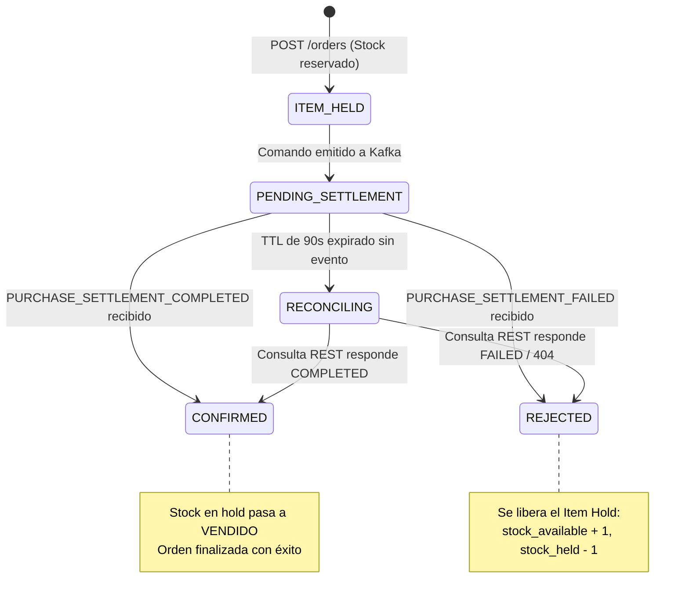
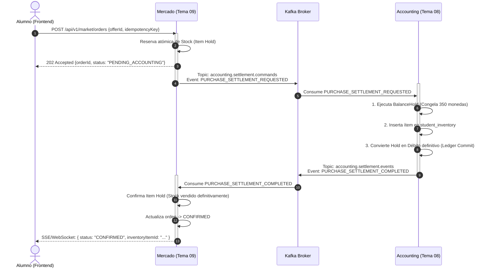
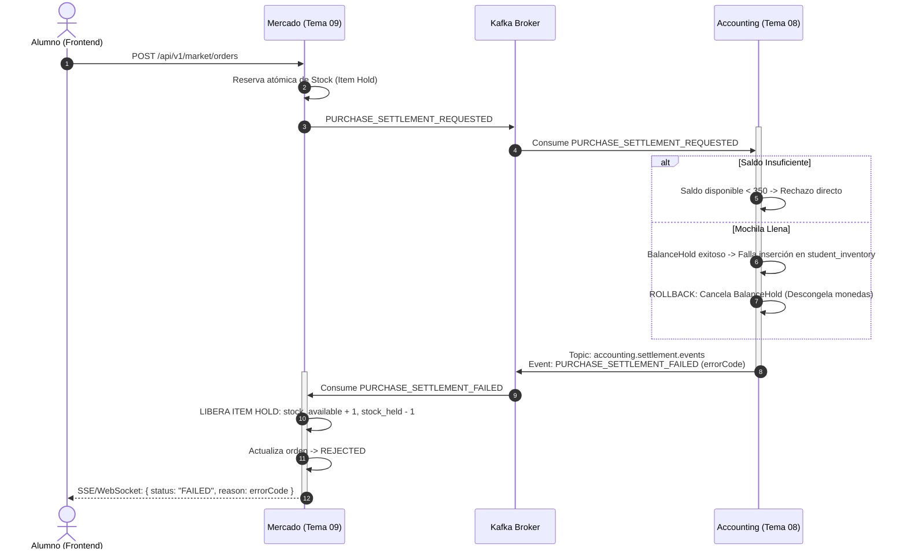
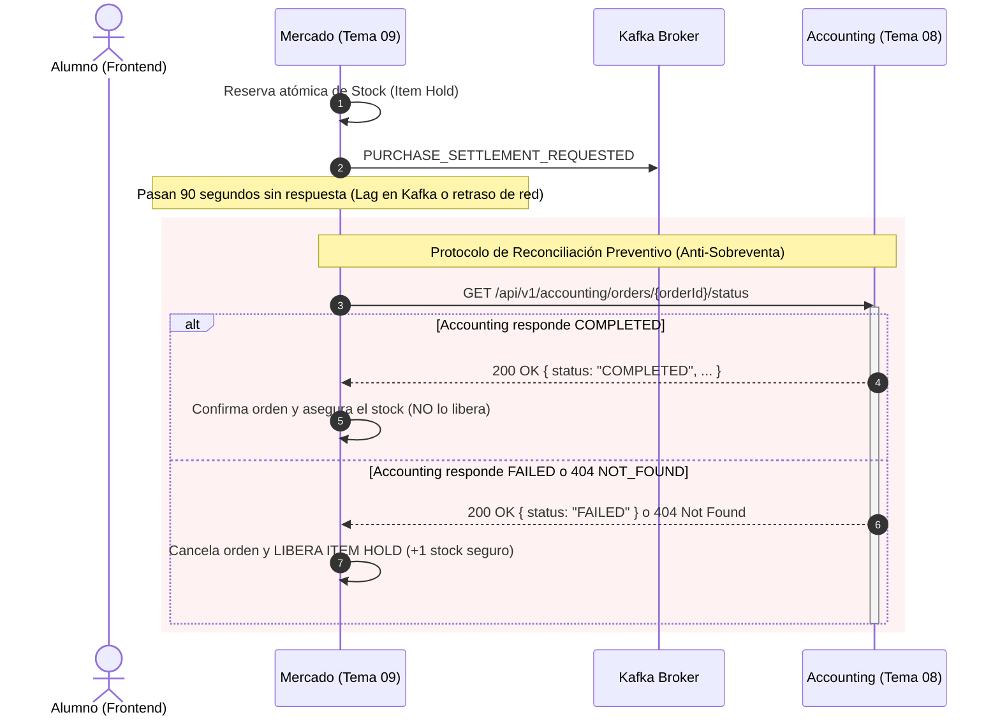

# Contrato de Integración y Protocolo Transaccional: Mercado (Tema 09) ↔ Accounting (Tema 08)
## Liquidación Asíncrona (Kafka), Retención de Saldo, Acreditación en Mochila, Item Hold y Reconciliación REST

> **Versión del Documento:** 2.0  
> **Fecha de Emisión:** 26/09/2026  
> **Estado:** Aprobado para Especificación e Implementación Técnica  
> **Microservicios involucrados:**
> 1. **Mercado (`market-backend` — Tema 09):** Vitrina de catálogo, gestor de stock y reserva temporal de unidades (`Item Hold`).
> 2. **Accounting (`accounting-backend` — Tema 08):** Procesador soberano financiero (Ledger / Balance Hold) y custodio de la mochila del estudiante (`student_inventory`).
> 3. **Bus de Mensajería (`kafka`):** Apache Kafka como canal asíncrono primario de comandos y eventos.
> 4. **API Gateway / Service Discovery (`api-gateway` / `eureka`):** Perímetro de seguridad y resolución de red interna.

---

## Índice
1. [Resumen Ejecutivo de Obligaciones de Accounting](#1-resumen-ejecutivo-de-obligaciones-de-accounting)
2. [El Mecanismo de "Item Hold" en Mercado](#2-el-mecanismo-de-item-hold-en-mercado)
3. [Topología de Red, Puertos y Enrutamiento](#3-topología-de-red-puertos-y-enrutamiento)
4. [Contrato de Eventos Asíncronos (Kafka)](#4-contrato-de-eventos-asíncronos-kafka)
   - 4.1 [Envoltorio Estándar (`EventEnvelope<T>`)](#41-envoltorio-estándar-eventenvelopet)
   - 4.2 [Comando: Solicitud de Liquidación (`PURCHASE_SETTLEMENT_REQUESTED`)](#42-comando-solicitud-de-liquidación-purchase_settlement_requested)
   - 4.3 [Evento: Liquidación Exitosa (`PURCHASE_SETTLEMENT_COMPLETED`)](#43-evento-liquidación-exitosa-purchase_settlement_completed)
   - 4.4 [Evento: Liquidación Fallida (`PURCHASE_SETTLEMENT_FAILED`)](#44-evento-liquidación-fallida-purchase_settlement_failed)
5. [Estrategia de Resiliencia, Reintentos y DLQ (Dead Letter Queue)](#5-estrategia-de-resiliencia-reintentos-y-dlq-dead-letter-queue)
   - 5.1 [Tópicos de Reintento y DLQ](#51-tópicos-de-reintento-y-dlq)
   - 5.2 [Comportamiento de Accounting ante Mensajes Venenosos](#52-comportamiento-de-accounting-ante-mensajes-venenosos)
   - 5.3 [Comportamiento de Mercado ante Errores de Consumo](#53-comportamiento-de-mercado-ante-errores-de-consumo)
6. [Endpoint Síncrono de Reconciliación REST](#6-endpoint-síncrono-de-reconciliación-rest)
   - 6.1 [Propósito y Cuándo Invocarlo](#61-propósito-y-cuándo-invocarlo)
   - 6.2 [Especificación de la API: `GET /orders/{orderId}/status`](#62-especificación-de-la-api-get-ordersorderidstatus)
7. [Diagramas de Secuencia](#7-diagramas-de-secuencia)
   - 7.1 [Camino Feliz (Happy Path Completo)](#71-camino-feliz-happy-path-completo)
   - 7.2 [Falla de Fondos o Mochila Llena (Rollback en Accounting)](#72-falla-de-fondos-o-mochila-llena-rollback-en-accounting)
   - 7.3 [Timeout de Red y Reconciliación mediante Endpoint REST](#73-timeout-de-red-y-reconciliación-mediante-endpoint-rest)

---

## 1. Resumen Ejecutivo de Obligaciones de Accounting

Accounting asume la responsabilidad unificada de **liquidación y entrega** de las compras directas. Al recibir el comando `PURCHASE_SETTLEMENT_REQUESTED` desde Kafka, Accounting debe ejecutar estrictamente las siguientes fases en su dominio:

```text
┌────────────────────────────────────────────────────────────────────────────────┐
│                        FLUJO INTERNO EN ACCOUNTING                             │
│                                                                                │
│  1. VALIDACIÓN E IDEMPOTENCIA                                                  │
│     Verifica si el orderId / idempotencyKey ya fue procesado.                  │
│     Si ya existe, reenvía la respuesta previa sin duplicar operaciones.        │
│                                                                                │
│  2. HOLD DE MONEDAS (BalanceHold)                                              │
│     Congela transaccionalmente el monto de monedas en la cuenta del alumno     │
│     asociada al curso-cohorte.                                                 │
│     • Si el saldo disponible es insuficiente: Aborta inmediatamente y emite    │
│       PURCHASE_SETTLEMENT_FAILED (errorCode: INSUFFICIENT_FUNDS).              │
│                                                                                │
│  3. INSTANCIACIÓN Y ENTREGA EN MOCHILA (student_inventory)                    │
│     Valida espacio en la mochila del estudiante y persiste el ítem con:        │
│     • itemTemplateId y tipo (SHIELD, BOOST_XP, STREAK_FREEZE, etc.)           │
│     • Parámetros de curaduría: cargas (charges), duración (TTL), etc.         │
│     • Si falla la inserción (mochila llena o error interno):                   │
│       -> Descongela las monedas retenidas en el paso 2 (Rollback del Hold)     │
│       -> Emite PURCHASE_SETTLEMENT_FAILED (errorCode: INVENTORY_BACKPACK_FULL).│
│                                                                                │
│  4. ASENTAMIENTO CONTABLE (Commit Definitivo)                                  │
│     Únicamente cuando el ítem ya fue persistido en la mochila:                 │
│     • Transforma el Hold de monedas en un Débito definitivo en el Ledger.      │
│                                                                                │
│  5. PUBLICACIÓN DE EVENTO                                                      │
│     Emite a Kafka el evento PURCHASE_SETTLEMENT_COMPLETED.                     │
└────────────────────────────────────────────────────────────────────────────────┘
```

> [!IMPORTANT]
> **Regla de Oro Transaccional de Accounting:**  
> Las monedas del alumno **nunca se debitan de forma definitiva** antes de que el ítem esté físicamente guardado en `student_inventory`. Si la entrega falla, el Hold de monedas debe cancelarse automáticamente sin dejar saldos retenidos.

---

## 2. El Mecanismo de "Item Hold" en Mercado

Para evitar condiciones de carrera donde dos o más alumnos intentan comprar la misma unidad de un ítem con cupo limitado (stock finito), Mercado implementa un bloqueo atómico a nivel de base de datos denominado **Item Hold**:

### 2.1. Bloqueo Atómico de Stock
Al recibir la solicitud de compra del frontend (`POST /api/v1/market/orders`), Mercado ejecuta una sentencia atómica con protección de concurrencia:

```sql
UPDATE market_offers
SET stock_available = stock_available - 1,
    stock_held = stock_held + 1
WHERE id = :offerId 
  AND status = 'ACTIVE' 
  AND stock_available >= 1;
```

* **Si `rows_updated == 1`:** Se reserva la unidad para este alumno, se crea la orden en estado `ITEM_HELD` y se envía el comando a Kafka.
* **Si `rows_updated == 0`:** El stock ya no está disponible. Se rechaza la solicitud de inmediato con HTTP `409 Conflict` (*"Unidad reservada por otro usuario o agotada"*). No se emite ningún mensaje a Kafka.

### 2.2. Máquina de Estados de la Orden en Mercado


---

## 3. Topología de Red, Puertos y Enrutamiento

En los entornos de despliegue (Docker Compose y Kubernetes):

* **Red común interna de plataforma:** `tpi-platform` (Docker bridge network).
* **Service Discovery:** Netflix Eureka (`http://eureka:8761/eureka/`).
* **Broker Kafka:** `kafka:9092` (interno) / `localhost:29092` (externo para tests).
* **Nombres de Servicio y Puertos Internos:**
  * **Mercado:** `market-backend:8084`
  * **Accounting:** `accounting-backend:8080` (o nombre registrado en Eureka `ACCOUNTING-SERVICE`).
* **Headers obligatorios de trazabilidad y seguridad:**
  * `X-Correlation-Id`: Identificador único de seguimiento de punta a punta (UUID).
  * `X-User-Id`: ID del alumno autenticado inyectado por el API Gateway.
  * `X-Roles`: Roles verificados del usuario (`ROLE_STUDENT`).

---

## 4. Contrato de Eventos Asíncronos (Kafka)

### 4.1. Envoltorio Estándar (`EventEnvelope<T>`)
Todos los mensajes producidos y consumidos deben respetar la estructura estándar definida en [`KAFKA_EVENT_STANDARD.md`](../KAFKA_EVENT_STANDARD.md):

```json
{
  "eventId": "UUID obligatorio",
  "eventType": "String en MAYUSCULAS_SNAKE_CASE",
  "eventVersion": 1,
  "timestamp": "ISO-8601 UTC (ej: 2026-09-26T18:30:00Z)",
  "producer": "Identificador del microservicio emisor",
  "payload": { }
}
```
* **Kafka Message Key (Obligatorio):** `studentId` (garantiza orden FIFO estricto por alumno).

---

### 4.2. Comando: Solicitud de Liquidación (`PURCHASE_SETTLEMENT_REQUESTED`)
* **Tópico:** `accounting.settlement.commands`
* **Emisor:** Mercado (`market-backend`)
* **Consumidor:** Accounting (`accounting-backend`)
* **Clave de partición:** `studentId`

#### Payload de Ejemplo:
```json
{
  "eventId": "e1a90c2b-871d-4e9b-b9f1-79b8a32d1001",
  "eventType": "PURCHASE_SETTLEMENT_REQUESTED",
  "eventVersion": 1,
  "timestamp": "2026-09-26T18:30:00Z",
  "producer": "market-backend",
  "payload": {
    "orderId": "ord-88391a-7b2c",
    "idempotencyKey": "idem-front-99120-uuid",
    "courseId": "COURSE_PROG4_2026",
    "studentId": "std-44012",
    "pricing": {
      "amount": 350,
      "currency": "COINS"
    },
    "item": {
      "itemTemplateId": "tmpl-shield-01",
      "name": "Escudo Protector",
      "itemType": "SHIELD",
      "description": "Protege racha ante un desafío fallido (excepto exámenes)",
      "configuration": {
        "charges": 2,
        "applicableChallenges": "NO_EXAMS"
      }
    }
  }
}
```

#### Descripción de Campos:
| Campo | Tipo | Requerido | Descripción |
| :--- | :--- | :---: | :--- |
| `orderId` | String (UUID) | Sí | Identificador único de la orden generada por Mercado. |
| `idempotencyKey` | String | Sí | Llave de idempotencia provista por el frontend/cliente. |
| `courseId` | String | Sí | Identificador del curso-cohorte donde se realiza la compra. |
| `studentId` | String | Sí | Identificador del alumno comprador. |
| `pricing.amount` | Integer | Sí | Cantidad exacta de monedas a retener y debitar. |
| `pricing.currency` | String | Sí | Moneda del curso (ej: `"COINS"`). |
| `item.itemTemplateId` | String | Sí | ID de la plantilla original del catálogo. |
| `item.name` | String | Sí | Nombre comercial del ítem. |
| `item.itemType` | String | Sí | Tipo de consumible (`SHIELD`, `BOOST_XP`, `STREAK_FREEZE`, `LIFE`). |
| `item.configuration` | Object | Sí | Parámetros técnicos específicos configurados por el profesor para la mochila (cargas, multiplicadores, vigencia TTL). |

---

### 4.3. Evento: Liquidación Exitosa (`PURCHASE_SETTLEMENT_COMPLETED`)
* **Tópico:** `accounting.settlement.events`
* **Emisor:** Accounting (`accounting-backend`)
* **Consumidor:** Mercado (`market-backend`)
* **Clave de partición:** `studentId`

#### Payload de Ejemplo:
```json
{
  "eventId": "f2b01d3c-982e-4f0c-c0a2-80c9b43e2002",
  "eventType": "PURCHASE_SETTLEMENT_COMPLETED",
  "eventVersion": 1,
  "timestamp": "2026-09-26T18:30:02Z",
  "producer": "accounting-backend",
  "payload": {
    "orderId": "ord-88391a-7b2c",
    "idempotencyKey": "idem-front-99120-uuid",
    "studentId": "std-44012",
    "courseId": "COURSE_PROG4_2026",
    "accountingTxId": "tx-acc-99201",
    "inventoryItemId": "inv-item-5544",
    "amountDebited": 350,
    "completedAt": "2026-09-26T18:30:02Z"
  }
}
```

#### Descripción de Campos:
| Campo | Tipo | Requerido | Descripción |
| :--- | :--- | :---: | :--- |
| `orderId` | String | Sí | Mismo ID de la orden provisto en la solicitud. |
| `idempotencyKey` | String | Sí | Llave de idempotencia original. |
| `accountingTxId` | String | Sí | Identificador único del movimiento contable en el Ledger de Accounting. |
| `inventoryItemId` | String | Sí | Identificador del ítem creado físicamente en la tabla `student_inventory`. |
| `amountDebited` | Integer | Sí | Monto final efectivamente debitado de la cuenta. |
| `completedAt` | String (ISO-8601) | Sí | Timestamp de consolidación de la operación. |

---

### 4.4. Evento: Liquidación Fallida (`PURCHASE_SETTLEMENT_FAILED`)
* **Tópico:** `accounting.settlement.events`
* **Emisor:** Accounting (`accounting-backend`)
* **Consumidor:** Mercado (`market-backend`)
* **Clave de partición:** `studentId`

#### Payload de Ejemplo:
```json
{
  "eventId": "a3c12e4d-093f-5a1d-d1b3-91da054f3003",
  "eventType": "PURCHASE_SETTLEMENT_FAILED",
  "eventVersion": 1,
  "timestamp": "2026-09-26T18:30:01Z",
  "producer": "accounting-backend",
  "payload": {
    "orderId": "ord-88391a-7b2c",
    "idempotencyKey": "idem-front-99120-uuid",
    "studentId": "std-44012",
    "courseId": "COURSE_PROG4_2026",
    "errorCode": "INSUFFICIENT_FUNDS",
    "errorMessage": "Saldo insuficiente en la cuenta del curso para efectuar el hold",
    "failedAt": "2026-09-26T18:30:01Z"
  }
}
```

#### Catálogo Oficial de Códigos de Error (`errorCode`):
| Código de Error | Causa Raíz | Acción en Mercado |
| :--- | :--- | :--- |
| `INSUFFICIENT_FUNDS` | El alumno no tiene suficientes monedas disponibles en el curso. | Libera el Hold del ítem (`+1` stock). Muestra al alumno: *"Saldo insuficiente"*. |
| `INVENTORY_BACKPACK_FULL` | La mochila del estudiante no dispone de ranuras/slots disponibles. | Libera el Hold del ítem (`+1` stock). Muestra: *"Mochila llena. Libera espacio o consume ítems"*. |
| `STUDENT_ACCOUNT_LOCKED` | La cuenta del estudiante se encuentra suspendida o desmatriculada. | Libera el Hold del ítem (`+1` stock). Muestra: *"Cuenta no habilitada para compras"*. |
| `INTERNAL_ERROR` | Falla imprevista en base de datos o lógica interna de Accounting. | Libera el Hold del ítem (`+1` stock). Muestra: *"Error al procesar la compra. Intente nuevamente"*. |

---

## 5. Estrategia de Resiliencia, Reintentos y DLQ (Dead Letter Queue)

Para asegurar que ningún mensaje bloquee las particiones de Kafka ni genere desfasajes financieros o de inventario, se implementa la arquitectura de **Retry + DLQ**:

### 5.1. Tópicos de Reintento y DLQ

```mermaid
flowchart TD
    subgraph ComandosMercado["Flujo de Comandos (Mercado -> Accounting)"]
        CmdMain["accounting.settlement.commands\n(Tópico Principal)"]
        CmdRetry["accounting.settlement.commands.retry\n(Reintentos con Backoff Exponencial)"]
        CmdDLQ["accounting.settlement.commands.dlq\n(Dead Letter Queue Accounting)"]

        CmdMain -->|Fallo Transitorio| CmdRetry
        CmdRetry -->|Supera 3 intentos| CmdDLQ
    end

    subgraph EventosAccounting["Flujo de Eventos (Accounting -> Mercado)"]
        EvtMain["accounting.settlement.events\n(Tópico Principal)"]
        EvtRetry["accounting.settlement.events.retry\n(Reintentos con Backoff Exponencial)"]
        EvtDLQ["accounting.settlement.events.dlq\n(Dead Letter Queue Mercado)"]

        EvtMain -->|Fallo Transitorio| EvtRetry
        EvtRetry -->|Supera 3 intentos| EvtDLQ
    end
```



### 5.2. Comportamiento de Accounting ante Mensajes Venenosos
1. **Errores no reintentables (Contrato roto o JSON inválido):**
   * Si un mensaje no puede deserializarse o carece de campos obligatorios (`studentId`, `orderId`, `pricing`), Accounting **no reintenta**: lo envía directamente a `accounting.settlement.commands.dlq`.
2. **Errores transitorios (Caída momentánea de base de datos):**
   * Se reintenta hasta **3 veces** con backoff exponencial ($1\text{ s}, 2\text{ s}, 4\text{ s}$).
   * Si tras el 3er intento la falla persiste, el mensaje viaja a la DLQ.
   * **Aviso de cortesía a Mercado:** Si se conoce el `orderId`, Accounting publica un evento `PURCHASE_SETTLEMENT_FAILED` con `errorCode: INTERNAL_ERROR` para que Mercado no retenga el ítem innecesariamente.

### 5.3. Comportamiento de Mercado ante Errores de Consumo
* Si Mercado recibe `PURCHASE_SETTLEMENT_COMPLETED` pero su base de datos sufre un error al actualizar la orden, reintenta hasta 3 veces en `accounting.settlement.events.retry`.
* Si persiste el fallo, el evento se preserva en `accounting.settlement.events.dlq` para que una alerta de soporte técnico impida la pérdida de la compra.

---

## 6. Endpoint Síncrono de Reconciliación REST

### 6.1. Propósito y Cuándo Invocarlo
Mercado mantiene un **TTL de 90 segundos** para la reserva del ítem. Si transcurren 90 segundos sin recibir el evento de respuesta desde Kafka (por saturación del broker, lag de red o retraso en consumidores):

> [!CAUTION]
> Mercado **no debe liberar el ítem a ciegas**. Si Accounting sí completó el cobro pero el evento de Kafka se retrasó unos segundos, liberar el ítem provocaría una **sobreventa de la misma unidad** a dos alumnos distintos.

Para evitar esta anomalía ("Split-Brain"), el timer de expiración de Mercado invoca el endpoint de reconciliación en Accounting antes de tomar una decisión sobre el stock.

### 6.2. Especificación de la API: `GET /orders/{orderId}/status`

* **Método:** `GET`
* **Ruta:** `/api/v1/accounting/orders/{orderId}/status`
* **Exposición:** Accounting (`accounting-backend:8080`)
* **Headers requeridos:**
  * `X-Correlation-Id`: UUID
  * `X-User-Id`: ID del sistema o del estudiante
  * `X-Roles`: `ROLE_SERVICE` o `ROLE_STUDENT`

#### Respuestas HTTP:

#### 1. Orden Procesada con Éxito (`200 OK`)
Indica que Accounting ya ejecutó el cobro y acreditó el ítem.
```json
{
  "orderId": "ord-88391a-7b2c",
  "status": "COMPLETED",
  "accountingTxId": "tx-acc-99201",
  "inventoryItemId": "inv-item-5544",
  "amountDebited": 350,
  "completedAt": "2026-09-26T18:30:02Z"
}
```
* **Acción de Mercado:** Confirma la orden localmente (`CONFIRMED`), asienta el ítem como vendido y notifica al alumno. **El ítem NO se libera.**

#### 2. Orden Fallida o Rechazada (`200 OK`)
Indica que Accounting rechazó la transacción.
```json
{
  "orderId": "ord-88391a-7b2c",
  "status": "FAILED",
  "errorCode": "INSUFFICIENT_FUNDS",
  "errorMessage": "Saldo insuficiente",
  "failedAt": "2026-09-26T18:30:01Z"
}
```
* **Acción de Mercado:** Cancela la orden localmente (`REJECTED`) y **libera el Item Hold (+1 al stock)**.

#### 3. Orden en Proceso (`200 OK`)
Indica que Accounting aún la tiene en cola o ejecutando.
```json
{
  "orderId": "ord-88391a-7b2c",
  "status": "PROCESSING",
  "message": "Operación en curso de liquidación"
}
```
* **Acción de Mercado:** Otorga una extensión de gracia de 30 segundos antes de reevaluar.

#### 4. Orden No Encontrada (`404 Not Found`)
Indica que Accounting nunca recibió ni procesó este `orderId`.
```json
{
  "orderId": "ord-88391a-7b2c",
  "status": "NOT_FOUND",
  "message": "No existe registro de transacción para esta orden"
}
```
* **Acción de Mercado:** Confirma que no hubo débito ni entrega. Cancela la orden y **libera el Item Hold (+1 al stock)** con total seguridad.

---

## 7. Diagramas de Secuencia

### 7.1. Camino Feliz (Happy Path Completo)



---

### 7.2. Falla de Fondos o Mochila Llena (Rollback en Accounting)



---

### 7.3. Timeout de Red y Reconciliación mediante Endpoint REST



---
*Fin de la Especificación de Contrato Técnico — AulaQuest 2026*
