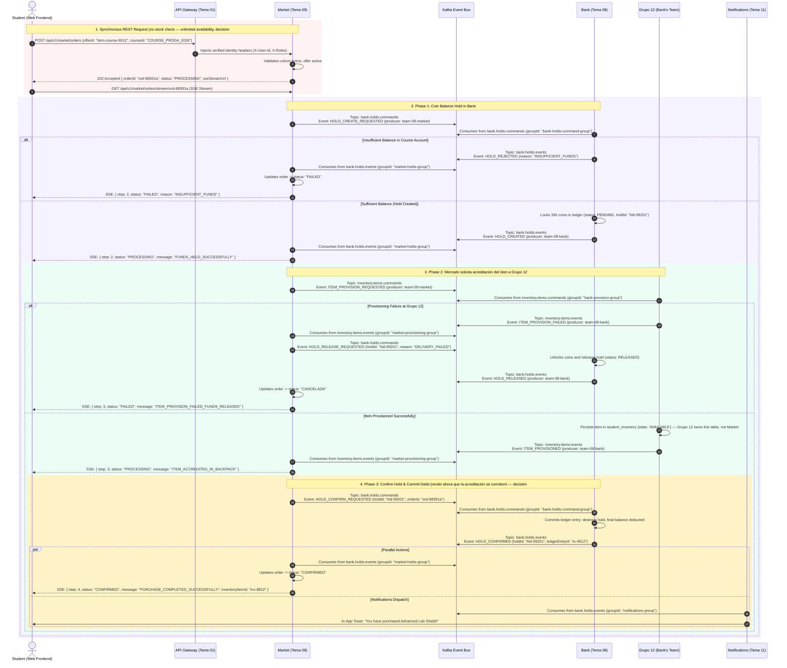

# Integration Protocol & Transactional Flow — Market (Tema 09) & Bank (Tema 08)
## Asynchronous Saga Choreography (Kafka) with Coin Holds, Item Provisioning (Grupo 12) & SSE Streaming

---

## 1. Architectural Doctrine: Reserve → Provision → Confirm Saga

Per the Aula Quest Product Requirements Document (PRD) and e-commerce resilience standards:
> **1) Coin Balance Hold in Bank $\rightarrow$ 2) Request item provisioning from Grupo 12 $\rightarrow$ 3) Commit final debit in Bank once provisioning is confirmed.**

1. **Market (Tema 09) as the Orchestrating Kiosk / Storefront:**
   - Exposes the Open Catalog configured by professors per cohort — offers always have unlimited availability while active (decision #6: no stock limit, ever).
   - Orchestrates the purchase saga: requests funds reservation from Bank, requests item provisioning from **Grupo 12**, and requests the final debit once item provisioning is confirmed.
2. **Bank (Tema 08) as the Ledger & Coin Hold Infrastructure:**
   - Manages student coin balances per cohort.
   - Creates temporary reservations (`BalanceHold`), freezing coins so they cannot be double-spent.
   - Waits for Market to notify that the asset was accredited by Grupo 12 before executing the final ledger deduction.
3. **Grupo 12 (Bank's own team) as owner of the student backpack:**
   - Since decision #13, item provisioning and the student's backpack (`student_inventory`) — its lifecycle, active slots, charges, and runtime effect evaluation — are Grupo 12's responsibility, not Market's. This is not a separate "Inventory microservice"; Grupo 12 is Bank's own Taiga team (Tema 08).
   - Receives the rich item metadata from Market only after Bank has confirmed the coin Hold.
4. **Standard 5-Field English Event Wrapper:**
   - Every Kafka event adheres to the official JSON schema:
     ```json
     {
       "eventId": "UUID",
       "eventType": "String",
       "timestamp": "ISO 8601 UTC",
       "producer": "String",
       "payload": { }
     }
     ```
   - Partition key: `studentId` (guarantees strict FIFO ordering per student).

---

## 2. Sequence Diagram: Dual Holds & Saga Choreography



---

## 3. Kafka Topics & Event Specifications (Strictly English)

### 3.1 Topic Directory

| Topic Name | Purpose | Producers | Consumers |
| :--- | :--- | :--- | :--- |
| `bank.holds.commands` | Commands to create, confirm, or release coin balance holds | `team-09-market` | `team-08-bank` |
| `bank.holds.events` | Factual events published by Bank regarding hold lifecycle | `team-08-bank` | `team-09-market`, `team-11-notifications` |
| `inventory.items.commands` | Commands sent to Grupo 12 to provision purchased items | `team-09-market` | `team-08-bank` (Grupo 12) |
| `inventory.items.events` | Factual events emitted by Grupo 12 upon item creation | `team-08-bank` (Grupo 12) | `team-09-market` |
| `market.orders.events` | Factual events on order lifecycle updates | `team-09-market` | `team-11-notifications` |

---

### 3.2 Step-by-Step Contract Specifications

#### Step 1: Initial Synchronous HTTP REST Order (Client $\rightarrow$ Market)
* **Endpoint:** `POST /api/v1/market/orders`
* **Headers:**
  - `Authorization: Bearer <JWT>`
  - `X-User-Id: usr-4821`
  - `X-Roles: ROLE_STUDENT`
  - `Content-Type: application/json`
* **Request Body:**
  ```json
  {
    "offerId": "item-course-9912",
    "courseId": "COURSE_PROG4_2026"
  }
  ```
* **Synchronous Response (202 Accepted):**
  ```json
  {
    "orderId": "ord-88391a",
    "status": "PROCESSING",
    "sseStreamUrl": "/api/v1/market/orders/stream/ord-88391a",
    "createdAt": "2026-09-16T22:40:00Z"
  }
  ```

---

#### Step 2: Request Coin Hold (`HOLD_CREATE_REQUESTED`)
Market validates the offer (no stock check — decision #6), then publishes command to Bank to lock student coins:

* **Topic:** `bank.holds.commands`
* **Partition Key:** `usr-4821`
* **Payload:**
  ```json
  {
    "eventId": "a10f92b4-7e18-4902-8c11-92b8d91c0001",
    "eventType": "HOLD_CREATE_REQUESTED",
    "timestamp": "2026-09-16T22:40:01Z",
    "producer": "team-09-market",
    "payload": {
      "orderId": "ord-88391a",
      "studentId": "usr-4821",
      "courseId": "COURSE_PROG4_2026",
      "amount": 350,
      "currency": "GOLD_COIN",
      "orderType": "DIRECT_PURCHASE"
    }
  }
  ```

---

#### Step 3: Bank Confirms Coin Hold (`HOLD_CREATED`)
Bank consumes command, verifies balance $\ge 350$, locks funds and replies:

* **Topic:** `bank.holds.events`
* **Partition Key:** `usr-4821`
* **Payload:**
  ```json
  {
    "eventId": "b21e83c5-8f29-4a13-9d22-03c9e02d1102",
    "eventType": "HOLD_CREATED",
    "timestamp": "2026-09-16T22:40:02Z",
    "producer": "team-08-bank",
    "payload": {
      "holdId": "hld-99201",
      "orderId": "ord-88391a",
      "studentId": "usr-4821",
      "courseId": "COURSE_PROG4_2026",
      "amount": 350,
      "currency": "GOLD_COIN",
      "status": "PENDING",
      "expiresAt": "2026-09-16T22:45:02Z"
    }
  }
  ```

---

#### Step 4: Provision Item via Grupo 12 (`ITEM_PROVISION_REQUESTED`)
Having secured student funds in Bank, Market requests **Grupo 12** to accredit the asset in the student's backpack:

* **Topic:** `inventory.items.commands`
* **Partition Key:** `usr-4821`
* **Payload:**
  ```json
  {
    "eventId": "c32f94d6-9a30-4b24-ae33-14daf13e2203",
    "eventType": "ITEM_PROVISION_REQUESTED",
    "timestamp": "2026-09-16T22:40:03Z",
    "producer": "team-09-market",
    "payload": {
      "orderId": "ord-88391a",
      "holdId": "hld-99201",
      "studentId": "usr-4821",
      "courseId": "COURSE_PROG4_2026",
      "itemPayload": {
        "catalogItemId": "item-course-9912",
        "templateId": "tpl-shield-base",
        "itemType": "SHIELD",
        "name": "Advanced Lab Shield",
        "icon": "shield-rune",
        "properties": {
          "chargesTotal": 2,
          "chargesRemaining": 2,
          "applicableChallenges": "PRACTICAL_ONLY"
        }
      }
    }
  }
  ```

---

#### Step 5: Grupo 12 Acknowledges Delivery (`ITEM_PROVISIONED`)
Grupo 12 persists the item into its own `student_inventory` in state `AVAILABLE` (decision #13 — this table is no longer Market's):

* **Topic:** `inventory.items.events`
* **Partition Key:** `usr-4821`
* **Payload:**
  ```json
  {
    "eventId": "d43a05e7-0b41-4c35-bf44-25eb024f3304",
    "eventType": "ITEM_PROVISIONED",
    "timestamp": "2026-09-16T22:40:04Z",
    "producer": "team-08-bank",
    "payload": {
      "orderId": "ord-88391a",
      "holdId": "hld-99201",
      "studentId": "usr-4821",
      "courseId": "COURSE_PROG4_2026",
      "inventoryItemId": "inv-8812",
      "itemType": "SHIELD",
      "state": "AVAILABLE"
    }
  }
  ```

---

#### Step 6: Market Requests Final Coin Hold Confirmation (`HOLD_CONFIRM_REQUESTED`)
Item is safely delivered to the student backpack. Market authorizes Bank to convert the temporary coin hold into an irrevocable ledger debit:

* **Topic:** `bank.holds.commands`
* **Partition Key:** `usr-4821`
* **Payload:**
  ```json
  {
    "eventId": "e54b16f8-1c52-4d46-c055-36fc135a4405",
    "eventType": "HOLD_CONFIRM_REQUESTED",
    "timestamp": "2026-09-16T22:40:05Z",
    "producer": "team-09-market",
    "payload": {
      "holdId": "hld-99201",
      "orderId": "ord-88391a",
      "studentId": "usr-4821",
      "courseId": "COURSE_PROG4_2026",
      "amount": 350
    }
  }
  ```

---

#### Step 7: Bank Finalizes Ledger Deduction (`HOLD_CONFIRMED`)
Bank commits the debit in the ledger, closes the coin hold as `COMMITTED`:

* **Topic:** `bank.holds.events`
* **Partition Key:** `usr-4821`
* **Payload:**
  ```json
  {
    "eventId": "f65c27a9-2d63-4e57-d166-47ad246b5506",
    "eventType": "HOLD_CONFIRMED",
    "timestamp": "2026-09-16T22:40:06Z",
    "producer": "team-08-bank",
    "payload": {
      "holdId": "hld-99201",
      "orderId": "ord-88391a",
      "studentId": "usr-4821",
      "amountDebited": 350,
      "ledgerEntryId": "tx-ledger-9021",
      "status": "COMMITTED"
    }
  }
  ```

#### Terminal Action in Market:
Market marks the `PurchaseOrder` as `CONFIRMED` and closes the SSE stream:
```json
{
  "step": 4,
  "status": "CONFIRMED",
  "orderId": "ord-88391a",
  "inventoryItemId": "inv-8812",
  "message": "PURCHASE_COMPLETED_SUCCESSFULLY"
}
```

---

### 3.3 Compensating Transactions: Release of the Coin Hold

If either Bank or Grupo 12 encounters a failure, the coin hold is released — there is no stock to restore (decision #6):

1. **Bank Rejects Coin Hold (`HOLD_REJECTED`):**
   - Order marked as `FAILED`. Nothing to release — the hold was never created.
2. **Item Provisioning Fails at Grupo 12 (`ITEM_PROVISION_FAILED`):**
   - Market publishes `HOLD_RELEASE_REQUESTED` to `bank.holds.commands` $\rightarrow$ Bank releases coin hold (`HOLD_RELEASED`).
   - Order marked as `COMPENSATED_FAILED`.
