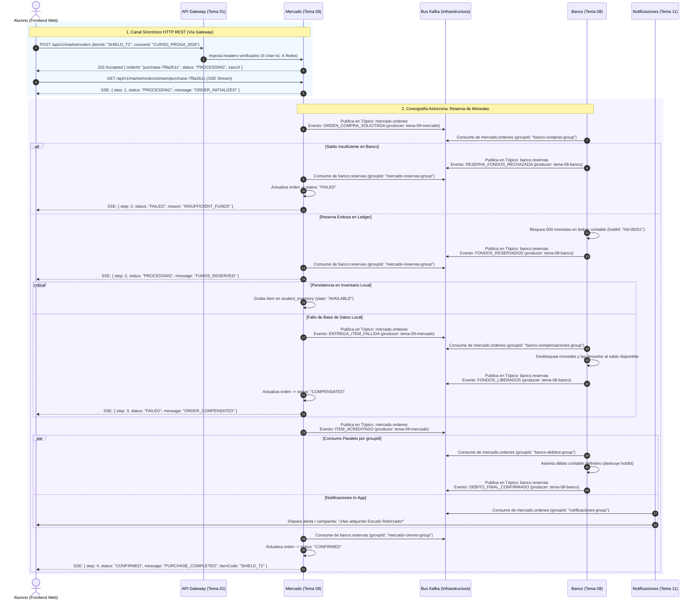

# Protocolo de Integración y Flujo Transaccional — Mercado (Tema 09) & Banco (Tema 08)
## Coreografía de Eventos Asíncrona (Kafka) con Envoltura Estándar y Streaming SSE

---

## 1. Doctrina de Comunicación: Eventos (Hechos Consumados) vs Comandos

En la plataforma distribuida de Aula Quest, **Apache Kafka opera como el Bus de Eventos central** (desplegado en contenedor Docker independiente) y se rige por las siguientes reglas arquitectónicas:

1. **Lo Sincrónico va por API Gateway (Tema 01):** Cuando un cliente o servicio necesita una respuesta inmediata o una validación bloqueante (ej: el navegador iniciando una orden o consultando si un alumno está matriculado), se realiza vía HTTP REST a través del API Gateway.
2. **Lo Asincrónico va por Apache Kafka (Bus de Eventos):** Se utiliza para comunicación desacoplada. Un microservicio **no envía comandos directos ni órdenes imperativas por Kafka** (Kafka no es un RPC message broker). En su lugar, el servicio emite un **hecho consumado que ya ocurrió en su dominio de negocio**, sin esperar respuesta bloqueante ni saber quién está escuchando.
3. **Múltiples Suscriptores en Paralelo (`groupId`):** Un emisor publica una sola vez a un tópico de dominio y múltiples microservicios consumen el mensaje de forma simultánea con sus respectivos `groupId` sin interferir entre sí.
4. **Contrato Estándar JSON Obligatorio:** Todo mensaje en Kafka debe encapsularse en la envoltura oficial (`eventId`, `eventType`, `timestamp`, `producer`, `payload`).

---

## 2. Diagrama de Secuencia: Coreografía de Hechos Consumados



---

## 3. Especificación de Contratos con la Envoltura Estándar Obligatoria

Todos los mensajes que circulan por Apache Kafka utilizan la estructura estándar de 5 campos:

```json
{
  "eventId": "UUID",
  "eventType": "String",
  "timestamp": "ISO 8601 UTC",
  "producer": "String",
  "payload": { }
}
```

---

### 3.1 Inicio de Orden: Canal Sincrónico HTTP REST (Cliente → Mercado vía Gateway)

#### Request Inicial
* **Endpoint:** `POST /api/v1/market/orders`
* **Headers:**
  - `Authorization: Bearer <JWT>`
  - `X-User-Id: usr-4821`
  - `X-Roles: ROLE_STUDENT`
  - `Content-Type: application/json`
* **Body:**
  ```json
  {
    "orderId": "purchase-7f9a2b1c",
    "itemCode": "SHIELD_T2",
    "courseId": "CURSO_PROG4_2026"
  }
  ```

#### Respuesta Inmediata de Mercado
* **Código:** `202 Accepted`
* **Body:**
  ```json
  {
    "orderId": "purchase-7f9a2b1c",
    "status": "PROCESSING",
    "streamUrl": "/api/v1/market/orders/stream/purchase-7f9a2b1c",
    "createdAt": "2026-09-09T16:00:00Z"
  }
  ```

---

### 3.2 Hecho Consumado 1: Orden de Compra Solicitada (Mercado → Kafka)

Mercado registra la orden en estado `PROCESSING` y publica el hecho en su propio tópico de dominio:

* **Tópico Kafka:** `mercado.ordenes`
* **Clave de Partición (`partitionKey`):** `usr-4821` (Garantiza orden por alumno)
* **Contrato Estándar JSON:**
  ```json
  {
    "eventId": "e81d4fae-7dec-11d0-a765-00a0c91e6bf6",
    "eventType": "ORDEN_COMPRA_SOLICITADA",
    "timestamp": "2026-09-09T16:00:01Z",
    "producer": "tema-09-mercado",
    "payload": {
      "orderId": "purchase-7f9a2b1c",
      "studentId": "usr-4821",
      "courseId": "CURSO_PROG4_2026",
      "itemCode": "SHIELD_T2",
      "amount": 500,
      "currency": "GOLD_COIN",
      "ttlMinutes": 5,
      "reason": "ITEM_PURCHASE_DIRECT"
    }
  }
  ```

---

### 3.3 Hecho Consumado 2: Fondos Reservados por Banco (Banco → Kafka)

Banco (con `groupId = "banco-compras-group"`) consume el evento. Verifica el saldo del alumno en la cuenta del curso. Congela 500 monedas de su `availableBalance` y emite su propio hecho consumado:

* **Tópico Kafka:** `banco.reservas`
* **Clave de Partición (`partitionKey`):** `usr-4821`
* **Contrato Estándar JSON (Camino Feliz):**
  ```json
  {
    "eventId": "f47ac10b-58cc-4372-a567-0e02b2c3d479",
    "eventType": "FONDOS_RESERVADOS",
    "timestamp": "2026-09-09T16:00:02Z",
    "producer": "tema-08-banco",
    "payload": {
      "holdId": "hld-99201",
      "orderId": "purchase-7f9a2b1c",
      "studentId": "usr-4821",
      "amount": 500,
      "currency": "GOLD_COIN",
      "status": "RESERVADO",
      "expiresAt": "2026-09-09T16:05:01Z"
    }
  }
  ```

#### Caso Alternativo: Saldo Insuficiente
Si el alumno no cuenta con las 500 monedas en esa cohorte, Banco emite:
* **Tópico Kafka:** `banco.reservas`
* **Contrato Estándar JSON:**
  ```json
  {
    "eventId": "c9a646d3-9c61-4cb7-9e32-2b6201f681a5",
    "eventType": "RESERVA_FONDOS_RECHAZADA",
    "timestamp": "2026-09-09T16:00:02Z",
    "producer": "tema-08-banco",
    "payload": {
      "orderId": "purchase-7f9a2b1c",
      "studentId": "usr-4821",
      "reason": "INSUFFICIENT_BALANCE",
      "availableBalance": 150,
      "requiredAmount": 500
    }
  }
  ```
* **Acción de Mercado:** Actualiza la orden local a `FAILED`, emite push SSE de rechazo al alumno y finaliza el streaming.

---

### 3.4 Hecho Consumado 3: Ítem Acreditado en Inventario (Mercado → Kafka)

Mercado (con `groupId = "mercado-reservas-group"`) consume `FONDOS_RESERVADOS`. Inserta el ítem en la tabla `student_inventory` en estado `AVAILABLE` y publica el hecho:

* **Tópico Kafka:** `mercado.ordenes`
* **Clave de Partición (`partitionKey`):** `usr-4821`
* **Contrato Estándar JSON:**
  ```json
  {
    "eventId": "d290f1ee-6c54-4b01-90e6-d701748f0851",
    "eventType": "ITEM_ACREDITADO",
    "timestamp": "2026-09-09T16:00:03Z",
    "producer": "tema-09-mercado",
    "payload": {
      "orderId": "purchase-7f9a2b1c",
      "holdId": "hld-99201",
      "studentId": "usr-4821",
      "courseId": "CURSO_PROG4_2026",
      "inventoryItemId": "inv-item-8801",
      "itemCode": "SHIELD_T2",
      "name": "Escudo Reforzado",
      "charges": 2,
      "state": "AVAILABLE"
    }
  }
  ```

#### Suscriptores que reaccionan a este evento:
1. **Tema 08 (Banco):** Con `groupId = "banco-debitos-group"`, sabe que la entrega fue exitosa y procede a asentar el débito final.
2. **Tema 11 (Notificaciones):** Con `groupId = "notificaciones-group"`, consume el evento y genera la notificación In-App / campanita para el alumno.
3. **Tema 12 (Backoffice):** Con `groupId = "backoffice-metricas-group"`, acumula las métricas de venta de la cohorte.

---

### 3.5 Hecho Consumado 4: Débito Final Confirmado (Banco → Kafka)

Banco toma el `holdId`, resta definitivamente las 500 monedas del saldo total del alumno en su ledger y emite el cierre:

* **Tópico Kafka:** `banco.reservas`
* **Clave de Partición (`partitionKey`):** `usr-4821`
* **Contrato Estándar JSON:**
  ```json
  {
    "eventId": "b73523f6-8097-4b76-a734-77e8cf7df32a",
    "eventType": "DEBITO_FINAL_CONFIRMADO",
    "timestamp": "2026-09-09T16:00:04Z",
    "producer": "tema-08-banco",
    "payload": {
      "holdId": "hld-99201",
      "orderId": "purchase-7f9a2b1c",
      "studentId": "usr-4821",
      "debitedAmount": 500,
      "transactionId": "tx-ledger-88392",
      "status": "CONFIRMADO"
    }
  }
  ```

#### Cierre en Mercado:
Mercado (con `groupId = "mercado-cierres-group"`) consume `DEBITO_FINAL_CONFIRMADO`, actualiza la orden de compra a `CONFIRMED` y envía el último frame SSE:
```json
{
  "step": 4,
  "status": "CONFIRMED",
  "orderId": "purchase-7f9a2b1c",
  "itemCode": "SHIELD_T2",
  "message": "PURCHASE_COMPLETED_SUCCESSFULLY"
}
```

---

### 3.6 Flujo de Compensación (Falla de Entrega Local en Mercado)

Si al intentar persistir el ítem en la base de datos de Mercado ocurre una falla crítica de infraestructura (disco lleno o fallo de conexión):

1. Mercado publica en `mercado.ordenes`:
   ```json
   {
     "eventId": "123e4567-e89b-12d3-a456-426614174000",
     "eventType": "ENTREGA_ITEM_FALLIDA",
     "timestamp": "2026-09-09T16:00:05Z",
     "producer": "tema-09-mercado",
     "payload": {
       "orderId": "purchase-7f9a2b1c",
       "holdId": "hld-99201",
       "studentId": "usr-4821",
       "reason": "LOCAL_STORAGE_PERSISTENCE_EXCEPTION"
     }
   }
   ```
2. Banco consume con `groupId = "banco-compensaciones-group"` y desbloquea las monedas reservadas, emitiendo:
   ```json
   {
     "eventId": "234e5678-e89b-12d3-a456-426614174001",
     "eventType": "FONDOS_LIBERADOS",
     "timestamp": "2026-09-09T16:00:06Z",
     "producer": "tema-08-banco",
     "payload": {
       "holdId": "hld-99201",
       "orderId": "purchase-7f9a2b1c",
       "studentId": "usr-4821",
       "amountReleased": 500,
       "status": "RELEASED_WITHOUT_CHARGE"
     }
   }
   ```
3. Mercado actualiza la orden a `COMPENSATED` y notifica al alumno por SSE: *"La compra no pudo completarse. El saldo retenido ha sido liberado intacto en tu cuenta de Banco."*

---

## 4. Matriz de Configuración Kafka para el Módulo

| Parámetro | Valor Canónico | Justificación |
| :--- | :--- | :--- |
| **Broker Central** | `kafka:9092` | Servicio compartido en red interna Docker de Aula Quest |
| **Tópico de Mercado** | `mercado.ordenes` | Eventos de compra y cambios de estado del pedido |
| **Tópico de Banco** | `banco.reservas` | Eventos de bloqueo contable y débitos finales |
| **Partition Key** | `studentId` (`UUID`) | Garantiza orden FIFO estricto de eventos por cada estudiante |
| **Semántica de Entrega** | *At-least-once* | Requiere idempotencia basada en `eventId` y `orderId` |
| **Consumer Group Mercado** | `mercado-saga-orders-group` | Permite escalar instancias del backend sin duplicar lecturas |
| **Consumer Group Banco** | `banco-saga-holds-group` | Procesamiento concurrente de reservas sin colisiones |

---

## 5. Inspección Interactiva de Cada Paso del Flujo (Drill-Down)

A continuación se detalla qué realiza exactamente cada paso de la interacción entre **Mercado (Tema 09)** y **Banco (Tema 08)**. Haz clic sobre cualquier paso para desplegar su especificación completa:

<details>
<summary><b>Paso 1: Inicio de Orden & Apertura de Canal SSE (Cliente → Mercado)</b></summary>

#### ¿Qué se hace en este paso?
* **Emisor:** Cliente Web / Navegador del Alumno.
* **Receptor:** Mercado (Tema 09) vía API Gateway (Tema 01).
* **Protocolo:** HTTP REST Sincrónico (`POST /api/v1/market/orders`).
* **Lógica en Mercado:**
  1. Extrae las cabeceras inyectadas `X-User-Id: usr-4821` y `X-Roles: ROLE_STUDENT`.
  2. Valida la existencia del ítem en el catálogo canónico (ej: `SHIELD_T2`, precio: 500 monedas).
  3. Valida que el alumno no supere el tope reglamentario de 3 vidas si compra una Poción (PAR-12).
  4. Inserta la orden en `market_orders` con estado preliminar `PENDING_RESERVATION`.
  5. Responde con `HTTP 202 Accepted` entregando el `orderId` y la URL para streaming SSE (`/api/v1/market/orders/{orderId}/events`).
* **Base de Datos (Mercado):**
  ```sql
  INSERT INTO market_orders (order_id, student_id, course_id, item_code, amount, status, created_at)
  VALUES ('purchase-7f9a2b1c', 'usr-4821', 'CURSO_PROG4_2026', 'SHIELD_T2', 500, 'PENDING_RESERVATION', NOW());
  ```
</details>

<details>
<summary><b>Paso 2: Emisión de Hecho Consumado: ORDEN_COMPRA_SOLICITADA (Mercado → Kafka)</b></summary>

#### ¿Qué se hace en este paso?
* **Emisor:** Mercado & Inventario (Tema 09).
* **Canal:** Apache Kafka, tópico `mercado.ordenes`.
* **Protocolo:** Asincrónico de Hecho Consumado.
* **Lógica en Mercado:**
  1. Mercado emite al bus de eventos que la orden fue solicitada formalmente en el sistema.
  2. No envía comandos directos a Banco; publica el hecho con `ttlMinutes: 5` y clave de partición `usr-4821`.
* **Contrato Estándar JSON:**
  ```json
  {
    "eventId": "e81d4fae-7dec-11d0-a765-00a0c91e6bf6",
    "eventType": "ORDEN_COMPRA_SOLICITADA",
    "timestamp": "2026-09-09T16:00:01Z",
    "producer": "tema-09-mercado",
    "payload": {
      "orderId": "purchase-7f9a2b1c",
      "studentId": "usr-4821",
      "courseId": "CURSO_PROG4_2026",
      "amount": 500,
      "currency": "GOLD_COIN",
      "ttlMinutes": 5,
      "reason": "ITEM_PURCHASE_DIRECT",
      "itemCode": "SHIELD_T2"
    }
  }
  ```
</details>

<details>
<summary><b>Paso 3: Reserva de Monedas en Ledger: FONDOS_RESERVADOS (Banco → Kafka)</b></summary>

#### ¿Qué se hace en este paso?
* **Emisor:** Banco & Fondos (Tema 08).
* **Canal:** Apache Kafka, tópico `banco.reservas`.
* **Protocolo:** Asincrónico de Hecho Consumado.
* **Lógica en Banco:**
  1. Banco escucha `mercado.ordenes` con `groupId = "banco-compras-group"`.
  2. Verifica en su base de datos si `usr-4821` dispone de saldo no comprometido suficiente (`saldo >= 500`).
  3. Bloquea temporalmente las 500 monedas bajo un identificador de retención (`holdId: hld-99201`) con vencimiento a 5 minutos.
  4. Publica en `banco.reservas` el hecho `FONDOS_RESERVADOS`.
* **Contrato Estándar JSON:**
  ```json
  {
    "eventId": "f47ac10b-58cc-4372-a567-0e02b2c3d479",
    "eventType": "FONDOS_RESERVADOS",
    "timestamp": "2026-09-09T16:00:02Z",
    "producer": "tema-08-banco",
    "payload": {
      "holdId": "hld-99201",
      "orderId": "purchase-7f9a2b1c",
      "studentId": "usr-4821",
      "amount": 500,
      "currency": "GOLD_COIN",
      "status": "RESERVADO",
      "expiresAt": "2026-09-09T16:05:01Z"
    }
  }
  ```
</details>

<details>
<summary><b>Paso 4: Acreditación de Ítem en Mochila: ITEM_ACREDITADO (Mercado → Kafka)</b></summary>

#### ¿Qué se hace en este paso?
* **Emisor:** Mercado & Inventario (Tema 09).
* **Canal:** Apache Kafka, tópico `mercado.ordenes`.
* **Protocolo:** Asincrónico de Hecho Consumado.
* **Lógica en Mercado:**
  1. Mercado consume `FONDOS_RESERVADOS` con `groupId = "mercado-reservas-group"`.
  2. Inserta el ítem en la mochila (`student_inventory`) con estado `AVAILABLE` y sus cargas correspondientes (ej: 2 cargas para Escudo Reforzado).
  3. Asocia el `holdId` a la orden y emite al bus el hecho consumado `ITEM_ACREDITADO`.
  4. Envía un evento por el canal SSE informando al frontend que el ítem ya está disponible.
* **Base de Datos (Mercado):**
  ```sql
  INSERT INTO student_inventory (inventory_item_id, student_id, course_id, item_code, charges, state, created_at)
  VALUES ('inv-item-8801', 'usr-4821', 'CURSO_PROG4_2026', 'SHIELD_T2', 2, 'AVAILABLE', NOW());
  ```
* **Contrato Estándar JSON:**
  ```json
  {
    "eventId": "d290f1ee-6c54-4b01-90e6-d701748f0851",
    "eventType": "ITEM_ACREDITADO",
    "timestamp": "2026-09-09T16:00:03Z",
    "producer": "tema-09-mercado",
    "payload": {
      "orderId": "purchase-7f9a2b1c",
      "holdId": "hld-99201",
      "studentId": "usr-4821",
      "courseId": "CURSO_PROG4_2026",
      "inventoryItemId": "inv-item-8801",
      "itemCode": "SHIELD_T2",
      "charges": 2,
      "state": "AVAILABLE"
    }
  }
  ```
</details>

<details>
<summary><b>Paso 5: Débito Definitivo Contable: DEBITO_FINAL_CONFIRMADO (Banco → Kafka)</b></summary>

#### ¿Qué se hace en este paso?
* **Emisor:** Banco & Fondos (Tema 08).
* **Canal:** Apache Kafka, tópico `banco.reservas`.
* **Protocolo:** Asincrónico de Hecho Consumado.
* **Lógica en Banco:**
  1. Banco consume `ITEM_ACREDITADO` con `groupId = "banco-debitos-group"`.
  2. Como el ítem ya fue entregado por Mercado, Banco transforma la retención temporal en débito definitivo.
  3. Resta irreversiblemente las 500 monedas en el libro mayor contable y emite `DEBITO_FINAL_CONFIRMADO`.
* **Contrato Estándar JSON:**
  ```json
  {
    "eventId": "b73523f6-8097-4b76-a734-77e8cf7df32a",
    "eventType": "DEBITO_FINAL_CONFIRMADO",
    "timestamp": "2026-09-09T16:00:04Z",
    "producer": "tema-08-banco",
    "payload": {
      "holdId": "hld-99201",
      "orderId": "purchase-7f9a2b1c",
      "studentId": "usr-4821",
      "debitedAmount": 500,
      "transactionId": "tx-ledger-88392",
      "status": "CONFIRMADO"
    }
  }
  ```
</details>

<details>
<summary><b>Paso 6: Cierre de Orden y Notificación Terminal (Mercado → SSE & Notificaciones)</b></summary>

#### ¿Qué se hace en este paso?
* **Emisor:** Mercado & Inventario (Tema 09).
* **Receptor:** Frontend Web (Streaming SSE) y Notificaciones (Tema 11 vía Kafka).
* **Lógica:**
  1. Mercado actualiza el estado de la venta en PostgreSQL a `CONFIRMED`.
  2. Envía por el stream SSE el evento terminal `PURCHASE_COMPLETED` y cierra la conexión HTTP.
  3. En paralelo, Notificaciones (Tema 11) alerta in-app al alumno felicitándolo por su compra.
* **Base de Datos (Mercado):**
  ```sql
  UPDATE market_orders SET status = 'CONFIRMED', completed_at = NOW() WHERE order_id = 'purchase-7f9a2b1c';
  ```
</details>

<details>
<summary><b>Paso 7 (Excepción F-02): Saldo Insuficiente en Banco (FONDOS_INSUFICIENTES)</b></summary>

#### ¿Qué se hace en este paso?
* Banco detecta que el alumno no tiene 500 monedas en su cuenta.
* Banco emite `FONDOS_INSUFICIENTES` a `banco.reservas`.
* Mercado marca la orden como `REJECTED_INSUFFICIENT_FUNDS`, no entrega el ítem y envía el código de error `4002` por SSE al navegador.
</details>

<details>
<summary><b>Paso 8 (Compensación F-03): Falla Local y Liberación de Hold (COMPRA_FALLIDA_COMPENSACION)</b></summary>

#### ¿Qué se hace en este paso?
* Si la base de datos de Mercado sufre un error de disco al persistir el ítem, Mercado emite `COMPRA_FALLIDA_COMPENSACION` a `mercado.ordenes`.
* Banco consume el evento, destruye el `holdId` y publica `RESERVA_LIBERADA` en `banco.reservas`, devolviendo el saldo intacto al estudiante.
</details>
