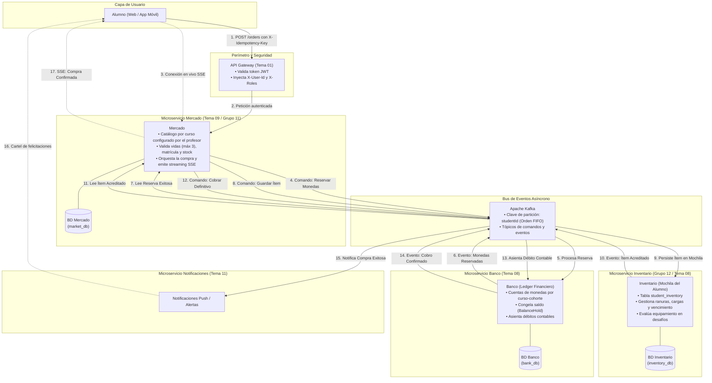
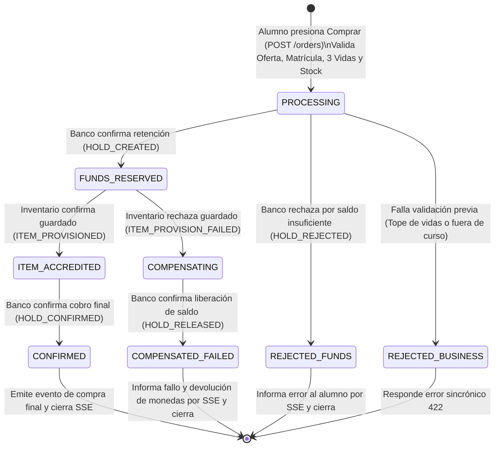
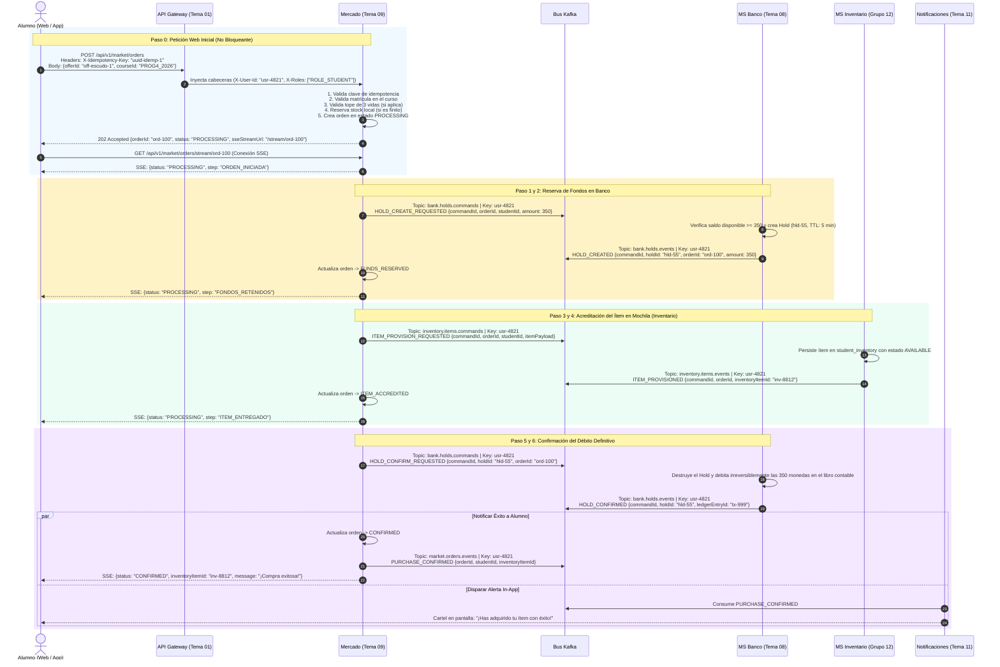
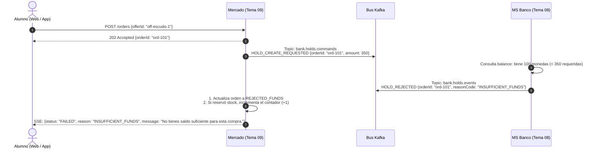
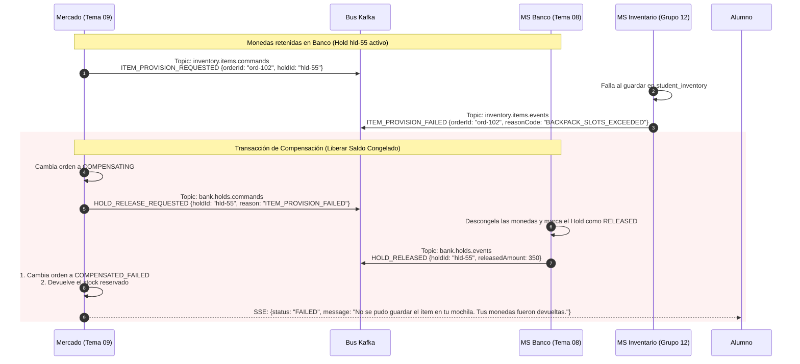
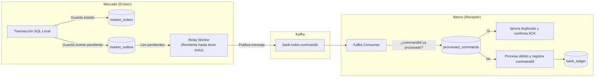

# Protocolo de Integración y Flujo Transaccional: Mercado (Tema 09) ↔ Banco (Tema 08) ↔ Inventario (Grupo 12 / Tema 08)
## Coreografía de Saga Asíncrona (Kafka), Retención de Saldo (Coin Holds), Acreditación en Mochila y Comunicación en Tiempo Real (SSE)

> **Estado:** Especificación Técnica Consolidada — Sprint 1  
> **Microservicios involucrados:** 
> 1. **Mercado (Tema 09 / Grupo 11):** Orquestador de compra y catálogo curado por cohorte.
> 2. **Banco (Tema 08):** Microservicio financiero soberano (Ledger de monedas y retenciones temporales).
> 3. **Inventario (Grupo 12 / Tema 08):** Microservicio soberano de la mochila del alumno (ranuras, equipamiento y efectos).
> 4. **API Gateway (Tema 01):** Perímetro de seguridad y validación de tokens JWT.
> 5. **Notificaciones (Tema 11):** Avisos y alertas en pantalla.  
> 
> **Aclaración Arquitectónica Fundamental:**  
> **Banco e Inventario son dos microservicios totalmente separados e independientes.** No comparten base de datos, memoria ni almacenamiento. Cada uno es dueño exclusivo de su propio dominio y toda interacción entre ellos y con Mercado se realiza de forma desacoplada a través del bus de eventos Apache Kafka.

---

## Índice
1. [Regla de Oro: Doctrina de la Saga (Reserve → Provision → Confirm)](#1-regla-de-oro-doctrina-de-la-saga-reserve--provision--confirm)
2. [Límites de Dominio y Microservicios Separados](#2-límites-de-dominio-y-microservicios-separados)
3. [Estructura de Mensajería: Envoltorio Kafka vs. Payload de Negocio](#3-estructura-de-mensajería-envoltorio-kafka-vs-payload-de-negocio)
4. [Ciclo de Vida de la Orden de Compra (Máquina de Estados)](#4-ciclo-de-vida-de-la-orden-de-compra-máquina-de-estados)
5. [Diagramas de Secuencia del Flujo](#5-diagramas-de-secuencia-del-flujo)
   - 5.1 [Camino Feliz (Paso a Paso Completo)](#51-camino-feliz-paso-a-paso-completo)
   - 5.2 [Caso de Falla: Saldo Insuficiente en Banco](#52-caso-de-falla-saldo-insuficiente-en-banco)
   - 5.3 [Caso de Falla: Error en Acreditación de Inventario y Compensación](#53-caso-de-falla-error-en-acreditación-de-inventario-y-compensación)
   - 5.4 [Resiliencia: Reintentos y Publicación Confiable (Outbox Pattern)](#54-resiliencia-reintentos-y-publicación-confiable-outbox-pattern)
6. [Catálogo de Tópicos Kafka](#6-catálogo-de-tópicos-kafka)
7. [Especificación de Contratos y Payloads de Negocio](#7-especificación-de-contratos-y-payloads-de-negocio)
   - 7.1 [Paso 0: Inicio de Orden por REST y Canal SSE](#71-paso-0-inicio-de-orden-por-rest-y-canal-sse)
   - 7.2 [Paso 1: Solicitud de Reserva de Monedas (`HOLD_CREATE_REQUESTED`)](#72-paso-1-solicitud-de-reserva-de-monedas-hold_create_requested)
   - 7.3 [Paso 2: Respuesta del Banco sobre la Reserva (`HOLD_CREATED` / `HOLD_REJECTED`)](#73-paso-2-respuesta-del-banco-sobre-la-reserva-hold_created--hold_rejected)
   - 7.4 [Paso 3: Solicitud de Entrega de Ítem a Inventario (`ITEM_PROVISION_REQUESTED`)](#74-paso-3-solicitud-de-entrega-de-ítem-a-inventario-item_provision_requested)
   - 7.5 [Paso 4: Respuesta de Entrega por Inventario (`ITEM_PROVISIONED` / `ITEM_PROVISION_FAILED`)](#75-paso-4-respuesta-de-entrega-por-inventario-item_provisioned--item_provision_failed)
   - 7.6 [Paso 5: Confirmación de Cobro Definitivo en Banco (`HOLD_CONFIRM_REQUESTED`)](#76-paso-5-confirmación-de-cobro-definitivo-en-banco-hold_confirm_requested)
   - 7.7 [Paso 6: Asentamiento del Débito en Ledger (`HOLD_CONFIRMED`)](#77-paso-6-asentamiento-del-débito-en-ledger-hold_confirmed)
   - 7.8 [Paso 7: Liberación de Fondos en Compensación (`HOLD_RELEASE_REQUESTED` / `HOLD_RELEASED`)](#78-paso-7-liberación-de-fondos-en-compensación-hold_release_requested--hold_released)
   - 7.9 [Streaming SSE al Alumno (Server-Sent Events)](#79-streaming-sse-al-alumno-server-sent-events)
8. [Reglas Clave de Negocio y Resiliencia Técnica](#8-reglas-clave-de-negocio-y-resiliencia-técnica)
   - 8.1 [Funcionamiento Simple del Período de Gracia (Grace Period)](#81-funcionamiento-simple-del-período-de-gracia-grace-period)
   - 8.2 [El `itemPayload` Oficial y su Alineación con la Curaduría del Profesor](#82-el-itempayload-oficial-y-su-alineación-con-la-curaduría-del-profesor)
   - 8.3 [Reglas de Vidas (Máximo 3) y Stock (Ilimitado o Finito)](#83-reglas-de-vidas-máximo-3-y-stock-ilimitado-o-finito)
   - 8.4 [Reintentos Indefinidos en Caso de Falla](#84-reintentos-indefinidos-en-caso-de-falla)
9. [Propuesta Técnica a Discutir en el Futuro: Posible Simplificación de Comunicación](#9-propuesta-técnica-a-discutir-en-el-futuro-posible-simplificación-de-comunicación)
10. [Matriz de Trazabilidad con Historias de Usuario (Taiga)](#10-matriz-de-trazabilidad-con-historias-de-usuario-taiga)

---

## 1. Regla de Oro: Doctrina de la Saga (Reserve → Provision → Confirm)

El flujo de compra directa entre Mercado, Banco e Inventario se rige bajo el patrón arquitectónico de **Saga por Coreografía Asíncrona**:

> **Regla de Oro (Decisión #8 — No negociable):**  
> **1) Congelar Saldo (Hold) en el Microservicio Banco** $\rightarrow$  
> **2) Guardar el Ítem en la Mochila del Alumno en el Microservicio Inventario** $\rightarrow$  
> **3) Confirmar el Cobro en Banco RECIÉN cuando el Inventario confirmó que guardó el ítem.**

### ¿Por qué este orden y no otro?
Si primero cobráramos el dinero y luego fallara el microservicio de Inventario, el alumno habría pagado sin recibir su ítem (generando inconsistencias financieras y reclamos).  
Con este orden:
1. El dinero **no se cobra de entrada**, solo queda congelado temporalmente (`Hold`).
2. Si el microservicio de Inventario rechaza guardar el ítem (por ejemplo, mochila llena o error interno), simplemente se cancela la reserva en Banco y el dinero vuelve a estar disponible para el alumno.
3. El dinero se descuenta de forma irreversible **únicamente cuando el ítem ya está físicamente persistido en la mochila del estudiante**.

---

## 2. Límites de Dominio y Microservicios Separados



### Características de los Microservicios:
- **Banco e Inventario NO comparten base de datos ni memoria:** Aunque pertenezcan a la misma temática general asignada, son **dos microservicios independientes**. Cada uno tiene su propio repositorio de datos (`bank_db` e `inventory_db`) y su propio ciclo de despliegue.
- **Mercado actúa como Kiosco y Orquestador:** Expone la vitrina del curso y coordina la conversación asíncrona entre el microservicio Banco (para la plata) y el microservicio Inventario (para la entrega del ítem).

---

## 3. Estructura de Mensajería: Envoltorio Kafka vs. Payload de Negocio

Todo mensaje que viaja por Kafka dentro de la plataforma AulaQuest utiliza una envoltura técnica estándar obligatoria (`EventEnvelope<T>`), definida en `KAFKA_EVENT_STANDARD.md`:

```text
Mensaje en Kafka
│
├── Topic (Dominio del evento)
├── Message Key (studentId -> garantiza orden estricto FIFO por alumno)
└── Value (Envelope Estándar de la Plataforma)
     ├── eventId (UUID único del mensaje técnico)
     ├── eventType (Tipo de evento en MAYÚSCULAS)
     ├── eventVersion (Versión del contrato, ej: 1)
     ├── timestamp (Fecha y hora UTC)
     ├── producer (Microservicio emisor, ej: team-09-market)
     └── payload { ... OBJETO DE NEGOCIO ... }
```

> **Aclaración clave:**  
> La envoltura (`eventId`, `eventType`, `eventVersion`, `timestamp`, `producer`) la gestiona automáticamente la librería común o infraestructura de Kafka del proyecto.  
> **Nuestros microservicios (Mercado, Banco e Inventario) únicamente generan y leen el objeto `payload`**. Por ello, en las especificaciones de este documento nos enfocamos en el contenido exacto de ese `payload`.

---

## 4. Ciclo de Vida de la Orden de Compra (Máquina de Estados)

En la base de datos de Mercado, cada compra (`PurchaseOrder`) atraviesa los siguientes estados:



---

## 5. Diagramas de Secuencia del Flujo

### 5.1 Camino Feliz (Paso a Paso Completo)



---

### 5.2 Caso de Falla: Saldo Insuficiente en Banco

Si el alumno no cuenta con las monedas necesarias, el microservicio Banco rechaza de inmediato la retención. No se genera ningún cobro y, si la oferta tenía stock finito, Mercado devuelve el cupo reservado:



---

### 5.3 Caso de Falla: Error en Acreditación de Inventario y Compensación

Si las monedas fueron congeladas con éxito, pero el microservicio de Inventario rechaza guardar el ítem (por ejemplo, mochila sin espacio o fallo interno):



---

### 5.4 Resiliencia: Reintentos y Publicación Confiable (Outbox Pattern)

Para que ningún mensaje se pierda si un servidor se reinicia o se corta la red:



---

## 6. Catálogo de Tópicos Kafka

| Nombre del Tópico | Tipo de Mensaje | Función | Productor | Consumidores | Message Key |
|---|---|---|---|---|---|
| `bank.holds.commands` | Comando | Solicitar crear, confirmar o liberar una reserva de monedas | `team-09-market` | `team-08-bank` | `studentId` |
| `bank.holds.events` | Evento | Informar resultado de retención, confirmación o liberación | `team-08-bank` | `team-09-market`, `team-11-notifications` | `studentId` |
| `inventory.items.commands` | Comando | Solicitar a Inventario que guarde el ítem en la mochila del alumno | `team-09-market` | `team-08-bank` (Inventario) | `studentId` |
| `inventory.items.events` | Evento | Informar si el ítem fue guardado con éxito o falló | `team-08-bank` (Inventario) | `team-09-market` | `studentId` |
| `market.orders.events` | Evento | Informar a toda la plataforma que una compra concluyó con éxito | `team-09-market` | `team-11-notifications` | `studentId` |

---

## 7. Especificación de Contratos y Payloads de Negocio

### 7.1 Paso 0: Inicio de Orden por REST y Canal SSE

- **Endpoint HTTP:** `POST /api/v1/market/orders`
- **Cabeceras obligatorias:**
  ```http
  Authorization: Bearer <JWT_DEL_ALUMNO>
  X-Idempotency-Key: 9f8a84a3-7bf1-4e8c-9c3f-9189bfa8102d
  X-User-Id: usr-4821
  X-Roles: ROLE_STUDENT
  Content-Type: application/json
  ```
- **Cuerpo de la Petición (Request Body):**
  ```json
  {
    "offerId": "off-item-escudo-9912",
    "courseId": "COURSE_PROG4_2026"
  }
  ```
- **Respuesta Exitosa Inmediata (`202 Accepted`):**
  ```json
  {
    "orderId": "ord-88391a",
    "status": "PROCESSING",
    "courseId": "COURSE_PROG4_2026",
    "offerId": "off-item-escudo-9912",
    "priceCoins": 350,
    "sseStreamUrl": "/api/v1/market/orders/stream/ord-88391a",
    "createdAt": "2026-09-21T20:00:00Z"
  }
  ```
- **Validaciones previas inmediatas (Errores HTTP 4xx sin ir a Kafka):**
  - Si el alumno intenta comprar una vida y ya tiene 3 vidas: responde HTTP `422 Unprocessable Entity` con `{ "error": "MAX_LIVES_REACHED", "message": "Vidas máximas" }`.
  - Si no está matriculado en el curso: responde HTTP `403 Forbidden` (`NOT_ENROLLED_IN_COURSE`).
  - Si la oferta tenía stock finito y llegó a 0: responde HTTP `422 Unprocessable Entity` (`OUT_OF_STOCK`).

---

### 7.2 Paso 1: Solicitud de Reserva de Monedas (`HOLD_CREATE_REQUESTED`)
- **Tópico:** `bank.holds.commands`
- **Clave del Mensaje (Key):** `usr-4821`

```json
{
  "commandId": "cmd-hold-create-ord-88391a",
  "orderId": "ord-88391a",
  "studentId": "usr-4821",
  "courseId": "COURSE_PROG4_2026",
  "amount": 350,
  "currency": "GOLD_COIN",
  "orderType": "DIRECT_PURCHASE",
  "ttlSeconds": 300
}
```

---

### 7.3 Paso 2: Respuesta del Banco sobre la Reserva (`HOLD_CREATED` / `HOLD_REJECTED`)

#### Caso A: Monedas Congeladas con Éxito
- **Tópico:** `bank.holds.events`

```json
{
  "commandId": "cmd-hold-create-ord-88391a",
  "holdId": "hld-99201",
  "orderId": "ord-88391a",
  "studentId": "usr-4821",
  "courseId": "COURSE_PROG4_2026",
  "amount": 350,
  "currency": "GOLD_COIN",
  "status": "PENDING",
  "expiresAt": "2026-09-21T20:05:00Z"
}
```

#### Caso B: Rechazo por Saldo Insuficiente
```json
{
  "commandId": "cmd-hold-create-ord-88391a",
  "orderId": "ord-88391a",
  "studentId": "usr-4821",
  "courseId": "COURSE_PROG4_2026",
  "reasonCode": "INSUFFICIENT_FUNDS",
  "currentBalance": 120,
  "requiredAmount": 350
}
```

---

### 7.4 Paso 3: Solicitud de Entrega de Ítem a Inventario (`ITEM_PROVISION_REQUESTED`)
- **Tópico:** `inventory.items.commands`
- **Clave del Mensaje (Key):** `usr-4821`

> El contenido del `itemPayload` coincide exactamente con la ficha del ítem curado por el profesor en `curacion-catalogo-profesor.html`:

```json
{
  "commandId": "cmd-item-prov-ord-88391a",
  "orderId": "ord-88391a",
  "holdId": "hld-99201",
  "studentId": "usr-4821",
  "courseId": "COURSE_PROG4_2026",
  "itemPayload": {
    "catalogOfferId": "off-item-escudo-9912",
    "templateId": "tpl-shield-base",
    "itemType": "SHIELD",
    "customName": "Égida de Laboratorio y Quizzes",
    "customDescription": "Absorbe hasta 2 fallos en entregas de código y quizzes conceptuales. Queda inactivo en parciales.",
    "icon": "🛡️",
    "configuration": {
      "itemType": "SHIELD",
      "charges": 2,
      "applicableChallenges": "NO_EXAMS"
    }
  }
}
```

---

### 7.5 Paso 4: Respuesta de Entrega por Inventario (`ITEM_PROVISIONED` / `ITEM_PROVISION_FAILED`)

#### Caso A: Ítem Guardado en la Mochila
- **Tópico:** `inventory.items.events`

```json
{
  "commandId": "cmd-item-prov-ord-88391a",
  "orderId": "ord-88391a",
  "holdId": "hld-99201",
  "studentId": "usr-4821",
  "courseId": "COURSE_PROG4_2026",
  "inventoryItemId": "inv-item-8812",
  "itemType": "SHIELD",
  "state": "AVAILABLE",
  "acquiredAt": "2026-09-21T20:00:02Z"
}
```

#### Caso B: Error al Guardar Ítem
```json
{
  "commandId": "cmd-item-prov-ord-88391a",
  "orderId": "ord-88391a",
  "holdId": "hld-99201",
  "studentId": "usr-4821",
  "reasonCode": "BACKPACK_SLOTS_EXCEEDED",
  "message": "La mochila del alumno no posee ranuras libres para este curso."
}
```

---

### 7.6 Paso 5: Confirmación de Cobro Definitivo en Banco (`HOLD_CONFIRM_REQUESTED`)
- **Tópico:** `bank.holds.commands`

```json
{
  "commandId": "cmd-hold-confirm-ord-88391a",
  "holdId": "hld-99201",
  "orderId": "ord-88391a",
  "studentId": "usr-4821",
  "courseId": "COURSE_PROG4_2026",
  "amount": 350
}
```

---

### 7.7 Paso 6: Asentamiento del Débito en Ledger (`HOLD_CONFIRMED`)
- **Tópico:** `bank.holds.events`

```json
{
  "commandId": "cmd-hold-confirm-ord-88391a",
  "holdId": "hld-99201",
  "orderId": "ord-88391a",
  "studentId": "usr-4821",
  "amountDebited": 350,
  "ledgerEntryId": "tx-ledger-9021",
  "status": "COMMITTED"
}
```

---

### 7.8 Paso 7: Liberación de Fondos en Compensación (`HOLD_RELEASE_REQUESTED` / `HOLD_RELEASED`)

#### Solicitud de Liberación (Mercado $\rightarrow$ Banco)
- **Tópico:** `bank.holds.commands`

```json
{
  "commandId": "cmd-hold-release-ord-88391a",
  "holdId": "hld-99201",
  "orderId": "ord-88391a",
  "studentId": "usr-4821",
  "reason": "ITEM_PROVISION_FAILED: BACKPACK_SLOTS_EXCEEDED"
}
```

#### Confirmación de Liberación (Banco $\rightarrow$ Mercado)
- **Tópico:** `bank.holds.events`

```json
{
  "commandId": "cmd-hold-release-ord-88391a",
  "holdId": "hld-99201",
  "orderId": "ord-88391a",
  "studentId": "usr-4821",
  "releasedAmount": 350,
  "status": "RELEASED"
}
```

---

### 7.9 Streaming SSE al Alumno (Server-Sent Events)

- **Ruta:** `GET /api/v1/market/orders/stream/{orderId}`
- **Mensajes emitidos en tiempo real:**

```http
event: order_status
data: {"orderId":"ord-88391a","status":"PROCESSING","step":"VALIDATED","message":"Orden iniciada."}

event: order_status
data: {"orderId":"ord-88391a","status":"PROCESSING","step":"FUNDS_HELD","message":"Monedas reservadas en Banco."}

event: order_status
data: {"orderId":"ord-88391a","status":"PROCESSING","step":"ITEM_PROVISIONED","message":"Ítem guardado en tu mochila."}

event: order_completed
data: {"orderId":"ord-88391a","status":"CONFIRMED","inventoryItemId":"inv-item-8812","message":"¡Compra exitosa! Ya puedes usar tu ítem."}
```

---

## 8. Reglas Clave de Negocio y Resiliencia Técnica

### 8.1 Funcionamiento Simple del Período de Gracia (Grace Period)

Para que el funcionamiento del **Grace Period** sea súper fácil de entender, usemos una regla de 3 tiempos:

```text
[0 seg] ────────────────── [60 seg] ────────────────── [5 min (TTL)] ────────────────── [20 min (Grace Period)]
   ▲                          ▲                             ▲                                    ▲
   │                          │                             │                                    │
Inicio de                  Timeout                       Vencimiento                          Cancelación
la Compra                de Mercado                      del Banco                            Definitiva
(Hold creado)         (Si Inventario no               (Si nadie cobró,                     (Solo si Mercado
                      respondió en 60s,               pero el cobro ya                     nunca apareció)
                     Mercado cancela solo)            está en camino,
                                                      Banco da 15 min más)
```

1. **Tiempo 1 — El Timeout de Mercado (60 segundos):**  
   Una compra normal tarda 2 o 3 segundos. Mercado le da un plazo máximo de 60 segundos al microservicio de Inventario para responder. Si en 60 segundos Inventario no contestó, Mercado asume que hubo un error y le pide a Banco cancelar la reserva.
2. **Tiempo 2 — El TTL del Banco (5 minutos):**  
   El Banco congela las monedas durante 5 minutos (`expiresAt`).
3. **Tiempo 3 — El Período de Gracia (+15 minutos adicionales):**  
   ¿Qué pasa si Mercado envió la orden de cobro (`HOLD_CONFIRM_REQUESTED`) justo a los 4 minutos y 58 segundos y hay demora en la red?  
   En lugar de vencer la reserva a los 5 minutos exactos y cancelar todo, **el Banco activa el Período de Gracia**: otorga 15 minutos más para permitir que el cobro se asiente tranquilamente, porque sabe que la compra ya fue autorizada y no debe cancelarse.

---

### 8.2 El `itemPayload` Oficial y su Alineación con la Curaduría del Profesor

En `curacion-catalogo-profesor.html`, el profesor define cómo funciona cada oferta según la plantilla elegida. Cuando Mercado le envía el comando a Inventario, el objeto `configuration` dentro del `itemPayload` varía según el tipo de ítem:

1. **Escudo (`SHIELD`):**
   ```json
   "configuration": {
     "itemType": "SHIELD",
     "charges": 2,
     "applicableChallenges": "NO_EXAMS"
   }
   ```
   *(Protege en quizzes y código diario; se desactiva en parciales).*

2. **Potenciador de XP o Monedas (`BOOST_XP` / `BOOST_COINS`):**
   - **Por tiempo (TTL):**
     ```json
     "configuration": {
       "itemType": "BOOST_XP",
       "multiplier": 1.5,
       "mode": "TTL",
       "durationMinutes": 60
     }
     ```
   - **Por cantidad de entregas (PER_EXAM):**
     ```json
     "configuration": {
       "itemType": "BOOST_XP",
       "multiplier": 1.5,
       "mode": "PER_EXAM",
       "attempts": 3,
       "consumptionRule": "CONSUME_ON_PASS_ONLY"
     }
     ```

3. **Protector de Racha (`STREAK_FREEZE`):**
   ```json
   "configuration": {
     "itemType": "STREAK_FREEZE",
     "daysProtected": 1
   }
   ```

---

### 8.3 Reglas de Vidas (Máximo 3) y Stock (Ilimitado o Finito)

- **Vidas del Alumno (Tope de 3 Vidas):**  
  Se valida **en el primer paso** (`POST /orders`). Si el ítem es una vida (`LIFE`) y el alumno ya cuenta con sus **3 vidas máximas**, la petición se frena al instante con error HTTP `422` y la interfaz muestra el aviso claro: **"Vidas máximas"**. No se envía ningún comando a Kafka ni se congelan monedas.
- **Stock de Ofertas (Ilimitado o Finito):**  
  El profesor decide por cada oferta:
  - **Ilimitado:** No tiene tope de unidades.
  - **Finito:** Mercado descuenta 1 unidad local al iniciar la orden. Si luego la compra fracasa por saldo o error en inventario, **Mercado devuelve la unidad de stock (+1)** de inmediato.

---

### 8.4 Reintentos Indefinidos en Caso de Falla

En caso de fallo de red o caída de un pod:
- Una vez que el microservicio de Inventario confirmó que el ítem está guardado en la mochila (Paso 4), **la compra ya no se puede anular**.
- Si el microservicio Banco no responde a la confirmación de cobro (`HOLD_CONFIRM_REQUESTED`), Mercado reintentará enviar el comando indefinidamente a través del **Transactional Outbox Pattern** hasta que Banco procese el cobro con éxito.

---

## 9. Propuesta Técnica a Discutir en el Futuro: Posible Simplificación de Comunicación

> **Nota:** Esta sección describe una propuesta de evolución técnica para **evaluar y debatir a futuro (en Sprint 2)** junto con los equipos. Para el presente Sprint 1, se mantiene firme el flujo de 3 pasos documentado en las secciones anteriores.

### Situación Actual (Sprint 1)
Mercado actúa como orquestador intermediario entre dos microservicios separados:
1. Mercado $\leftrightarrow$ Microservicio Banco (reserva y confirma fondos).
2. Mercado $\leftrightarrow$ Microservicio Inventario (acredita el ítem).  
Esto requiere **6 mensajes en Kafka** (3 idas y vueltas completas) por cada compra.

### Propuesta a Evaluar para el Futuro
Dado que ambos microservicios (Banco e Inventario) son desarrollados por el mismo equipo de trabajo (Tema 08):
- Se podría evaluar si en una fase posterior el equipo de Banco/Inventario prefiere exponer un único punto de entrada de liquidación (`ORDER_SETTLE_REQUESTED`).
- En ese escenario hipotético, Mercado enviaría un único comando y ellos coordinarían internamente el cobro y la mochila, respondiendo con un único evento final (`ORDER_SETTLED`).

*Esta idea queda registrada exclusivamente como tema de conversación técnica para futuros refinamientos de arquitectura.*

---

## 10. Matriz de Trazabilidad con Historias de Usuario (Taiga)

| Historia de Usuario | Nombre en Taiga | Implementación en este Documento |
|---|---|---|
| **US-138** | Comprar un ítem del catálogo | Sección 1 (Doctrina de 3 pasos), Sección 5.1 (Camino feliz) y Sección 7 (Payloads). |
| **US-139** | No pagar dos veces por un doble clic | Sección 7.1 (`X-Idempotency-Key` en HTTP) y Sección 5.4 (`commandId` en Kafka). |
| **US-140** | Ver el resultado de una compra en proceso | Sección 7.1 (`sseStreamUrl`) y Sección 7.9 (Eventos SSE). |
| **US-141** | Recuperar mis monedas si la compra no se completó | Sección 5.2 y 5.3 (Compensaciones) y Sección 7.8 (`HOLD_RELEASE_REQUESTED`). |
| **US-142** | Comprar una vida sin pasarme del tope | Sección 7.1 y Sección 8.3 (Tope de 3 vidas y aviso "Vidas máximas"). |
| **US-143** | Revisar las compras que quedaron a medias | Sección 4 (Máquina de estados) y Sección 8.1 (Manejo de TTL y Grace Period). |

---
*Documento consolidado y actualizado — AulaQuest 2026*
