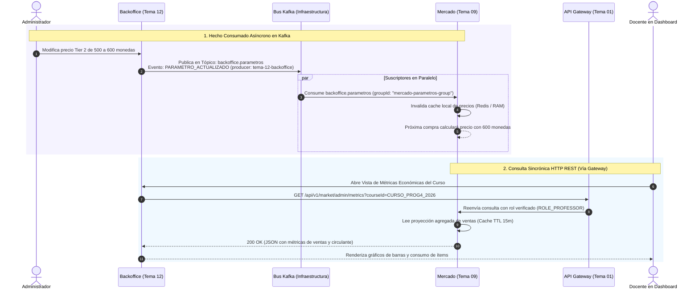

# Protocolo de Integración — Mercado (Tema 09) & Backoffice (Tema 12)
## Consumo Asíncrono de Parámetros (`backoffice.parametros`) y Exposición de Analítica Sincrónica

---

## 1. Resumen Ejecutivo del Flujo y Doctrina Kafka

El módulo de **Backoffice (Tema 12)** actúa como el panel de administración central de la plataforma Aula Quest.

Su integración con **Mercado (Tema 09)** ejemplifica el balance entre comunicación sincrónica y asincrónica:

1. **Hechos Consumados Asíncronos (Backoffice → Bus Kafka):**  
   Cuando un administrador modifica una variable de balance económico en Backoffice (precio de vidas extras PAR-06, matriz de precios por Tier PAR-07 o tope de vidas PAR-12), Backoffice no hace llamadas REST directas a cada microservicio. Simplemente emite un hecho consumado (`PARAMETRO_ACTUALIZADO`) en el tópico de su dominio: `backoffice.parametros`. Mercado escucha este evento, invalida su caché local y asume los nuevos valores de inmediato.
2. **Consultas Sincrónicas de Analítica (Backoffice → Mercado vía Gateway):**  
   Cuando un docente abre el panel de control de la cohorte para ver el dashboard de ventas, Backoffice consulta directamente a Mercado (`GET /api/v1/market/admin/metrics?courseId={id}`). Mercado responde con un snapshot preagregado con frescura máxima de 15 minutos.

---

## 2. Diagrama de Secuencia de Parámetros y Analítica



---

## 3. Especificación Técnica de Contratos

### 3.1 Consumo Asíncrono de Parámetros Globales (PAR-06 y PAR-07)

* **Tópico Kafka:** `backoffice.parameters.events` o `backoffice.parametros`
* **Clave de Partición (`partitionKey`):** `PAR-07`

#### Contrato Estándar JSON emitido por Backoffice:
```json
{
  "eventId": "a8f34bc1-9124-4f9e-a89c-5c8e419b8823",
  "eventType": "PARAMETRO_ACTUALIZADO",
  "timestamp": "2026-09-09T17:00:00Z",
  "producer": "tema-12-backoffice",
  "payload": {
    "parameterKey": "PAR-07",
    "category": "TIER_PRICES",
    "values": {
      "TIER_1": 200,
      "TIER_2": 500,
      "TIER_3": 1000,
      "TIER_4": 2000,
      "TIER_5": 4000
    },
    "updatedBy": "admin-system",
    "effectiveDate": "2026-09-09T17:00:00Z"
  }
}
```

#### Parámetros Monitoreados por Mercado:
- **PAR-06:** `EXTRA_LIFE_PRICE` = 300 monedas (precio canje oficial de la poción de vida).
- **PAR-07:** `TIER_PRICES` = Matriz de precios por Tier (200, 500, 1.000, 2.000, 4.000).
- **PAR-12:** `MAX_LIVES_LIMIT` = 3 vidas (tope de amortiguación).

---

### 3.2 Exposición Sincrónica de Contratos de Analítica hacia Backoffice

Para que los tableros de control docentes reflejen el estado de la economía sin sobrecargar la base transaccional:

* **Endpoint:** `GET /api/v1/market/admin/metrics?courseId={courseId}`
* **Headers:**
  - `X-User-Id: prof-1002`
  - `X-Roles: ROLE_PROFESSOR`
* **Código:** `200 OK`

#### Payload Retornado a Backoffice:
```json
{
  "courseId": "CURSO_PROG4_2026",
  "reportGeneratedAt": "2026-09-09T17:15:00Z",
  "freshnessMinutes": 15,
  "metrics": {
    "totalTransactions": 142,
    "totalGoldCoinsSpent": 84500,
    "topSellingItems": [
      {
        "itemCode": "SHIELD_T2",
        "name": "Escudo Reforzado",
        "quantitySold": 58,
        "totalRevenue": 29000
      },
      {
        "itemCode": "XP_BOOST_T1",
        "name": "Tónico de Concentración",
        "quantitySold": 44,
        "totalRevenue": 8800
      }
    ],
    "activeEquippedShields": 38,
    "activeEquippedBuffs": 22
  }
}
```

---

## 4. Inspección Interactiva de Cada Paso del Flujo (Drill-Down)

A continuación se detalla qué realiza exactamente cada paso de la interacción entre **Mercado (Tema 09)** y **Backoffice (Tema 12)**. Haz clic sobre cualquier paso para desplegar su especificación completa:

<details>
<summary><b>Paso 1: Carga Inicial de Precios por Tier y Parámetros en Arranque</b></summary>

#### ¿Qué se hace en este paso?
* **Emisor:** Mercado & Inventario (Tema 09).
* **Receptor:** Memoria Local (`ConcurrentHashMap` / Caché de Aplicación).
* **Protocolo:** Inicialización del contenedor Spring Boot (`@PostConstruct`).
* **Lógica:**
  1. Al iniciar el microservicio de Mercado en Docker/Kubernetes, lee la tabla `market_parameters` y las variables de entorno de infraestructura.
  2. Carga los parámetros canónicos:
     - **PAR-06:** Precio de la Poción de Vida (300 monedas).
     - **PAR-07:** Matriz de precios por Tier (T1: 200, T2: 500, T3: 1.000, T4: 2.000, T5: 4.000).
     - **PAR-12:** Tope reglamentario de 3 vidas por estudiante.
  3. Precalienta la memoria RAM para responder cotizaciones con latencia sub-milisegundo.
* **Base de Datos (Mercado):**
  ```sql
  SELECT param_key, param_value FROM market_parameters;
  ```
* **Manejo de Fallos:** Si la tabla no está accesible en el arranque, utiliza los valores por defecto configurados en `application.yml` garantizando alta disponibilidad.
</details>

<details>
<summary><b>Paso 2: Ajuste de Parámetros Económicos en Panel Web</b></summary>

#### ¿Qué se hace en este paso?
* **Emisor:** Administrador de Plataforma o Docente Encargado.
* **Receptor:** Microservicio Backoffice (Tema 12).
* **Protocolo:** REST API Privada / Dashboard Administrativo.
* **Lógica:**
  1. El administrador accede al panel de control de la economía de Aula Quest.
  2. Modifica, por ejemplo, el precio de los ítems de Tier 3 ajustándolo de 1.000 a 1.200 monedas de oro para equilibrar la dificultad del cuatrimestre.
  3. Backoffice valida que los números sean enteros positivos y respeten la progresión geométrica de los Tiers.
  4. Persiste el cambio en la base de datos de administración.
* **Payload de Modificación en Backoffice:**
  ```json
  {
    "adminAction": "UPDATE_PARAMETER",
    "targetParameter": "PAR-07",
    "category": "TIER_PRICES",
    "newValues": {
      "TIER_3": 1200
    },
    "updatedBy": "admin-system"
  }
  ```
</details>

<details>
<summary><b>Paso 3: Emisión de Hecho Consumado: PARAMETRO_ACTUALIZADO en Kafka (Backoffice → Bus)</b></summary>

#### ¿Qué se hace en este paso?
* **Emisor:** Microservicio Backoffice (Tema 12).
* **Canal:** Apache Kafka, tópico `backoffice.parametros`.
* **Clave de Partición (`partitionKey`):** `PAR-07`.
* **Protocolo:** Asincrónico de Hecho Consumado.
* **Lógica:**
  1. Backoffice notifica al bus central que una regla económica ha cambiado.
  2. No se comunica de forma sincrónica con cada microservicio; publica el hecho consumado en su tópico.
  3. Mercado, Banco y los motores de gamificación reciben la notificación en paralelo.
* **Contrato Estándar JSON:**
  ```json
  {
    "eventId": "a8f34bc1-9124-4f9e-a89c-5c8e419b8823",
    "eventType": "PARAMETRO_ACTUALIZADO",
    "timestamp": "2026-09-09T17:00:00Z",
    "producer": "tema-12-backoffice",
    "payload": {
      "parameterKey": "PAR-07",
      "category": "TIER_PRICES",
      "values": {
        "TIER_1": 200,
        "TIER_2": 500,
        "TIER_3": 1200,
        "TIER_4": 2000,
        "TIER_5": 4000
      },
      "updatedBy": "admin-system",
      "effectiveDate": "2026-09-09T17:00:00Z"
    }
  }
  ```
</details>

<details>
<summary><b>Paso 4: Hot-Reload Dinámico en Memoria sin Downtime (Kafka → Mercado)</b></summary>

#### ¿Qué se hace en este paso?
* **Emisor:** Bus Central Kafka (`backoffice.parametros`).
* **Receptor:** Mercado & Inventario (Tema 09, `groupId = "mercado-parametros-group"`).
* **Protocolo:** Consumidor Reactivo de Configuración.
* **Lógica:**
  1. El listener de Kafka en Mercado intercepta `PARAMETRO_ACTUALIZADO`.
  2. Identifica que `PAR-07` afecta la matriz de precios de la tienda.
  3. Ejecuta una recarga en caliente (**Hot Reload**) en su estructura `ConcurrentHashMap` en memoria.
  4. La siguiente cotización de un ítem de Tier 3 (ej: `SHIELD_T3` o `XP_BOOST_T3`) se liquida automáticamente a 1.200 monedas **sin reiniciar el pod y con 0 segundos de interrupción de servicio**.
  5. Inserta un registro de auditoría en la base de datos de Mercado.
* **Base de Datos (Mercado):**
  ```sql
  INSERT INTO market_audit_log (event_type, action, result, timestamp) 
  VALUES ('PARAMETER_SYNCED', 'HOT_RELOAD_PAR_07', 'SUCCESS_NEW_TIER3_PRICE_1200', NOW());
  ```
</details>

