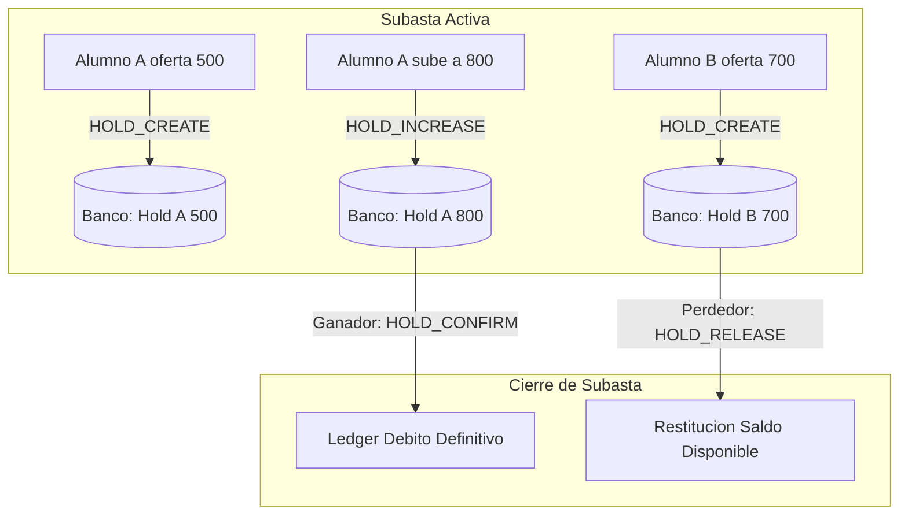
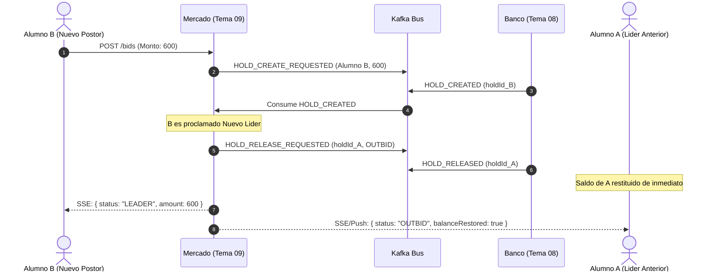

# [G11 - Subastas] 01 · Análisis de Opciones de Arquitectura para Subastas

## Perspectiva: Analista en Sistemas Senior (15+ años en Arquitectura Empresarial y Sistemas Distribuidos)

---

### 1. Resumen Ejecutivo y Contexto Operativo

En la plataforma **Aula Quest**, el módulo de **Mercado (Tema 09)** introduce las **Subastas (Épica E-07)** como una dinámica competitiva de asignación de ítems escasos dentro de un curso-cohorte. A diferencia de la compra directa a precio fijo (Épica E-02) —donde una transacción dura menos de 3 a 5 segundos entre reserva, acreditación y confirmación—, una subasta es un **proceso transaccional asíncrono y de larga duración (long-running business transaction)** que se extiende por horas o días, con alta concurrencia concentrada en el minuto final de cierre (estimada en ~120 sesiones simultáneas compitiendo contra el mismo reloj).

El componente crítico de integración es **Banco (Tema 08)**, custodio del saldo contable de monedas (`GOLD_COIN`) de cada alumno por cohorte. Banco ya implementa el concepto de **BalanceHold (`HOLD`)**, bloqueando saldo del `available_balance` antes de asentar un débito definitivo en el Ledger.

A continuación, se analizan **3 opciones viables de arquitectura** para modelar y operar las subastas, evaluando su comportamiento contable, impacto en infraestructura, experiencia de usuario y resiliencia.

---

### 2. Opción 1: Subasta con Holds Persistentes y Escalables por Alumno (Hold Escrow Total)

#### 2.1 Mecanismo de Funcionamiento

- Cada alumno que participa realiza una puja inicial mediante `POST /api/v1/market/auctions/{id}/bids`.
- Mercado genera un comando `HOLD_CREATE_REQUESTED` hacia Kafka en el tópico `bank.holds.commands` con un `ttlSeconds` correspondiente a la duración total restante de la subasta.
- Banco retiene el 100% de la oferta del alumno en estado `PENDING`.
- Si el alumno incrementa su puja (`PUT /api/v1/market/auctions/{id}/bids`), Mercado emite `HOLD_INCREASE_REQUESTED` con el `newTotalAmount`. Banco toma lock pesimista sobre la cuenta, verifica saldo disponible para la diferencia y actualiza el `amount` bloqueado.
- **Al momento del cierre:** Mercado determina la oferta más alta. Emite `HOLD_CONFIRM_REQUESTED` para el ganador y emite $N-1$ comandos `HOLD_RELEASE_REQUESTED` (con `releaseReason: "AUCTION_REFUND"`) hacia todos los perdedores.

#### 2.2 Análisis Técnico

- **Solvencia Financiera (ACID):** Absoluta. El 100% de las posturas está respaldado por dinero real inmovilizado. Riesgo de insolvencia al cierre = 0%.
- **Impacto en Banco:** Alto. Banco debe mantener en tabla caliente cientos de filas de `balance_holds` durante días. Requiere deshabilitar o parametrizar especialmente el `HoldExpirationScheduler` para evitar que expire automáticamente a los 5 minutos como en compra directa.
- **Impacto en UX / Negocio:** Negativo ("Circulante Congelado"). Si 15 alumnos pujan 1,000 monedas cada uno por un ítem raro, hay 15,000 monedas atrapadas durante 72 horas. Esos alumnos no pueden usar su dinero para comprar vidas, consumibles en el catálogo ni participar en otras actividades.
- **Pico en el Cierre:** Complejidad $O(N)$ en el martillazo. Cerrar una subasta con 50 ofertas implica enviar 1 confirmación y 49 eventos de liberación asíncronos que saturarán el tópico de Kafka y exigirán procesamiento en lote en Banco.

---

### 3. Opción 2: Subasta con Retención Exclusiva al Líder Activo (Leader-Only Floating Hold)

#### 3.1 Mecanismo de Funcionamiento

- En todo momento de la subasta, **solo la postura que lidera el ranking mantiene un HOLD activo en Banco**.
- **Flujo de Relevo de Liderazgo:**
  1. El Alumno A lidera con 500 monedas (Hold $H_A$ activo en Banco).
  2. El Alumno B envía una puja superior por 600 monedas.
  3. Mercado mantiene a A como líder transitorio y emite `HOLD_CREATE_REQUESTED` por 600 monedas para B.
  4. Banco valida saldo de B, crea el Hold $H_B$ y responde con `HOLD_CREATED`.
  5. Una vez que Mercado tiene confirmado $H_B$, actualiza formalmente a B como nuevo líder indiscutido.
  6. Inmediatamente, Mercado emite `HOLD_RELEASE_REQUESTED` para liberar el Hold $H_A$ de A con `releaseReason: "AUCTION_OUTBID"`.
  7. Si la reserva de B falla (ej: fondos insuficientes), la puja de B es rechazada y A sigue siendo el líder con su hold intacto.
- **Al momento del cierre:** Mercado solo tiene **UN hold que liquidar**. Emite `HOLD_CONFIRM_REQUESTED` sobre el líder. Cero liberaciones pendientes de perdedores porque ya fueron liberados en el momento exacto en que fueron superados.

#### 3.2 Análisis Técnico

- **Solvencia Financiera:** Absoluta. El ganador siempre tiene su dinero retenido y listo para capturar.
- **Impacto en Banco:** Mínimo. Banco solo mantiene exactamente **1 hold por subasta activa**. No hay acumulación de holds estáticos durante días.
- **Impacto en UX / Negocio:** Óptimo. En el instante en que un alumno es superado, sus monedas vuelven a estar disponibles en su balance para comprar en catálogo o formular una nueva contraoferta. Se maximiza la velocidad de circulación de la economía del curso.
- **Pico en el Cierre:** Complejidad $O(1)$. En el minuto 00:00:00 del cierre (pico de carga), solo se despacha 1 comando a Banco (`HOLD_CONFIRM_REQUESTED`). No existe tormenta de liberaciones masivas.
- **Desafío Arquitectónico:** Requiere una máquina de estados estricta en Mercado para evitar condiciones de carrera si dos alumnos intentan superar al líder al mismo milisegundo (resuelto mediante partición única en Kafka o lock pesimista a nivel subasta).

---

### 4. Opción 3: Subasta con Depósito de Fianza / Colateral + Liquidación Post-Cierre (Collateral Margin &amp; Settlement)

#### 4.1 Mecanismo de Funcionamiento

- Para poder participar y ofertar en una subasta, el alumno no inmoviliza el total de cada puja, sino que abona o congela un **depósito de garantía fijo (Colateral)** mediante `HOLD_CREATE_REQUESTED` (por ejemplo, 100 monedas fijas o el 20% del valor base del ítem).
- Durante la vida de la subasta, las pujas sucesivas se gestionan virtualmente dentro de Mercado validando de forma ligera que el alumno posea saldo teórico en Banco.
- **Al momento del cierre:**
  1. El sistema declara ganador al mejor postor.
  2. Se intenta liquidar el saldo total: se captura el hold del colateral y se solicita un débito directo (`DIRECT_DEBIT_REQUESTED`) por la diferencia restante.
  3. **Ruta Crítica (Default del Ganador):** Si el ganador gastó sus monedas libres antes del cierre y no puede pagar la diferencia, se confisca el colateral como penalización (se envía al fondo común del curso) y la adjudicación pasa automáticamente al 2° postor en orden de mérito (*Waterfall Settlement*).
  4. Los perdedores reciben la liberación íntegra de su colateral.

#### 4.2 Análisis Técnico

- **Solvencia Financiera:** Parcial / Débil. No hay garantía total de cobro al cierre. Introduce el riesgo de "Default" (insolvencia sobrevenida del postor).
- **Impacto en Banco:** Muy bajo durante la subasta.
- **Impacto en UX / Negocio:** Muy riesgoso en un entorno educativo. Los alumnos pueden pujar sin compromiso real para perjudicar a compañeros, o sentirse frustrados al ser penalizados con su colateral si calcularon mal su saldo.
- **Complejidad:** Muy alta. Implementar lógica de adjudicación en cascada (1° lugar falla -&gt; intentar con el 2° -&gt; si falla, intentar con el 3°) introduce estados intermedios y demoras de liquidación de varios días.

---

### 5. Matriz Comparativa de Opciones

| Dimensión de Análisis                  | Opción 1: Hold Escrow Total              | Opción 2: Hold Exclusivo al Líder           | Opción 3: Colateral + Settlement  |
| :-------------------------------------- | :---------------------------------------- | :------------------------------------------- | :--------------------------------- |
| **Garantía Contable de Cobro**         | **100% Garantizada**                     | **100% Garantizada**                        | Condicionada (Riesgo de Default)  |
| **Liquidez para Alumnos**              | Muy Mala (Fondos atrapados días)         | **Excelente (Restitución inmediata)**       | Buena (Solo colateral retenido)   |
| **Carga en Ledger de Banco**           | Alta ($N$ holds vivos de larga data)     | **Óptima (1 hold vivo por subasta)**        | Media (Holds de fianza estáticos) |
| **Complejidad del Cierre (**$T=0$**)** | $O(N)$ (1 confirmación + $N-1$ releases) | $O(1)$ **(1 sola confirmación)**            | Compleja (Cascada ante impagos)   |
| **Tolerancia a Concurrencia Móvil**    | Media (Riesgo de desincronización)       | **Alta (Feedback claro de líder/superado)** | Baja (Incertidumbre post-cierre)  |
| **Alineación con Épica E-07**          | Alta (Es el modelo asumido en E-07)      | **Evolución Recomendada de E-07**           | Divergente de los criterios E-07  |

---

### 6. Dictamen y Recomendación del Analista Senior

Como analista senior con 15 años de experiencia en sistemas distribuidos bancarios y de e-commerce, mi recomendación inequívoca es:

1. **Arquitectura Objetivo: Opción 2 (Hold Exclusivo al Líder / Floating Hold).**
 Es la solución más elegante, escalable y respetuosa de la experiencia de usuario. En los sistemas de subastas de alta concurrencia (como eBay o plataformas de subastas financieras), nunca se bloquea el capital de todos los participantes durante semanas; se bloquea únicamente al tomador de la mejor postura o se utiliza una línea de crédito pre-autorizada. La Opción 2 elimina de raíz el problema más temido de la Épica E-07: el pico de concurrencia al cierre donde 120 sesiones saturan el sistema y hay que despachar decenas de liberaciones concurrentes que pueden fallar y dejar saldos colgados.
2. **Compatibilidad con el estado actual del equipo:**
 Dado que el equipo de Banco (Tema 08) ya documentó preliminarmente el soporte para `HOLD_INCREASE_REQUESTED` en `flujo-subasta (1).html`, nuestro diseño en Mercado debe ser capaz de soportar la **Opción 1 como base mínima de lanzamiento (MVP)** garantizando que no se rompa nada, pero incorporando en el motor de subastas la transición hacia la **Opción 2** desacoplando a los perdedores tempranos para optimizar el rendimiento.

