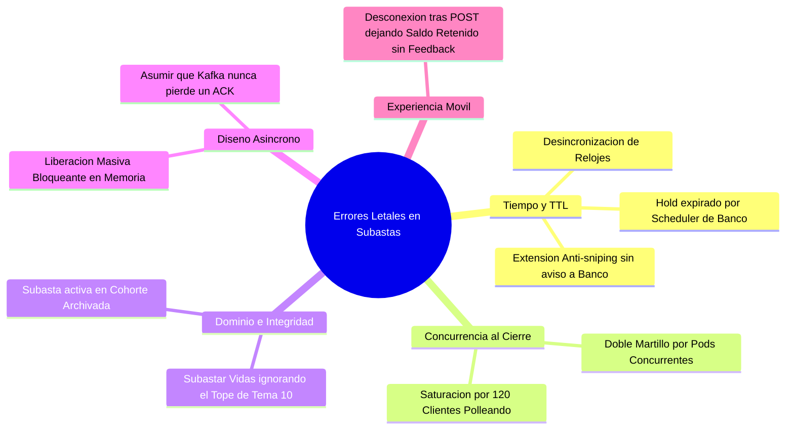
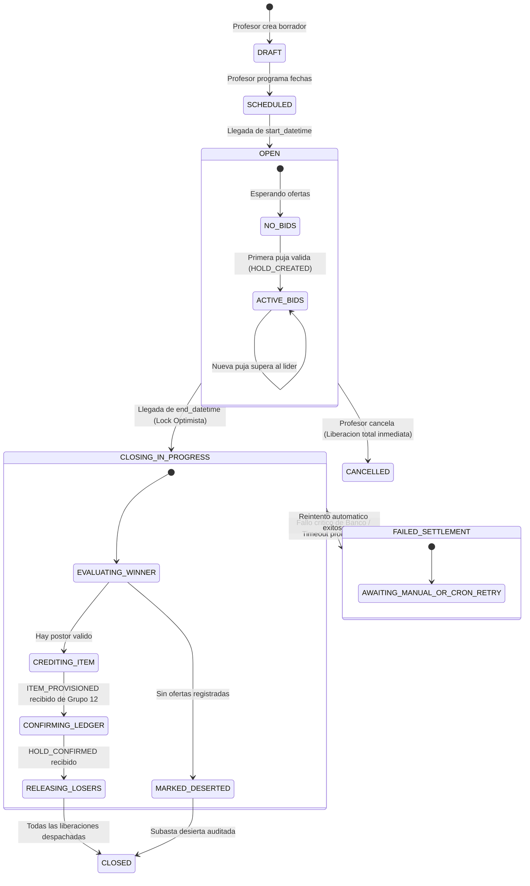

# [G11 - Subastas] 02 · Matriz de Fallos, Errores Potenciales y Soluciones de Resiliencia
## Guía Táctica del Analista Senior para Sistemas Distribuidos Tolerantes a Fallas

---

### 1. Los 5 Errores Críticos que Podemos Cometer (Anti-Patrones de Diseño)

En 15 años diseñando sistemas financieros y transaccionales, he visto fracasar proyectos de subastas no por el frontend o la base de datos, sino por **suposiciones ingenuas sobre el tiempo, el estado compartido y la red**. Estos son los 5 errores letales que debemos evitar en Aula Quest:

---

#### Error 1: Desincronización de Expiración (TTL Drift & Anti-Sniping)
* **El Error:** Enviar un `ttlSeconds` estático en `HOLD_CREATE_REQUESTED` y asumir que Banco y Mercado tienen sincronización de reloj perfecta. Peor aún: implementar una regla de **Anti-Sniping (Soft Close)** —donde si alguien puja en el último minuto, la subasta se prorroga 2 minutos más para evitar bots— **sin notificar a Banco**.
* **La Consecuencia:** El `HoldExpirationScheduler` de Banco corre su barrido periódico, detecta que venció el TTL original del hold y lo libera automáticamente a `EXPIRED`. Cuando Mercado finalmente cierra la subasta y envía `HOLD_CONFIRM_REQUESTED`, Banco rechaza el débito porque el hold ya no existe. El ítem queda adjudicado en Mercado pero las monedas jamás se cobraron.
* **Solución de Arquitectura:**
  1. **Regla del Margen de Seguridad (Grace Period):** El `ttlSeconds` que Mercado envía a Banco siempre debe ser `duracion_subasta + 30 minutos de buffer de seguridad`. La subasta debe cerrarse por decisión explícita de Mercado, no por el temporizador pasivo de Banco.
  2. **Contrato de Extensión:** Si se implementa anti-sniping, Mercado debe emitir `HOLD_EXTEND_REQUESTED` o re-emitir `HOLD_INCREASE_REQUESTED` para refrescar el `expiresAt` en el ledger.

---

#### Error 2: La Carrera del Doble Cierre (The Double-Hammer Race Condition)
* **El Error:** Disparar el cierre de la subasta con un `@Scheduled` estándar de Spring Boot en un clúster donde Mercado corre con 2 o más réplicas/pods en Kubernetes/Docker Swarm.
* **La Consecuencia:** Ambos pods disparan el método de cierre a las `23:59:59.001`. Pod 1 adjudica al Alumno A. Pod 2 toma otra transacción y adjudica al Alumno B o intenta confirmar dos veces el mismo hold, duplicando transacciones o generando excepciones contables no recuperables.
* **Solución de Arquitectura:**
  1. **Bloqueo Optimista Obligatorio (`@Version`):** En la entidad `MarketAuction`, la columna `version INT` garantiza que solo una transacción logre transicionar el estado de `OPEN` a `CLOSING_IN_PROGRESS`. La segunda fallará con `OptimisticLockingFailureException` y abortará silenciosamente.
  2. **Coordinación de Tareas Distribuidas:** Utilizar **ShedLock** sobre la base de datos PostgreSQL compartida o particionar por `auctionId` en Kafka para que un único hilo de ejecución sea el dueño del ciclo de cierre.

---

#### Error 3: El Caso Borde de las Vidas y el Límite de Roadmap (Tema 10)
* **El Error:** Permitir que un profesor subaste un consumible de "Vida extra" sin prever qué ocurre si el ganador ya posee el tope máximo de vidas (RF-MKT-09 / HU-09).
* **La Consecuencia:** En compra directa, esto se pre-valida antes de pedir el hold. En una subasta que dura 3 días, un alumno que pujó el lunes con 1 vida puede haber completado desafíos el miércoles y tener 5 vidas al momento del cierre el jueves. Cuando Mercado intenta acreditar la vida en inventario, Tema 10 la rechaza por exceso de tope.
* **Solución de Arquitectura (Regla del Senior):**
  * **Opción Preventiva (Recomendada):** Por definición de producto en Backoffice, **las vidas no son subastables**. Solo se subastan cosméticos, títulos honoríficos, escudos o multiplicadores de XP sin tope rígido.
  * **Opción de Compensación:** Si se permite subastar vidas y el alumno está en el tope, el sistema convierte automáticamente el ítem en un "Ticket de Vida en Inventario" consumible cuando pierda una vida, evitando la pérdida de fondos o la anulación frustrante de la subasta.

---

#### Error 4: La Tormenta de Liberaciones Masivas al Cierre (Thundering Herd Release)
* **El Error:** Iterar en un `for` síncrono en memoria enviando 100 comandos `HOLD_RELEASE_REQUESTED` individuales por Kafka, esperando respuesta bloqueante o colapsando el pool de conexiones.
* **La Consecuencia:** Timeout en el hilo de cierre, saturación de la partición de Kafka y sobrecarga en la base de datos de Banco. Si el proceso se interrumpe a la mitad, la mitad de los alumnos queda con monedas atrapadas indefinidamente.
* **Solución de Arquitectura:**
  1. **Operación en Lote (Batch Release):** Mercado emite un único evento de dominio consolidado: `AUCTION_CLOSED` con la lista de `holdIds` perdedores, o Banco expone el comando `HOLD_RELEASE_BATCH_REQUESTED(auctionId)`.
  2. **Confirmado (decisión #3): la Opción 1 (Hold Escrow Total) es la arquitectura final, no transicional.** El Batch Release de arriba es la solución definitiva para este error — no hay plan de migrar a la Opción 2 (Hold al Líder), que fue evaluada y descartada (ver `01-analisis-opciones-arquitectura.md`, Sección 6).

---

#### Error 5: Desconexión Móvil Inmediata tras Ofertar
* **El Error:** Asumir que el cliente móvil siempre mantiene el socket SSE abierto hasta recibir confirmación. En redes 4G/5G inestables, el alumno presiona "Ofertar", el paquete viaja a Mercado, pero el móvil pierde cobertura antes de recibir el `202 Accepted` o el evento SSE.
* **La Consecuencia:** El alumno cree que su oferta no entró, reintenta compulsivamente cuando recupera señal o se retira frustrado pensando que hubo un error, mientras que en Banco se le retuvo el saldo.
* **Solución de Arquitectura:**
  * **Clave de Idempotencia en el Header:** El cliente móvil genera un `X-Idempotency-Key` único por intento. Si reintenta tras reconexión, Mercado detecta la clave y responde con el estado ya procesado sin generar reservas duplicadas.
  * **Reconexión SSE con `Last-Event-ID`:** El cliente móvil reconecta al canal SSE enviando el último ID de evento recibido para recuperar la secuencia perdida sin recargar toda la página.

---

### 2. Matriz de Fallos de Microservicios y Mecanismos de Recuperación

| Microservicio Afectado | Momento / Escenario | Impacto Directo | Mecanismo de Detección | Solución y Compensación Arquitectónica |
| :--- | :--- | :--- | :--- | :--- |
| **Banco (Tema 08)** | Durante una puja inicial (`HOLD_CREATE`) | La reserva no se puede asentar. Saldo del alumno no se congela. | Timeout en Gateway / Error 503 / Falta de `HOLD_CREATED` en Kafka tras 5s. | **Rechazo Inmediato y Limpio:** Mercado transiciona la puja local a `REJECTED_BANK_UNAVAILABLE`. Se notifica al alumno por SSE: *"El servicio bancario no responde. No se debitó ninguna moneda. Reintenta en unos instantes."* Cero impacto contable. |
| **Banco (Tema 08)** | Durante el Cierre (`HOLD_CONFIRM`) | El ganador fue elegido, pero su débito definitivo en el ledger no puede registrarse. | Falta de evento `HOLD_CONFIRMED` en el tópico de eventos. | **Estado `CLOSING_PENDING_SETTLEMENT`:** La subasta no se da por terminada. Queda en estado pendiente. Un **Transactional Outbox Worker** en Mercado reintenta la confirmación con Exponential Backoff. Si Banco está caído por horas, el hold sigue en `PENDING` protegiendo los fondos hasta que Banco levante. |
| **Banco (Tema 08)** | Durante la Liberación (`HOLD_RELEASE`) | El ganador pagó, pero las monedas de los perdedores no se desbloquean. | Excepciones en el listener de liberaciones o timeout. | **Sweeper Reconciliador Automático:** Las liberaciones fallidas se encolan en una tabla local `market_pending_refunds`. Un cronjob de Mercado re-emite los comandos periódicamente hasta recibir el ACK de Banco. Alerta visual en Backoffice (Tema 12) si un hold lleva > 15 min sin liberar. |
| **Mercado (Tema 09)** | Crash del pod en pleno proceso de cierre | El cron murió tras elegir al ganador pero antes de enviar los comandos a Kafka. | Liveness/Readiness probe de Kubernetes reinicia el contenedor. | **Recuperación al Arranque (Self-Healing):** Al levantar una instancia de Mercado, un `AuctionRecoveryService` busca subastas cuya `end_datetime < NOW()` y su estado sea `OPEN` o `CLOSING_IN_PROGRESS`. Reanuda el cierre idempotentemente gracias a la clave `orderId = auctionId`. |
| **Apache Kafka (Bus)** | Caída del clúster o partición de red | Los comandos emitidos no pueden ser entregados a los tópicos. | `KafkaProducerException` / Buffer local lleno. | **Transactional Outbox Pattern:** Ningún microservicio escribe directamente a Kafka dentro de su hilo HTTP/transaccional. Los eventos se guardan en la tabla `market_outbox` en la misma transacción ACID de PostgreSQL. Un hilo relay independiente los lee y despacha cuando Kafka restablece conexión. |
| **Grupo 12 (antes "Inventario")** | Fallo al acreditar el ítem del ganador (`CREDITING_ITEM`) | Con el orden corregido (decisión #8 y Sección 6 de `CONTEXTO-MERCADO-SPRINT1.md`), la acreditación del ítem ocurre **antes** de confirmar el débito — el hold del ganador sigue en `PENDING`, sin confirmar. | `ITEM_PROVISION_FAILED` recibido de Grupo 12, o timeout sin `ITEM_PROVISIONED`. | **Caso normal, sin compensación necesaria:** la subasta pasa a `FAILED_SETTLEMENT` (`AWAITING_MANUAL_OR_CRON_RETRY`) y reintenta la acreditación; como el hold del ganador nunca se confirmó, no hay nada que revertir. **Fallback poco frecuente** (solo si el hold ya llegó a confirmarse y luego se detecta que el ítem no puede acreditarse): Mercado emite `COMPENSATION_REFUND_REQUESTED` hacia Banco para revertir el débito — ya no es el camino feliz esperado, solo una salvaguarda residual. |

---

### 3. Diagrama de la Máquina de Estados Resiliente de la Subasta

Para que el sistema sea inmune a fallos, la entidad `market_auction` no puede pasar directamente de `OPEN` a `CLOSED`. Debe respetar una **máquina de estados estricta de 2 fases**:

> **Nota de orden (corrección aplicada):** `CREDITING_ITEM` va **antes** que `CONFIRMING_LEDGER`, no al revés — este documento tenía el orden invertido (confirmaba el débito antes de acreditar el ítem), lo cual contradecía la decisión #8. El orden correcto es: corroborar que el ítem se puede acreditar en Grupo 12 → recién ahí confirmar el débito. Así "el ganador pagó pero no recibió el ítem" deja de ser un escenario normal a compensar — solo ocurre por falla técnica genuina después de corroborar.

---

### 4. Resumen de Directivas de Implementación
1. **Nunca emitir a Kafka fuera de una transacción de BD local:** Utilizar la tabla `outbox_events` tanto en Mercado como en Banco.
2. **Desacoplar la expiración del hold del cierre de la subasta:** Asignar siempre un TTL con gracia amplia (+30 min) para que el martillo sea potestad exclusiva de Mercado.
3. **No permitir subasta de consumibles con tope:** Limitar las subastas a cosméticos, badges o equipables para evitar colisiones insolubles con el microservicio de Roadmap al momento de adjudicar.
4. **Alerta temprana en Prometheus/Grafana:** Métricas de `auctions_closing_pending_seconds` con alerta crítica si una subasta permanece en `CLOSING_IN_PROGRESS` más de 120 segundos.
