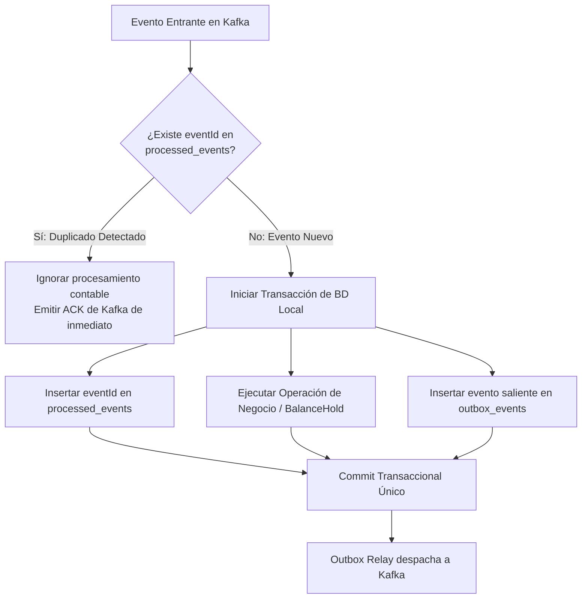

# [G11 - Subastas] 03 · Contratos de Eventos, Comunicación Inter-Microservicios e Idempotencia
## Especificación Técnica de Integración — Mercado (Tema 09) & Banco (Tema 08)

---

### 1. Canales y Estrategia de Comunicación Inter-Microservicios

Para lograr un sistema desacoplado, escalable y tolerante a fallas, se aplica una separación estricta de canales según la naturaleza de la interacción:

```mermaid
flowchart LR
    subgraph Sincronico_HTTP ["1. Canal Sincrónico (REST / JSON)"]
        direction TB
        Client[Frontend Web / Móvil] -->|1. POST /bids<br/>Idempotency-Key| GW[API Gateway - Tema 01]
        GW -->|2. Inyecta X-User-Id, X-Roles| Mercado[Mercado Core - Tema 09]
        Mercado -->|3. 202 Accepted + sseUrl| Client
    end

    subgraph Streaming_SSE ["2. Canal Streaming Unidireccional (SSE)"]
        direction TB
        Client -.->|GET /stream/auctions/{id}| Mercado
        Mercado -.->|push: BID_ACCEPTED, OUTBID, CLOSED| Client
    end

    subgraph Asincronico_Kafka ["3. Canal Asincrónico (Apache Kafka)"]
        direction TB
        Mercado -->|Tópico: bank.holds.commands| Kafka[(Kafka Cluster)]
        Kafka -->|Consumer Group: banco-holds-group| Banco[Banco Ledger - Tema 08]
        Banco -->|Tópico: bank.holds.events| Kafka
        Kafka -->|Consumer Group: mercado-subastas-group| Mercado
        Kafka -->|Consumer Group: notificaciones-group| Notif[Notificaciones - Tema 11]
    end
```

#### Reglas de Comunicación:
1. **Inbound Cliente → Mercado:** Exclusivamente sincrónico vía **API Gateway (Tema 01)**. Retorna `202 Accepted` de inmediato con un identificador de seguimiento `bidId` y una URL de Server-Sent Events (`sseUrl`). Nunca bloquea la conexión HTTP del usuario esperando confirmaciones de base de datos de Banco.
2. **Streaming Mercado → Cliente:** Server-Sent Events (SSE) para feedback en tiempo real al navegador o dispositivo móvil del alumno (notificación de oferta aceptada, oferta superada o resultado del cierre).
3. **Coreografía Backend → Backend:** Exclusivamente asincrónica mediante **Apache Kafka**. Los microservicios nunca se invocan directamente por HTTP entre sí en el camino crítico de la subasta, evitando dependencias en cascada y garantizando resiliencia si algún servicio se reinicia.
4. **Estrategia de Particionamiento en Kafka:**
   * **Tópico `bank.holds.commands`:** `partitionKey = auctionId`. Esto garantiza que todas las operaciones y pujas de una misma subasta viajen a la misma partición y sean consumidas en estricto orden cronológico (FIFO), eliminando condiciones de carrera de red.

---

### 2. Doctrina de Idempotencia en Todos los Niveles

Dado que Kafka provee semántica de entrega **At-Least-Once (al menos una vez)**, es matemáticamente inevitable que ocurran reentregas de mensajes ante reconexiones de red o rebalances de particiones. Para garantizar que **ningún alumno pague dos veces ni se dupliquen holds**, se implementa una estrategia de idempotencia en tres capas:



#### 2.1 Clave de Idempotencia Natural (`commandId` / `eventId`)
Para cada puja o incremento, Mercado genera un identificador determinístico irrepetible:
$$\text{commandId} = \text{SHA-256}(\text{auctionId} + \text{studentId} + \text{bidSequenceNumber})$$
Si el cliente móvil envía dos veces el formulario por doble clic o pérdida de paquetes 4G, el Gateway y Mercado reciben la misma `X-Idempotency-Key`, devolviendo la respuesta cacheada sin generar una segunda solicitud.

#### 2.2 Tabla de Deduplicación en Banco (`processed_commands`)
Banco mantiene una tabla con índice único:
```sql
CREATE TABLE processed_commands (
    command_id VARCHAR(64) PRIMARY KEY,
    producer_service VARCHAR(32) NOT NULL,
    command_type VARCHAR(64) NOT NULL,
    processed_at TIMESTAMP WITH TIME ZONE DEFAULT CURRENT_TIMESTAMP,
    response_payload JSONB
);
```
Si un comando duplicado llega al `HoldEventListener`, Banco verifica la existencia de `command_id`: si existe, omite la mutación contable y, si corresponde, re-emite el evento previo desde su outbox.

#### 2.3 Bloqueo Optimista en Mercado (`@Version`)
La subasta cuenta con control de versión concurrente:
```java
@Entity
@Table(name = "market_auction")
public class MarketAuction {
    @Id
    private UUID id;
    
    @Version
    private Long version;
    
    @Enumerated(EnumType.STRING)
    private AuctionStatus status; // OPEN, CLOSING_IN_PROGRESS, CLOSED
    // ...
}
```
Esto impide que dos instancias concurrentes del programador de tareas o dos peticiones simultáneas modifiquen el estado de la subasta al mismo tiempo.

---

### 3. Envoltura Estándar Obligatoria (Envelope JSON)

Todos los eventos y comandos que circulan por Apache Kafka utilizan la estructura canónica oficial de 5 campos del ecosistema de Aula Quest:

```json
{
  "eventId": "UUIDv4",
  "eventType": "String",
  "timestamp": "ISO-8601 UTC",
  "producer": "String",
  "payload": { }
}
```

---

### 4. Especificación Completa de Contratos de Eventos y Comandos

#### 4.1 `HOLD_CREATE_REQUESTED` (Mercado → Kafka → Banco)
* **Tópico:** `bank.holds.commands`
* **Emisor:** `tema-09-mercado`
* **Receptor:** `tema-08-banco` (`groupId: banco-holds-group`)
* **Propósito:** Solicitar el bloqueo contable inicial de monedas para respaldar la primera oferta de un alumno.
* **Payload JSON:**
```json
{
  "eventId": "a1b2c3d4-e5f6-7a8b-9c0d-1e2f3a4b5c6d",
  "eventType": "HOLD_CREATE_REQUESTED",
  "timestamp": "2026-09-12T18:00:00.120Z",
  "producer": "tema-09-mercado",
  "payload": {
    "commandId": "cmd-auct-8821-usr-104-seq-1",
    "auctionId": "auct-8821",
    "studentId": "usr-104",
    "accountId": "acc-usr-104-prog4",
    "amount": 1200.00,
    "currency": "GOLD_COIN",
    "orderType": "AUCTION_BID",
    "ttlSeconds": 86400,
    "graceBufferSeconds": 1800
  }
}
```

---

#### 4.2 `HOLD_CREATED` (Banco → Kafka → Mercado)
* **Tópico:** `bank.holds.events`
* **Emisor:** `tema-08-banco`
* **Receptor:** `tema-09-mercado` (`groupId: mercado-holds-group`)
* **Propósito:** Confirmar que las monedas fueron bloqueadas exitosamente en el ledger del alumno.
* **Payload JSON:**
```json
{
  "eventId": "b2c3d4e5-f6a7-8b9c-0d1e-2f3a4b5c6d7e",
  "eventType": "HOLD_CREATED",
  "timestamp": "2026-09-12T18:00:00.350Z",
  "producer": "tema-08-banco",
  "payload": {
    "commandId": "cmd-auct-8821-usr-104-seq-1",
    "holdId": "hld-99401",
    "auctionId": "auct-8821",
    "studentId": "usr-104",
    "amount": 1200.00,
    "status": "PENDING",
    "expiresAt": "2026-09-13T18:30:00.000Z"
  }
}
```

---

#### 4.3 `HOLD_INCREASE_REQUESTED` (Mercado → Kafka → Banco)
* **Tópico:** `bank.holds.commands`
* **Emisor:** `tema-09-mercado`
* **Receptor:** `tema-08-banco`
* **Propósito:** El alumno incrementa su puja previa en la misma subasta; se incrementa el hold existente.
* **Payload JSON:**
```json
{
  "eventId": "c3d4e5f6-a7b8-9c0d-1e2f-3a4b5c6d7e8f",
  "eventType": "HOLD_INCREASE_REQUESTED",
  "timestamp": "2026-09-12T19:15:22.010Z",
  "producer": "tema-09-mercado",
  "payload": {
    "commandId": "cmd-auct-8821-usr-104-seq-2",
    "holdId": "hld-99401",
    "auctionId": "auct-8821",
    "studentId": "usr-104",
    "currentAmount": 1200.00,
    "newTotalAmount": 1500.00,
    "incrementalAmount": 300.00
  }
}
```

---

#### 4.4 `HOLD_INCREASED` (Banco → Kafka → Mercado)
* **Tópico:** `bank.holds.events`
* **Emisor:** `tema-08-banco`
* **Receptor:** `tema-09-mercado`
* **Propósito:** Banco confirma que la cuenta disponía de las 300 monedas adicionales y actualizó el hold.
* **Payload JSON:**
```json
{
  "eventId": "d4e5f6a7-b8c9-0d1e-2f3a-4b5c6d7e8f9a",
  "eventType": "HOLD_INCREASED",
  "timestamp": "2026-09-12T19:15:22.215Z",
  "producer": "tema-08-banco",
  "payload": {
    "commandId": "cmd-auct-8821-usr-104-seq-2",
    "holdId": "hld-99401",
    "auctionId": "auct-8821",
    "studentId": "usr-104",
    "newTotalAmount": 1500.00,
    "status": "PENDING"
  }
}
```

---

#### 4.5 `HOLD_CONFIRM_REQUESTED` (Mercado → Kafka → Banco)
* **Tópico:** `bank.holds.commands`
* **Emisor:** `tema-09-mercado`
* **Receptor:** `tema-08-banco`
* **Propósito:** Confirmar definitivamente el cobro de la postura ganadora tras el martillazo de la subasta.
* **Payload JSON:**
```json
{
  "eventId": "e5f6a7b8-c9d0-1e2f-3a4b-5c6d7e8f9a0b",
  "eventType": "HOLD_CONFIRM_REQUESTED",
  "timestamp": "2026-09-13T18:00:01.050Z",
  "producer": "tema-09-mercado",
  "payload": {
    "commandId": "cmd-auct-8821-settle-winner",
    "holdId": "hld-99401",
    "auctionId": "auct-8821",
    "winnerStudentId": "usr-104",
    "confirmedAmount": 1500.00,
    "description": "LIQUIDACION_SUBASTA_ITEM_SWORD_OF_VALOR"
  }
}
```

---

#### 4.6 `HOLD_CONFIRMED` (Banco → Kafka → Mercado)
* **Tópico:** `bank.holds.events`
* **Emisor:** `tema-08-banco`
* **Receptor:** `tema-09-mercado`
* **Propósito:** Banco informa que el débito contable definitivo fue asentado en el Ledger bajo un asiento formal.
* **Payload JSON:**
```json
{
  "eventId": "f6a7b8c9-d0e1-2f3a-4b5c-6d7e8f9a0b1c",
  "eventType": "HOLD_CONFIRMED",
  "timestamp": "2026-09-13T18:00:01.320Z",
  "producer": "tema-08-banco",
  "payload": {
    "commandId": "cmd-auct-8821-settle-winner",
    "holdId": "hld-99401",
    "auctionId": "auct-8821",
    "studentId": "usr-104",
    "debitedAmount": 1500.00,
    "ledgerEntryId": "ledg-tx-774102",
    "status": "COMMITTED"
  }
}
```

---

#### 4.7 `HOLD_RELEASE_REQUESTED` (Mercado → Kafka → Banco)
* **Tópico:** `bank.holds.commands`
* **Emisor:** `tema-09-mercado`
* **Receptor:** `tema-08-banco`
* **Propósito:** Liberar íntegramente las monedas retenidas a un participante perdedor (o a todos si se cancela).
* **Payload JSON:**
```json
{
  "eventId": "07b8c9d0-e1f2-3a4b-5c6d-7e8f9a0b1c2d",
  "eventType": "HOLD_RELEASE_REQUESTED",
  "timestamp": "2026-09-13T18:00:02.100Z",
  "producer": "tema-09-mercado",
  "payload": {
    "commandId": "cmd-auct-8821-release-usr-209",
    "holdId": "hld-99388",
    "auctionId": "auct-8821",
    "studentId": "usr-209",
    "releaseReason": "AUCTION_REFUND"
  }
}
```

---

#### 4.8 `HOLD_RELEASED` (Banco → Kafka → Mercado)
* **Tópico:** `bank.holds.events`
* **Emisor:** `tema-08-banco`
* **Receptor:** `tema-09-mercado`
* **Propósito:** Banco confirma que el saldo retenido fue reintegrado intacto al `available_balance` del alumno.
* **Payload JSON:**
```json
{
  "eventId": "18c9d0e1-f2a3-4b5c-6d7e-8f9a0b1c2d3e",
  "eventType": "HOLD_RELEASED",
  "timestamp": "2026-09-13T18:00:02.310Z",
  "producer": "tema-08-banco",
  "payload": {
    "commandId": "cmd-auct-8821-release-usr-209",
    "holdId": "hld-99388",
    "auctionId": "auct-8821",
    "studentId": "usr-209",
    "releasedAmount": 1400.00,
    "status": "RELEASED",
    "releaseReason": "AUCTION_REFUND"
  }
}
```

---

#### 4.9 `SUBASTA_ADJUDICADA` (Mercado → Kafka → Notificaciones / Backoffice)
* **Tópico:** `mercado.subastas`
* **Emisor:** `tema-09-mercado`
* **Receptores:** `tema-11-notificaciones`, `tema-12-backoffice`, `tema-02-cursos`
* **Propósito:** Hecho consumado de cierre de subasta con ganador formal.
* **Payload JSON:**
```json
{
  "eventId": "29d0e1f2-a3b4-5c6d-7e8f-9a0b1c2d3e4f",
  "eventType": "SUBASTA_ADJUDICADA",
  "timestamp": "2026-09-13T18:00:03.000Z",
  "producer": "tema-09-mercado",
  "payload": {
    "auctionId": "auct-8821",
    "courseId": "CURSO_PROG4_2026",
    "itemId": "item-sword-valor",
    "winnerStudentId": "usr-104",
    "winningBidAmount": 1500.00,
    "totalBidsCount": 14,
    "participantsCount": 5,
    "closedAt": "2026-09-13T18:00:00.000Z"
  }
}
```

---

#### 4.10 `OFERTA_SUPERADA` (Mercado → SSE / Notificaciones)
* **Tópico:** `notificaciones.alertas` / Canal SSE
* **Emisor:** `tema-09-mercado`
* **Receptor:** `tema-11-notificaciones` / Web & Móvil
* **Propósito:** Alertar al alumno que acaba de perder el liderazgo para que pueda ingresar a contraofertar.
* **Payload JSON:**
```json
{
  "eventId": "3ae1f2a3-b4c5-6d7e-8f9a-0b1c2d3e4f5a",
  "eventType": "OFERTA_SUPERADA",
  "timestamp": "2026-09-12T19:15:23.000Z",
  "producer": "tema-09-mercado",
  "payload": {
    "auctionId": "auct-8821",
    "outbidStudentId": "usr-209",
    "previousBid": 1400.00,
    "newHighestBid": 1500.00,
    "timeRemainingSeconds": 82800,
    "ctaUrl": "/market/auctions/auct-8821"
  }
}
```
