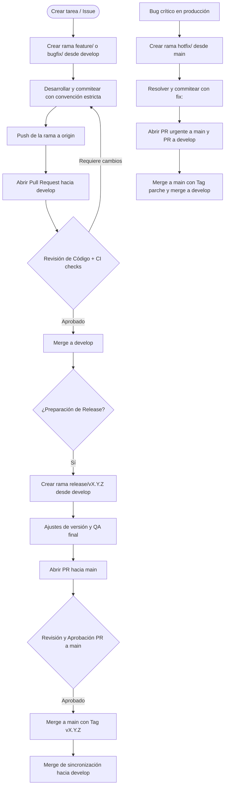
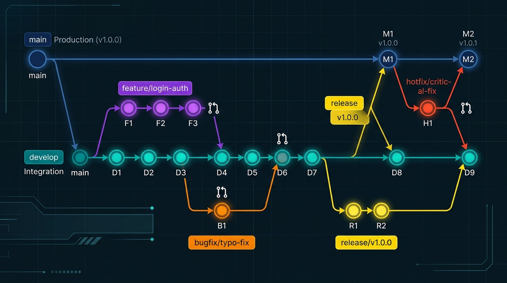

# Guía de Flujo de Trabajo (Git Workflow) y Estándares de Repositorio

Este documento define la metodología de trabajo, estrategia de ramificación (branching), políticas de integración continua y la convención estricta de commits para el repositorio principal del proyecto.

---

## 📌 1. Reglas Fundamentales y Filosofía del Repositorio

Para garantizar la estabilidad, trazabilidad y calidad del código en producción y en entornos de prueba, se establecen las siguientes reglas obligatorias:

1. **La rama `main` refleja fielmente el estado de producción**:
   - Está estrictamente protegida contra *push* directo (`git push origin main` está bloqueado).
   - **La única forma de incorporar cambios a `main` es mediante una Pull Request (PR)** aprobada y con todas las pruebas y validaciones automatizadas superadas.
2. **La rama `develop` es el núcleo de desarrollo e integración**:
   - Todos los desarrollos activos, nuevas funcionalidades y correcciones no críticas se integran en `develop`.
   - Ningún desarrollador debe realizar *push* directo a `develop`; todo cambio se somete a revisión vía Pull Request desde su respectiva rama de trabajo.
3. **Desarrollo aislado en ramas específicas**:
   - Cada tarea, historia de usuario o corrección se trabaja en una rama aislada creada con el prefijo y nomenclatura oficial.
4. **Commits atómicos y estandarizados**:
   - Cada commit debe representar una unidad lógica de cambio y cumplir con la convención establecida.

---

## 🌿 2. Estrategia y Nomenclatura de Ramas

Las ramas deben crearse siguiendo una taxonomía clara en minúsculas, utilizando guiones medios (`kebab-case`) para separar palabras después del prefijo.

```
<prefijo>/<descripcion-kebab-case>
```

### 2.1. Ramas Principales (Long-lived Branches)

* **`main`**: 
  - Contiene el código fuente que se encuentra actualmente desplegado en producción.
  - Cada merge hacia `main` representa una versión liberada y debe ser etiquetado (*git tag*) con la versión correspondiente (ej. `v1.0.0`).
* **`develop`**: 
  - Rama de integración continua. Acumula las nuevas características, mejoras y correcciones probadas que formarán parte del próximo lanzamiento (*release*).

---

### 2.2. Ramas de Características (`feature/`)

Se utilizan para desarrollar nuevas funcionalidades, componentes o cambios planificados en el código. Se originan a partir de `develop` y, una vez finalizadas y probadas, se reintegran a `develop` mediante Pull Request.

* **Origen**: `develop`
* **Destino (PR)**: `develop`
* **Ejemplos**:
  - `feature/login-authentication`
  - `feature/new-ui-layout`
  - `feature/add-user-profile`
  - `feature/catalogo-consumibles`
  - `feature/reserva-saldo-banco`

---

### 2.3. Ramas de Corrección de Errores (`bugfix/`)

Destinadas a corregir incidencias o defectos detectados en la rama `develop` o durante las etapas de pruebas e integración (que no impactan urgentemente a producción).

* **Origen**: `develop`
* **Destino (PR)**: `develop`
* **Ejemplos**:
  - `bugfix/login-error`
  - `bugfix/missing-icons`
  - `bugfix/404-page-not-found`
  - `bugfix/desfase-subasta-timer`

---

### 2.4. Ramas de Lanzamiento (`release/`)

Utilizadas para preparar, estabilizar y validar una nueva versión del sistema antes de su puesta en producción. Permiten congelar características, ajustar metadatos, actualizar números de versión y corregir detalles menores sin interferir con el desarrollo continuo en `develop`.

* **Origen**: `develop`
* **Destino (PR)**: Se mergea hacia `main` (con tag de versión) y de vuelta hacia `develop` para propagar cualquier ajuste final.
* **Ejemplos**:
  - `release/v1.0.0`
  - `release/v1.2.0`
  - `release/v1.2.1`

---

### 2.5. Ramas de Mantenimiento o Parches Urgentes (`hotfix/`)

Diseñadas para atender errores críticos detectados directamente en producción que requieren una resolución inmediata sin esperar al ciclo normal de desarrollo.

* **Origen**: `main`
* **Destino (PR)**: Se mergea hacia `main` (mediante PR urgente con tag de parche) y simultáneamente hacia `develop` (para asegurar que el error no reaparezca en futuros despliegues).
* **Ejemplos**:
  - `hotfix/critical-login-issue`
  - `hotfix/payment-processing-error`
  - `hotfix/token-jwt-expiration-bug`

---

### 2.6. Ramas Personales o de Experimentación

Utilizadas por desarrolladores para pruebas de concepto, spikes técnicos o prototipado de librerías/arquitecturas que no garantizan su incorporación al producto final.

* **Prefijos permitidos**: `experiment/<tema>` o `<nombre-desarrollador>/<tema>`
* **Destino**: Ramas de uso temporal. Si el experimento tiene éxito y se formaliza, se migra a una rama `feature/`.
* **Ejemplos**:
  - `experiment/new-framework-test`
  - `experiment/kafka-reactive-client`
  - `john/prototype-new-feature`
  - `valen/spike-websockets`

---

## 📝 3. Convención y Nomenclatura de Commits

Todos los mensajes de commit deben redactarse en español o con el formato estándar convencional:

```
<tipo>(<alcance_opcional>): <descripción clara y concisa>
```

> **Ejemplo**: `feat(auth): implementar inicio de sesión con JWT y refresh token`

### Catálogo Completo de Tipos de Commit

| Tipo | Impacto SemVer | Descripción | ¿Afecta código de producción? |
| :--- | :---: | :--- | :---: |
| **`feat`** | **MINOR** | Incorpora una nueva funcionalidad o recurso al sistema. | Sí |
| **`fix`** | **PATCH** | Soluciona un problema o defecto en el código (*bug fix*). | Sí |
| **`docs`** | N/A | Cambios exclusivamente en documentación (README, especificaciones, guías). | No |
| **`test`** | N/A | Creación, modificación o eliminación de pruebas unitarias o de integración. | No |
| **`build`** | N/A | Modificaciones en archivos de compilación, empaquetado o dependencias (`pom.xml`, `package.json`, Dockerfile). | No directo |
| **`perf`** | **PATCH** | Cambios de código orientados a optimizar el rendimiento y la eficiencia. | Sí |
| **`style`** | N/A | Ajustes de formato, espaciado, punto y coma, reglas de linter, sin cambio funcional. | No |
| **`refactor`** | N/A | Reestructuración de código que no altera su comportamiento externo ni añade funcionalidades. | Sí |
| **`chore`** | N/A | Tareas auxiliares de mantenimiento, configuración de herramientas, ajustes de `.gitignore`. | No |
| **`ci`** | N/A | Modificaciones en flujos de integración continua o despliegue (GitHub Actions, pipelines CI/CD). | No |
| **`raw`** | N/A | Modificaciones en archivos de configuración, datos semilla (*seeds*), parámetros o feature flags. | Variable |
| **`cleanup`** | N/A | Eliminación de código comentado, bloques muertos o limpieza para mejorar legibilidad y mantenibilidad. | Sí |
| **`remove`** | **MINOR / PATCH** | Eliminación deliberada de archivos, directorios o funcionalidades obsoletas y no utilizadas. | Sí |

---

### 3.1. Detalle y Ejemplos de Cada Tipo

#### 1. `feat` (Feature)
Indica que el fragmento de código está incluyendo un nuevo recurso o funcionalidad. Incrementa la versión **MINOR** en el versionado semántico (`0.X.0`).
- `feat(subastas): habilitar soporte para pujas en tiempo real vía WebSockets`
- `feat(mercado): agregar filtro por categoría en catálogo de items`

#### 2. `fix` (Bug Fix)
Indica que el código soluciona un defecto o comportamiento anómalo. Incrementa la versión **PATCH** en el versionado semántico (`0.0.X`).
- `fix(banco): corregir cálculo de comisión en transferencias concurrentes`
- `fix(auth): solucionar redirección errónea al caducar la sesión`

#### 3. `docs` (Documentación)
Cambios exclusivos en la documentación del repositorio. No incluye alteraciones de código fuente.
- `docs(api): documentar contratos de eventos de Kafka para el módulo Banco`
- `docs(workflow): actualizar guía de ramas y políticas de pull request`

#### 4. `test` (Pruebas)
Alteraciones en la suite de pruebas (añadir, refactorizar o eliminar pruebas unitarias, de integración o e2e). No altera lógica de producción.
- `test(subastas): agregar pruebas unitarias para validación de saldo mínimo`
- `test(usuarios): añadir caso de prueba para credenciales duplicadas`

#### 5. `build` (Compilación y Dependencias)
Modificaciones en sistemas de empaquetado, scripts de construcción o actualización de dependencias de terceros.
- `build(deps): actualizar Spring Boot a versión 3.3.0`
- `build(maven): configurar plugin de empaquetado de imágenes OCI`

#### 6. `perf` (Rendimiento)
Cambios en el código orientados a maximizar la velocidad de respuesta, reducir consumo de CPU o memoria, o mejorar queries.
- `perf(db): indexar columna user_id en tabla de transacciones de subastas`
- `perf(cache): implementar Redis para lectura de catálogo frecuente`

#### 7. `style` (Formato y Estilo)
Cambios cosméticos de código que no modifican en absoluto la lógica: espacios en blanco, punto y coma, indentación, reglas de linting.
- `style(gateway): aplicar reglas de Checkstyle y formatear indentación`
- `style: eliminar trailing spaces en controladores REST`

#### 8. `refactor` (Refactorización)
Cambios de diseño o estructura interna de código que no modifican la funcionalidad externa (por ejemplo, extraer una clase, simplificar un método, aplicar un patrón de diseño).
- `refactor(banco): extraer lógica de reservas de saldo a un servicio independiente`
- `refactor: reemplazar bucle anidado por Streams de Java`

#### 9. `chore` (Mantenimiento)
Tareas rutinarias de mantenimiento que no tocan código de producción ni pruebas (actualización de `.gitignore`, licencias, metadatos).
- `chore: ignorar carpeta de reportes temporales en .gitignore`
- `chore(repo): actualizar configuraciones de entorno local`

#### 10. `ci` (Integración Continua)
Cambios relacionados con pipelines de integración y despliegue continuo (workflows de GitHub Actions, Dockerfiles de CI, runners).
- `ci: agregar paso de análisis estático con SonarCloud en pull requests`
- `ci: configurar ejecución de pruebas automatizadas al pushear a develop`

#### 11. `raw` (Archivos de Configuración y Datos)
Cambios vinculados a datos brutos, seeds de base de datos, parámetros iniciales de negocio o archivos de properties/YAML.
- `raw(seeds): cargar catálogo inicial de 25 consumibles para el servidor de pruebas`
- `raw(config): ajustar umbral de timeout de Kafka a 5000ms`

#### 12. `cleanup` (Limpieza de Código)
Remoción de código comentado antiguo, console logs, código no alcanzable o fragmentos redundantes para pulir la calidad del repositorio.
- `cleanup(controlador): remover endpoints de depuración y código comentado`
- `cleanup: eliminar métodos no utilizados tras la migración a la v2`

#### 13. `remove` (Eliminación de Elementos Obsoletos)
Exclusión explícita de archivos, directorios completos, scripts deprecados o endpoints dados de baja, reduciendo la complejidad del proyecto.
- `remove: eliminar archivos HTML de maquetas obsoletas`
- `remove(legacy): descontinuar cliente SOAP no utilizado`

---

## 🔄 4. Ciclo de Vida del Trabajo Paso a Paso



### 4.1. Paso 1: Partir siempre desde la última versión de `develop`
```bash
git checkout develop
git pull origin develop
git checkout -b feature/login-authentication
```

### 4.2. Paso 2: Desarrollar y realizar commits atómicos
```bash
git add src/auth/
git commit -m "feat(auth): implementar validación de credenciales con BCrypt"
```

### 4.3. Paso 3: Publicar la rama y abrir Pull Request hacia `develop`
```bash
git push -u origin feature/login-authentication
```
- Desde la plataforma (GitHub) se crea la **Pull Request** apuntando a `develop` como rama base.
- Se describe el objetivo del cambio, pruebas realizadas e issues asociados.

### 4.4. Paso 4: Revisión de Código (Code Review)
- Al menos un revisor debe aprobar el cambio.
- Las suites automatizadas de CI deben finalizar en verde.

### 4.5. Paso 5: Preparación de Release y Paso a `main`
- Cuando `develop` contiene las características planificadas para un release, se genera la rama `release/vX.Y.Z`.
- Se abre la **Pull Request hacia `main`**.
- Tras la aprobación, se efectúa el merge hacia `main` y se genera el tag de versión:
```bash
git checkout main
git pull origin main
git tag -a v1.0.0 -m "Release version 1.0.0"
git push origin v1.0.0
```
- Se sincroniza `develop` para que contenga cualquier corrección realizada en la rama de release.

---

## 📊 5. Diagrama Visual del Flujo de Trabajo

El siguiente esquema representa la interacción entre las ramas a lo largo del tiempo:



### Resumen de interacción de ramas:
1. **`main`**: Solo recibe merges de `release/*` y `hotfix/*` mediante Pull Request formal.
2. **`develop`**: Recibe merges continuos de `feature/*`, `bugfix/*`, y sincronizaciones de `release/*` y `hotfix/*`.
3. **`feature/*`**: Salen de `develop` y vuelven a `develop`.
4. **`bugfix/*`**: Salen de `develop` y vuelven a `develop`.
5. **`release/*`**: Salen de `develop`, se bifurcan para pruebas finales y se integran en `main` y `develop`.
6. **`hotfix/*`**: Salen de `main` ante emergencias críticas y se integran tanto en `main` como en `develop`.
