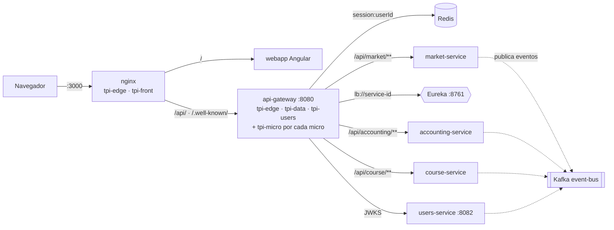
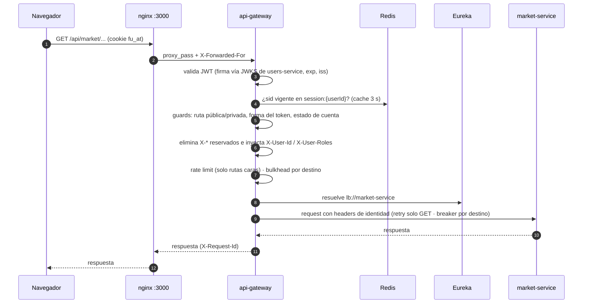

# Cómo viaja una petición por la plataforma

> **Estado:** verificado contra `tpi-api-gateway` (`docs/GATEWAY-REFERENCE.md` y `application.yml`, release 1.0.1) y `tpi-system-compose` (`docker-compose.yml`, `nginx/`, `registry/`) al 29/09/2026.
> Reemplaza a los diagramas de Archify anteriores (`flujo-de-un-pedido`, `flujo-de-una-entrega`, `redes-docker-microservicios`), cuyo mapa de puertos y redes ya no coincide con el sistema real (ver §6).

## 1. Idea en una línea

El navegador solo habla con **nginx** (`:3000`). Todo `/api/**` entra al **API Gateway**, que valida la identidad y elige el microservicio por **Eureka**. Los micros no publican puertos y **no comparten red entre sí**: para llamarse usan el Gateway. Lo asincrónico va por **Kafka**.

## 2. Topología real

- **Puertos publicados al host** (solo loopback): nginx `3000`, Eureka `8761`, Kafka `9094`, Prometheus `9090`, Grafana `3001`. El Gateway y los micros usan `expose:`, nunca `ports:`. Esto es lo que permite que los micros confíen en los headers `X-*`: nada llega a ellos sin pasar por el Gateway.
- **Redes**: `tpi-edge` (nginx + gateway), `tpi-front`, `tpi-data`, `tpi-users`, `tpi-monitoring` y una red `tpi-<micro>` por cada micro, que comparte solo con el Gateway, Eureka, Prometheus y el bus. Dos micros distintos no tienen red en común, así que no pueden llamarse directo aunque quisieran.
- **Registro de micros:** `tpi-system-compose/registry/services.yml`. Que un micro se registre en Eureka **no lo expone**: el Gateway lo rutea recién cuando está en `GATEWAY_ALLOWLIST` (sin allowlist, 404).

## 3. Recorrido de una petición autenticada

Ejemplo: un alumno pide `GET /api/market/...`.

Orden real de la cadena, según `GATEWAY-REFERENCE.md` §2: Security (JWT) → `SessionGuard` → `CorrelationIdFilter` → `LoggingFilter` → `PublicRouteGuard` → `PrivateRouteGuard` → `AccountStateGuard` → `ServiceAudienceFilter` → `IdentityPropagationFilter` → `RateLimitFilter` → `BulkheadFilter` → `Retry` → `CircuitBreaker`.

Qué implica para Mercado:

| Tema | Regla |
|---|---|
| Ruta | `/api/market/**`; el path **no se reescribe** (el micro recibe el prefijo completo). Lo público va bajo `/api/market/public/**`. |
| Identidad | El micro **no valida JWT**. Lee `X-Principal-Type`, `X-User-Id`, `X-User-Roles`. Roles y permisos se aplican en el micro (`@PreAuthorize`); el Gateway solo exige token válido. |
| Cuenta | Si la petición llegó, la cuenta está habilitada: el micro no maneja estados de cuenta. |
| Errores | Los rechazos del Gateway usan `application/problem+json` (RFC 9457): `401`, `403 invalid-audience`, `404 route-not-found`, `429`, `503` con `Retry-After`. |
| Trazas | `X-Request-Id` y `traceparent` viajan hacia el micro y se devuelven en la respuesta. |

## 4. Micro → micro (ej. Mercado → Banco)

No hay llamada directa. El micro origen obtiene un **service token** (`type: service`, `roles` con `MS`, `aud` = servicio destino) y llama **al Gateway** (`GATEWAY_URL`), que lo enruta.

- El token de servicio va en `Authorization: Bearer`; un token de persona **nunca** va en ese header (va en la cookie `fu_at`) y viceversa.
- Si el `aud` no coincide con el destino, el Gateway responde `403 invalid-audience`.
- Qué puede pedir cada micro sale del registro: `offers` (scopes que publica) y `needs` (scopes que consume) en `services.yml`. Hoy Mercado ofrece `market.catalog.read` y no declara `needs`.

El diseño objetivo de la saga de compra (reserva de monedas en Banco, acreditación en Inventario, confirmación) está en [`integracion/banco/flujo-mercado-inventario.md`](../integracion/banco/flujo-mercado-inventario.md); el estado real (síncrono y mockeado) en [`ESTADO-IMPLEMENTACION-BANCO.md`](../integracion/banco/ESTADO-IMPLEMENTACION-BANCO.md).

## 5. Lo asincrónico

Los eventos viajan por Kafka (`event-bus`), en el topic de dominio de cada equipo (`market.events`, `accounting.events`, `users.events`, …, cada uno con su `.DLT`), dentro del envelope de [`KAFKA_EVENT_STANDARD.md`](./KAFKA_EVENT_STANDARD.md). El cliente no espera por ellos. Lista de topics provisionados: ver [`README.md`](../README.md#-kafka-topics).

## 6. Qué cambió respecto de los diagramas anteriores

| Diagrama viejo | Hoy |
|---|---|
| Puertos de micros `3001…3013` | Puertos `80xx` según `services.yml` (users `8082`, course `8086`, accounting `8090`, …) |
| Gateway en `:8000` | Gateway en `:8080` (tráfico) y `:8081` (actuator) |
| Entrada `443:8443`, TLS en nginx | nginx en `127.0.0.1:3000`, sin TLS local; en el servidor, la única entrada es la tailnet |
| Dos nginx (web + reverse proxy) | Un solo nginx que sirve `/` (webapp) y proxea `/api/`, `/.well-known/`, `/grafana/` |
| Redes `edge_net`, `gateway_net`, `backend_net`, `<x>_net` | `tpi-edge`, `tpi-front`, `tpi-data`, `tpi-users`, `tpi-monitoring` y `tpi-<micro>` |
| RabbitMQ opcional | No existe: solo Kafka |
| MinIO compartido (`:9000`) | No está en la plataforma |
| 12 grupos con bases Postgres, Mongo, ClickHouse, Redis por servicio | Bases Postgres o MySQL declaradas por micro en `services.yml`; Redis lo usa el Gateway como store de sesión |
| El proxy no toca la red de backend | Se conserva: nginx no llega a los micros, solo al Gateway |
| Todos los servicios pasan por el Gateway para llamarse | Se conserva, reforzado con service tokens y `aud` |

Lo que sigue siendo válido de los diagramas viejos: un único punto de entrada, el Gateway como única puerta hacia los micros, lo sincrónico por el Gateway y lo asincrónico por el bus, y la respuesta que vuelve por el mismo camino.

## 7. Inconsistencias detectadas (a confirmar con Identidad / Plataforma)

1. **Puerto de Mercado:** `registry/services.yml` declara `market-service` en `8100` (y `llm-service` en `8084`), pero `tpi-market` arranca por defecto en `8084` (gestión `8085`).
2. **`registry/generated/micros.yml`** no incluye la red `tpi-market` ni el servicio: parece generado antes de sumar Mercado; hay que re-renderizarlo con `scripts/render-registry.sh`.
3. **`GATEWAY-REFERENCE.md`** habla de la red externa `tpi-platform` y de que nginx proxea `/dev/`; el compose actual usa `tpi-edge`/`tpi-data`/… y el nginx de `nginx/default.conf.template` no tiene `/dev/`.
4. **Timeout:** el Gateway define `3s` por defecto, pero `config/api-gateway.env` lo sube a `25s` (por debajo del `proxy_read_timeout` de 30 s de nginx).
5. **`springdoc.swagger-ui.urls`** del Gateway lista solo `users-service` y `api-gateway`; Mercado todavía no agregó su línea al desplegable de documentación.
