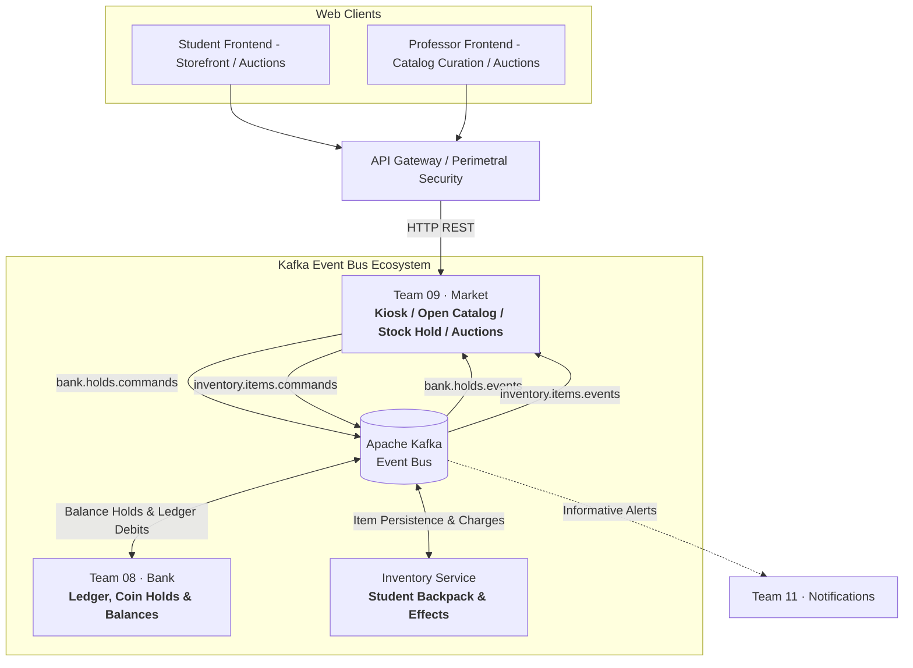
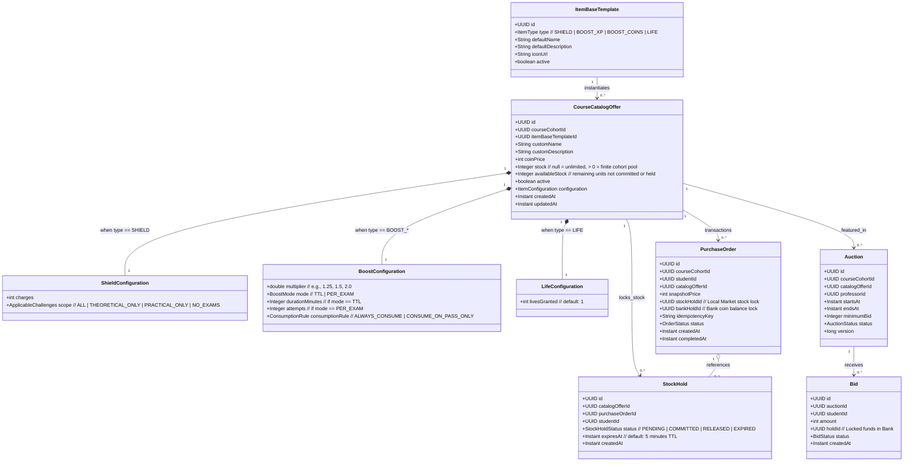
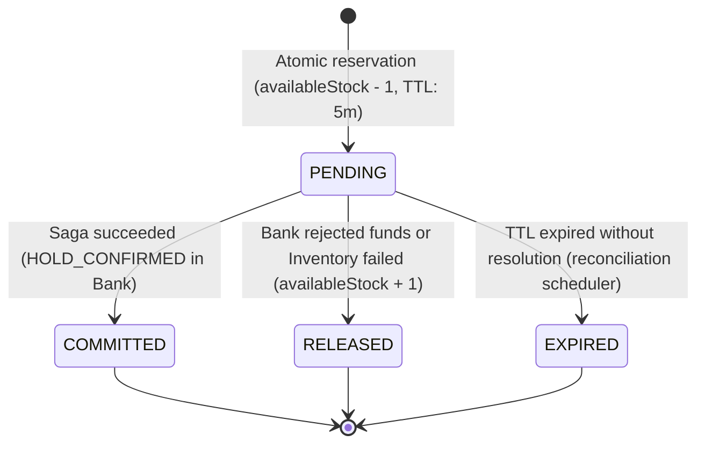
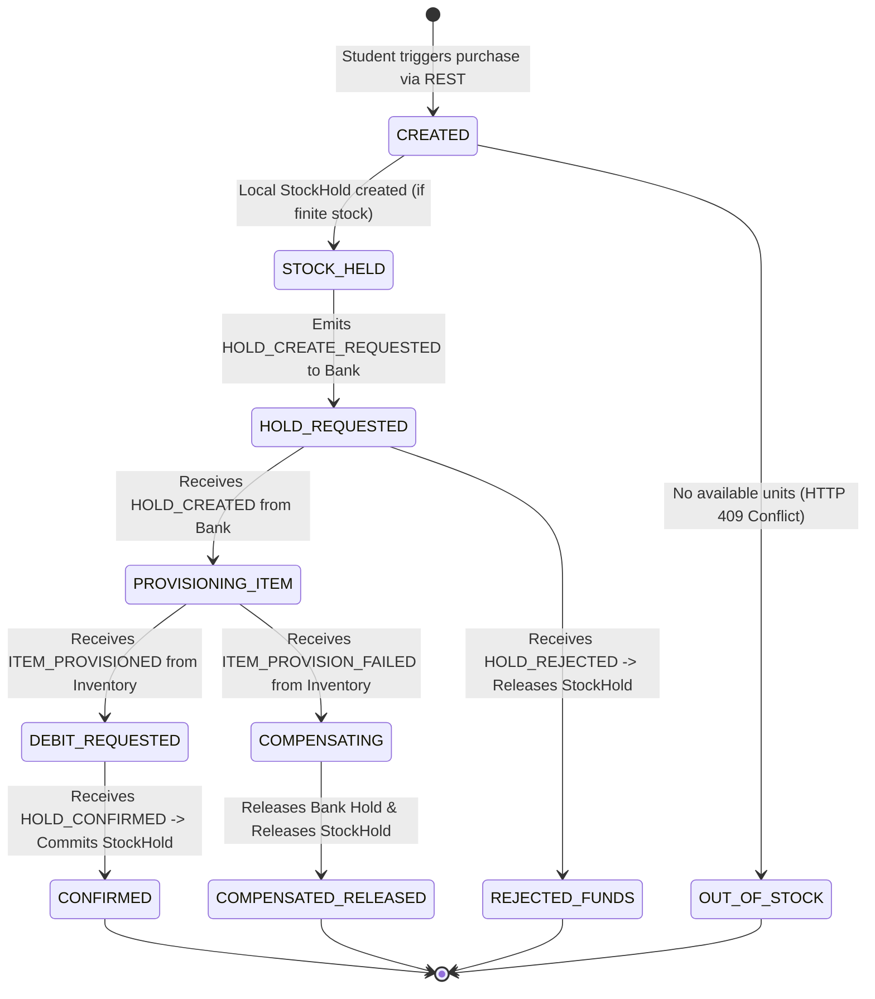
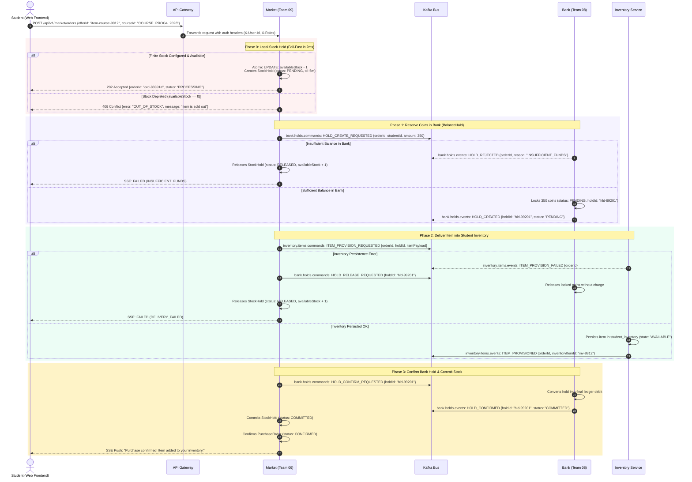
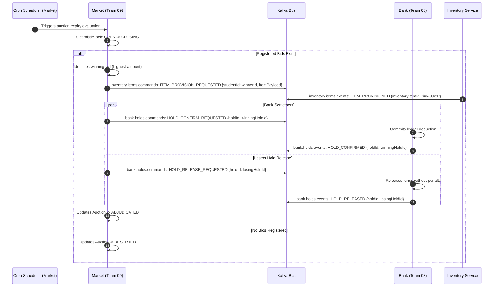

# Architectural Diagrams — Market (Team 09)
## Distributed Gamified Platform · Aula Quest (TUP UTN FRC)

---

## 1. Context Diagram: Market & External Microservices

Market acts as an orchestrating Kiosk / Storefront. In accordance with platform design, the Two-Phase Hold Saga, and the **Local Stock Hold (Fail-Fast)** pattern:
- **Market (Team 09):** Holds local product stock (`StockHold`) before touching external services, orchestrates the purchase saga, and curates the Open Catalog.
- **Bank (Team 08):** Manages coin balances, handles `BalanceHold` commands, and settles ledger debits.
- **Inventory Service:** Separate microservice managing the student backpack (`student_inventory`), active slots, charges, and runtime effect execution.

---

## 2. Market Domain Model (Open Catalog, Stock Holds & Two-Layer Architecture)

Market manages templates, cohort offerings, purchase orders, **local stock holds**, and auctions:

---

## 3. State Machines

### 3.1 Local Stock Hold State Machine (Market)

### 3.2 Purchase Order State Machine (Two-Phase Hold Saga)

---

## 4. Sequence Diagram: Direct Purchase with Dual Holds (Stock Hold + Bank Hold)

---

## 5. Sequence Diagram: Auction Closing & Asset Settlement

