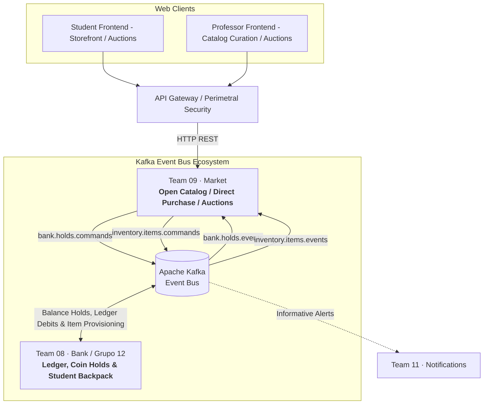
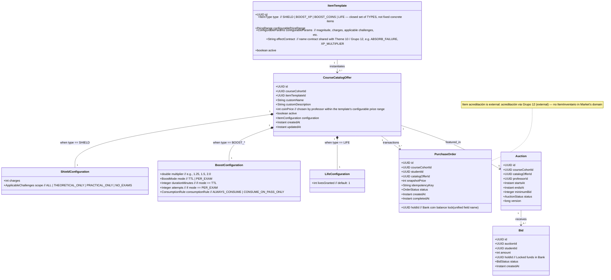
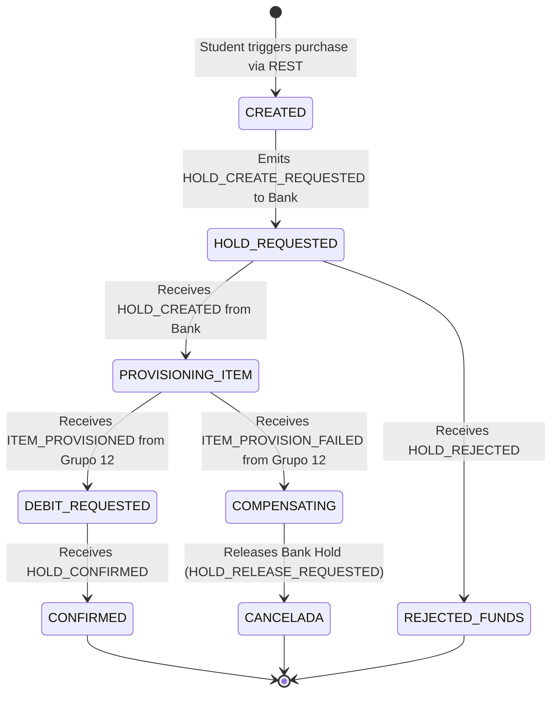
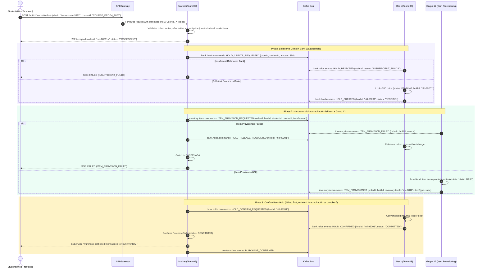
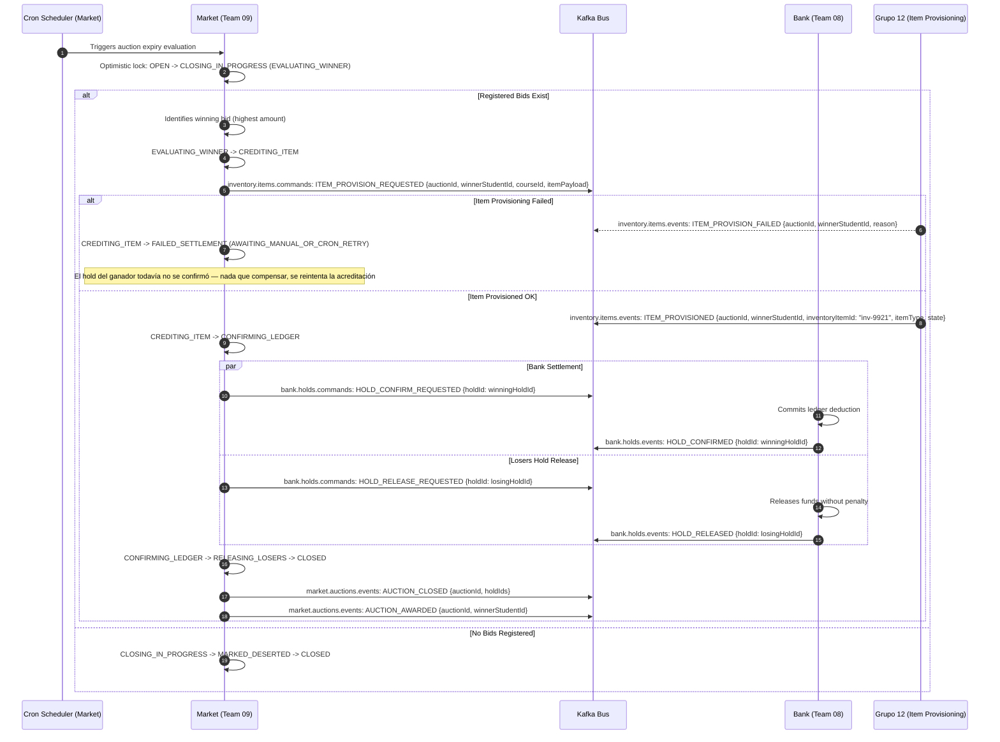

# Architectural Diagrams — Market (Team 09)
## Distributed Gamified Platform · Aula Quest (TUP UTN FRC)

---

## 1. Context Diagram: Market & External Microservices

Market acts as an orchestrating Kiosk / Storefront. In accordance with platform design and the Reserve → Provision → Confirm Saga (no local stock — decision #6: catalog offers have unlimited availability while active):
- **Market (Team 09):** Orchestrates the purchase/auction saga and curates the Open Catalog (templates with professor-configured parameters, no fixed stock).
- **Bank / Grupo 12 (Team 08):** Manages coin balances, handles `BalanceHold` commands, settles ledger debits, and — since decision #13 — also owns the student backpack (`student_inventory`), its lifecycle, and runtime effect execution. This is not a separate microservice; Grupo 12 is Bank's own Taiga team.

---

## 2. Market Domain Model (Open Catalog by Templates, No Stock)

Market manages item templates, cohort offerings, purchase orders, and auctions. There is **no local stock** (decision #6: offers have unlimited availability while active) and **no `ItemInventario`** — final item acreditación is an external contract with Grupo 12 (decision #13):

---

## 3. State Machines

### 3.1 Purchase Order State Machine (Reserve → Provision → Confirm Saga)

> Note: there is no local stock step and no "create `ItemInventario`" step — the hold is requested directly from Bank, and item acreditación is requested and corroborated against Grupo 12 before the debit is confirmed (decision #8 + #13).

---

## 4. Sequence Diagram: Direct Purchase (Reserve → Provision via Grupo 12 → Confirm)

---

## 5. Sequence Diagram: Auction Closing & Asset Settlement

