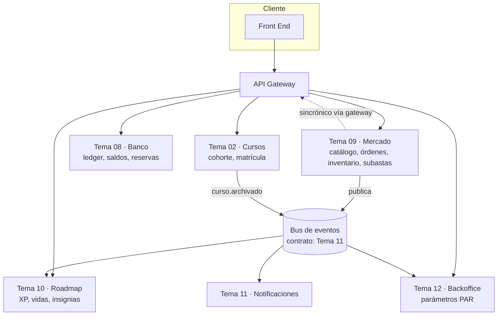
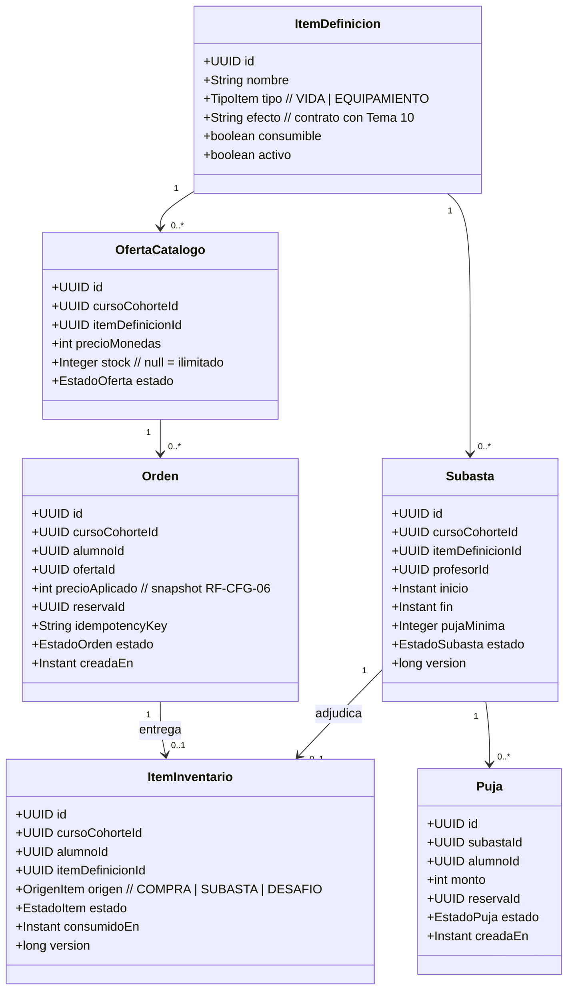
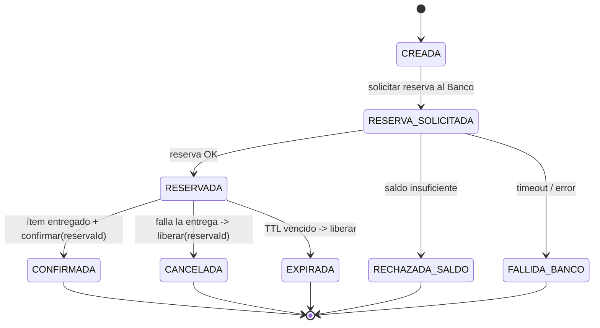
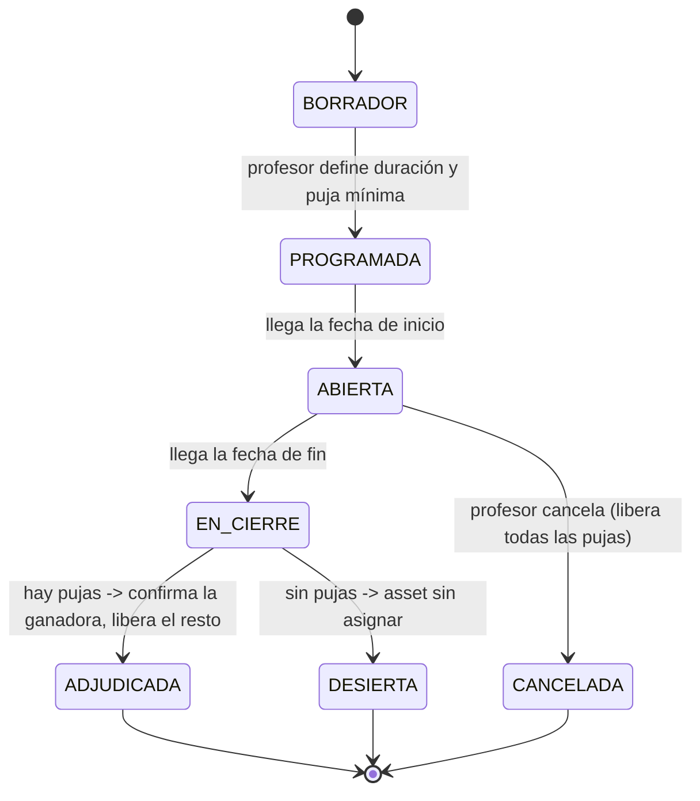
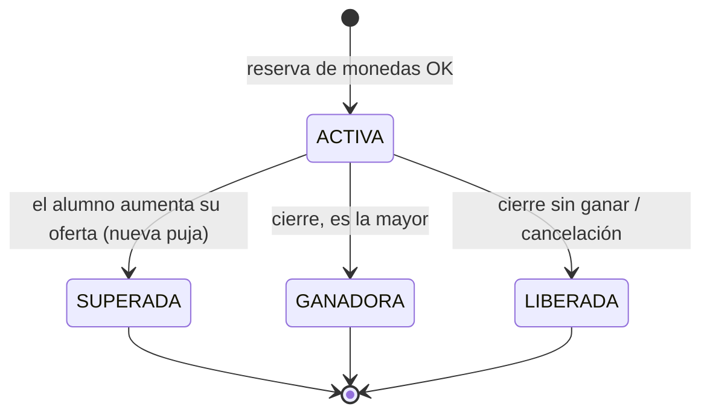
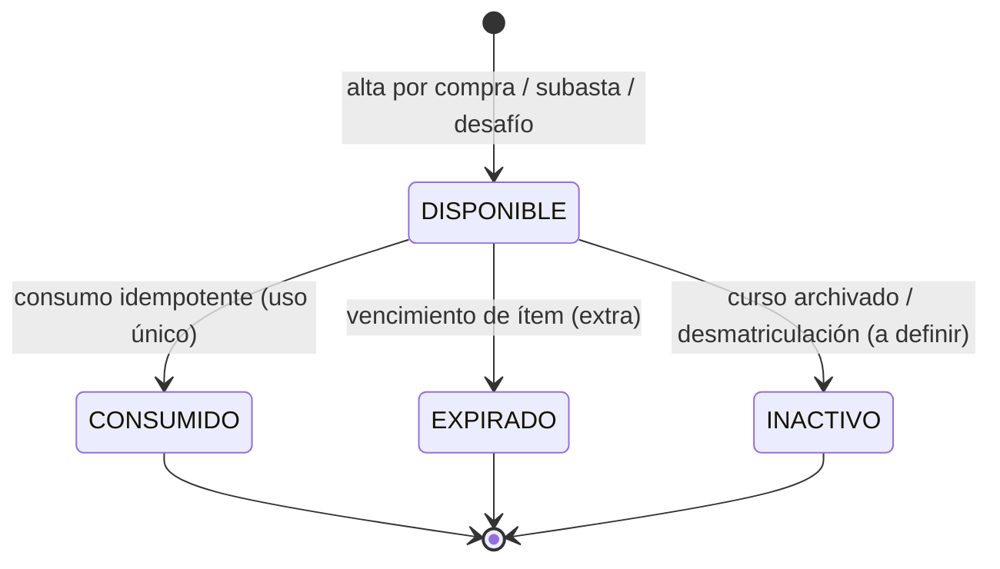
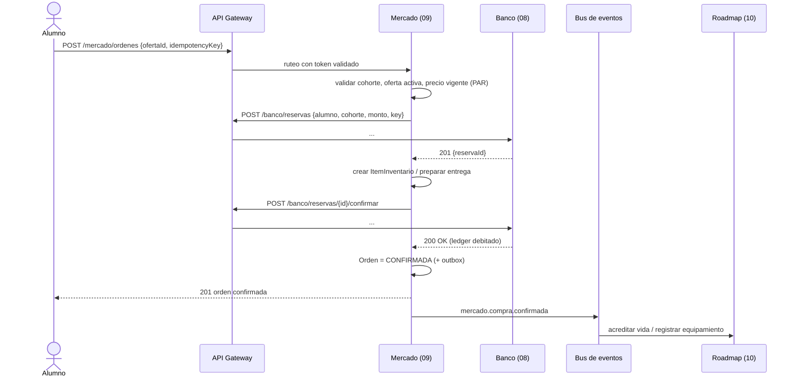
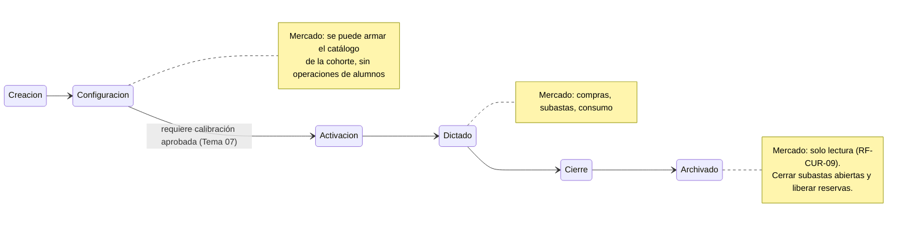

# Diagramas base — Tema 09 Mercado

Borradores en Mermaid para discutir y corregir en equipo. **No los tomen como
verdad**: la mitad del valor de hoy está en romperlos y rehacerlos juntos.

Se renderizan en GitHub, GitLab, Notion, Obsidian, VS Code (extensión Mermaid) y en
mermaid.live.

---

## 1. Contexto: el Mercado y sus vecinos



**Regla que el diagrama tiene que respetar:** el Mercado nunca llama directo a otro
microservicio ni lee su base. Sale y vuelve a entrar por el gateway.

---

## 2. Modelo de dominio (borrador)



Preguntas para la discusión:
- ¿La vida entra al inventario o va directo al Tema 10 sin instancia local?
- ¿`OfertaCatalogo` guarda el precio o lo lee siempre del Tema 12? (Sugerencia: lo lee,
  pero la `Orden` guarda el snapshot.)
- ¿Hace falta `stock`? El PRD no lo pide para compra directa.

---

## 3. Máquina de estados — Orden de compra directa



---

## 4. Máquina de estados — Subasta (RF-INT-05, RF-INT-06)



`EN_CIERRE` no está en el PRD: lo agregamos porque el cierre no es instantáneo (hay que
confirmar una reserva y liberar N). Sin ese estado intermedio, dos ejecuciones
concurrentes del cierre pueden adjudicar dos veces.

---

## 5. Máquina de estados — Puja



Decisión pendiente con el Tema 08: cuando el alumno **aumenta** su oferta, ¿se reserva
solo el delta (más eficiente, más difícil de razonar) o se libera la anterior y se
reserva el total (más simple, con una ventana en la que el alumno podría gastar esas
monedas en otro lado)?

---

## 6. Máquina de estados — Ítem de inventario (RF-REC-05)



---

## 7. Secuencia — Compra directa (camino feliz)



### Variantes que hay que dibujar también

- **Saldo insuficiente**: el Banco rechaza en el paso de reserva → orden
  `RECHAZADA_SALDO`, nada que compensar.
- **Falla la entrega después de reservar**: `liberar(reservaId)` → orden `CANCELADA`.
- **Timeout al confirmar**: reintento con la misma clave de idempotencia; si persiste,
  la reserva expira por TTL del lado del Banco y el job de reconciliación cierra la
  orden.
- **El Roadmap rechaza la vida (máximo alcanzado)**: por eso conviene validar **antes**
  de reservar, o definir una compensación explícita (devolver monedas + notificar).

---

## 8. Secuencia — Cierre de subasta

```mermaid
sequenceDiagram
    participant S as Scheduler (Mercado)
    participant M as Mercado (09)
    participant GW as API Gateway
    participant B as Banco (08)
    participant BUS as Bus de eventos

    S->>M: cerrar subastas con fin <= ahora
    M->>M: lock optimista: ABIERTA -> EN_CIERRE
    alt hay pujas
        M->>M: determinar puja ganadora (mayor monto, desempate por fecha)
        M->>GW: confirmar(reservaId de la ganadora)
        GW->>B: ...
        B-->>M: OK
        loop por cada puja perdedora
            M->>GW: liberar(reservaId)
            GW->>B: ...
        end
        M->>M: crear ItemInventario para el ganador; estado ADJUDICADA
        M->>BUS: mercado.subasta.cerrada {ganador}
    else sin pujas
        M->>M: estado DESIERTA
        M->>BUS: mercado.subasta.cerrada {desierta}
    end
```

Puntos de diseño a resolver: idempotencia del cierre (si el scheduler corre en dos
instancias), criterio de desempate ante montos iguales, y qué pasa si la confirmación
de la ganadora falla (¿se adjudica al segundo?).

---

## 9. Ciclo de vida de la cohorte visto desde el Mercado


