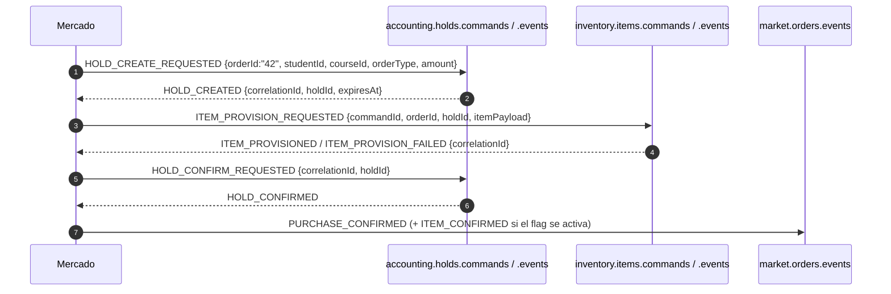
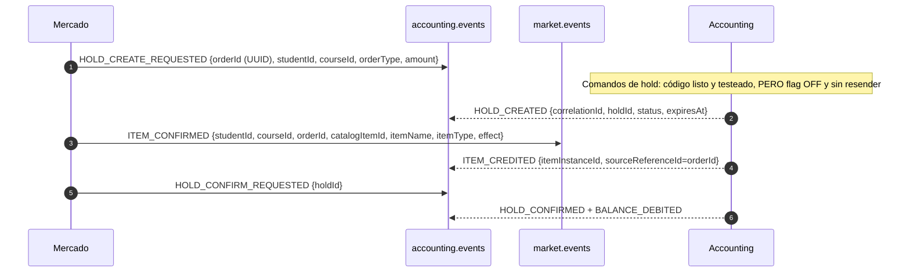
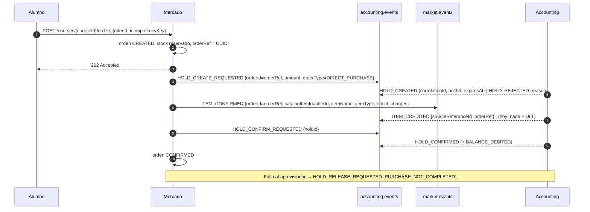

# Integración Mercado ↔ Accounting: estado real del código y flujo recomendado

> **Estado al 29/09/2026**, verificado leyendo el código de `tpi-market` (`develop` @ `7528610`) y `tpi-accounting` (`develop` @ `f965420`), más las PRs e issues abiertos de ambos repos.
> **Accounting** es el servicio "Grupo 12 / Banco / Inventario" de los documentos anteriores: monedas y retenciones (holds), vidas e inventario del alumno viven en el mismo repo. Este documento **reemplaza como referencia de estado** a [`ESTADO-IMPLEMENTACION-BANCO.md`](./ESTADO-IMPLEMENTACION-BANCO.md) (que asumía Banco e Inventario separados y solo síncronos/mockeados).
> Para el detalle de Accounting en sí (repo, contratos, REST, dominio, pendientes) ver [`accounting-estado-y-contratos.md`](./accounting-estado-y-contratos.md).
> Alcance: solo lo que Mercado necesita de Accounting para **compra**, **gestión de tienda** y **subasta**.

## 1. Resumen ejecutivo

**Hoy Mercado y Accounting no pueden completar una compra entre sí.** Cada lado está implementado y testeado contra su propia lectura del contrato, pero las dos lecturas no coinciden. Los bloqueantes, en orden de gravedad:

| # | Bloqueante | Lado | Evidencia |
|---|---|---|---|
| 1 | **Topics distintos.** Mercado publica/consume `accounting.holds.commands`, `accounting.holds.events`, `inventory.items.commands`, `inventory.items.events` y `market.orders.events`. Accounting solo habla por `accounting.events` y `market.events`. Los topics de Mercado **ni siquiera existen en el broker** (`init-topics.sh` de `tpi-system-compose` no los crea y la auto-creación está deshabilitada). | Mercado | `tpi-market/.../application.properties:38-42`; `tpi-accounting/.../InboundTopic.java` |
| 2 | **`orderId` no es UUID.** Mercado manda `String.valueOf(order.id)` (ej. `"42"`); Accounting exige UUID canónico y contesta `HOLD_REJECTED / MALFORMED_COMMAND`. | Mercado | `OrderHoldServiceImpl.java:91`; `HoldCommandParser.java:29-30` |
| 3 | **Los comandos de hold están apagados en Accounting y no se pueden encender.** `app.holds.commands.enabled=false` y no existe la implementación de producción de `HoldReplyResender`; activar el flag rompe el arranque. Con el flag apagado el dispatcher **ignora y confirma el offset**: Mercado nunca recibe respuesta. | Accounting | `application.properties:41`; `CoinHoldsConfiguration.java:68-75` |
| 4 | **El paso "aprovisionar ítem" no existe en Accounting.** Mercado envía `ITEM_PROVISION_REQUESTED` y espera `ITEM_PROVISIONED`/`ITEM_PROVISION_FAILED`. Accounting solo entiende `ITEM_CONFIRMED` (en `market.events`) y contesta `ITEM_CREDITED` (en `accounting.events`). En Mercado el envío de `ITEM_CONFIRMED` está detrás de un flag en `false` (pregunta abierta Q5). | Ambos | `OutboxInventoryItemProvisionClient`; `ItemConfirmedInboundHandler` |
| 5 | **El catálogo de Accounting es un placeholder.** Solo acepta `catalogItemId` ∈ {`ITEM-PLACEHOLDER-1`, `-2`, `-3`}; cualquier otro va 3 reintentos y a `market.events.DLT`, **sin evento de error de vuelta**. | Accounting | `InventoryCatalog.java:18-21` |
| 6 | **No existe `GET /holds/{holdId}`.** El cliente de consulta de Mercado (`BankHoldQueryClient`) y su reconciliador dependen de ese endpoint, pero en Mercado solo hay un mock, y Accounting nunca lo construyó (solo existe el equivalente para *life holds*). | Ambos | `docs/accounting-modelo.md:784-792` (propuesta) |

Además, dos defectos propios de Mercado que impiden arrancar/operar en modo Kafka (detalle en [`compra.md`](../../mercado/estado-actual/compra.md)): bajo `transport=kafka` faltan beans (`BankHoldQueryClient`) y el `.tpi` pasa `KAFKA_SERVERS` pero la app lee `SPRING_KAFKA_BOOTSTRAP_SERVERS`.

## 2. Cómo está hoy cada lado

### 2.1 Mercado (lo que implementó)

Todo por **outbox transaccional + relay** (`outbox_events`, cada 2 s) y consumidores idempotentes (`processed_events`). Con `market.messaging.transport=mock` (default en dev/tests) una contraparte ficticia responde en memoria; solo con `transport=kafka` (perfiles `docker` y `prod`) habla por Kafka.

### 2.2 Accounting (lo que implementó)

Detalles del lado de Accounting: transporte y contrato de la skill `contratos-kafka` v3 (envelope de 6 campos), grupo `tema-08-accounting-service-group`, respuestas por outbox con relay cada 5 s (esperar hasta ~5 s de latencia), reintentos 3 × 2 s y luego `<topic>.DLT`.

## 3. Tabla de discrepancias

| Tema | Mercado hoy | Accounting espera / hace | Acción sugerida |
|---|---|---|---|
| Topic de comandos de hold | `accounting.holds.commands` | `accounting.events` | **Mercado** cambia al topic de la plataforma |
| Topic de respuestas de hold | `accounting.holds.events` | `accounting.events` (mismo topic; hay que filtrar por `eventType`) | **Mercado** |
| Topic de aprovisionamiento | `inventory.items.commands/events` | no existe; usa `market.events` → `accounting.events` | **Mercado** |
| Topic de eventos de orden | `market.orders.events` | suscribe `market.events` | **Mercado** |
| `orderId` | `"42"` (id de la tabla) | UUID canónico (o `HOLD_REJECTED`) | **Mercado** agrega un `orderRef` UUID por orden |
| `producer` | `market-service` (comandos), `tema-09-mercado` (eventos) | no valida el nombre (solo no vacío, ≤ 60) | Unificar en `tema-09-mercado` |
| `correlationId` | = `eventId` del comando ✅ | igual ✅ | — |
| Payload `HOLD_CREATE_REQUESTED` | `orderId, studentId, courseId, orderType, amount` | ídem, `ttlSeconds` solo obligatorio para `AUCTION_BID` ✅ | OK salvo `orderId` |
| `HOLD_CONFIRM_REQUESTED` | `{correlationId, holdId}` | lee solo `holdId`, ignora el resto ✅ | OK |
| `HOLD_RELEASE_REQUESTED` | `{correlationId, holdId, releaseReason:"PURCHASE_NOT_COMPLETED"}` | acepta `AUCTION_LOST`, `AUCTION_CANCELLED`, `PURCHASE_NOT_COMPLETED` ✅ | OK |
| Rechazos de hold | cualquier `HOLD_REJECTED` al crear ⇒ `REJECTED_INSUFFICIENT_FUNDS` | razones: `ACCOUNT_NOT_FOUND`, `ACCOUNT_INACTIVE`, `HOLD_ALREADY_EXISTS`, `INSUFFICIENT_BALANCE`, `INVALID_AMOUNT`, `MALFORMED_COMMAND`, … | **Mercado** mapea razón por razón |
| Aprovisionar ítem | `ITEM_PROVISION_REQUESTED` → espera `ITEM_PROVISIONED/FAILED` | `ITEM_CONFIRMED` → `ITEM_CREDITED` (sin `correlationId`, sin evento de error) | **Mercado** adapta; **Accounting** agrega correlación y error |
| Ids de ítem | `catalogItemId` = id de la oferta (ej. `"17"`) | lista fija de 3 placeholders | **Accounting** deja de validar contra lista fija |
| Cargas del ítem | Mercado conoce `charges` por oferta | `maxCharges` sale del placeholder; `ITEM_CONFIRMED` no trae cargas | Agregar `charges` al contrato (**ambos**) |
| `effect` | derivado por tipo: `SHIELD→ABSORB_FAILURE` (confirmado), resto **sin confirmar** (Q6) | texto libre, pero vacío ⇒ excepción ⇒ DLT | Cerrar vocabulario de `effect` |
| Vidas (`LIFE`) | manda como ítem genérico; espera rechazo `LIFE_CAP_REACHED` (US-142) | las vidas son otra cosa (`LIFE_PURCHASE_CONFIRMED`, **sin mergear**, en `feature/lives-purchase-credit`); el tope se **trunca en silencio** | Decisión de producto: ver §6 |
| Consulta de estado de hold | espera `GET /api/accounting/holds/{holdId}` | no existe | **Accounting** lo construye, o Mercado lo elimina |
| TTL del hold | 300 s de referencia; reconcilia `HOLD_GRANTED` vencidos (job apagado) | TTL 300 s sin scheduler; **no publica `HOLD_EXPIRED`** ni valida `expiresAt` al confirmar | Decidir quién expira (§5.4) |
| Reintentos | mismo `eventId` en reintentos (outbox) ✅ | idempotencia por `eventId`; con `eventId` nuevo es otro comando | Mantener `eventId` estable |
| Formato de error HTTP | `application/problem+json` (RFC 9457) | `ErrorApi` propio | Solo importa si se agrega un GET |

## 4. Flujo recomendado (Mercado se adapta al contrato de plataforma)

Razón: los topics `accounting.events` y `market.events` son los provisionados por la plataforma (`tpi-system-compose/event-bus/init-topics.sh`) y los que Accounting ya consume/publica; adaptar Mercado es el cambio más chico y no requiere crear topics nuevos.

### 4.1 Cambios en Mercado (`tpi-market`)

1. **Topics por configuración** (`market.messaging.topics.*`): comandos y respuestas de hold → `accounting.events`; `ITEM_CONFIRMED` y eventos de orden → `market.events`. Un solo listener sobre `accounting.events` que despache por `eventType` e ignore los eventos que no le sirven (`BALANCE_DEBITED`, `ITEM_EQUIP_RESULT`, etc.); `ITEM_CREDITED` sí se usa, correlado por `orderId`.
2. **`orderRef` UUID** persistido en `orders` (nueva columna, índice único) y usado como `orderId` en holds e `ITEM_CONFIRMED`. Las respuestas de Accounting traen `orderId`, así que sirve también para correlar `ITEM_CREDITED` (que no tiene `correlationId`).
3. **Reemplazar el aprovisionamiento** `ITEM_PROVISION_REQUESTED/ITEM_PROVISIONED` por `ITEM_CONFIRMED` → `ITEM_CREDITED`. Mapear `ITEM_CREDITED` a la transición `ITEM_PROVISION_REQUESTED → ITEM_PROVISIONED`. Cierra Q5 en favor de Accounting.
4. **Timeout de aprovisionamiento**: Accounting no avisa fallos, así que una orden en `ITEM_PROVISION_REQUESTED` necesita vencimiento propio (hoy no lo tiene en modo Kafka) que dispare `HOLD_RELEASE_REQUESTED`.
5. **Mapear razones de rechazo** de `HOLD_REJECTED` (§3) en lugar de asumir fondos insuficientes.
6. Reparar el arranque bajo `transport=kafka` (bean `BankHoldQueryClient`, variable `SPRING_KAFKA_BOOTSTRAP_SERVERS`) y unificar `producer`.

### 4.2 Cambios en Accounting (`tpi-accounting`)

1. **Habilitar los comandos de hold**: implementar `HoldReplyResender` de producción y poner `app.holds.commands.enabled=true` (hoy es la pieza que bloquea todo).
2. **Catálogo real**: aceptar los `catalogItemId` de Mercado (o derivarlos del payload) y dejar de rechazar todo lo que no sea `ITEM-PLACEHOLDER-*`; agregar `charges` a `ITEM_CONFIRMED`.
3. **Cerrar el ciclo de `ITEM_CONFIRMED`**: incluir `correlationId` en `ITEM_CREDITED` y publicar un evento de error (`ITEM_REJECTED`/similar) en lugar de mandar a DLT sin aviso.
4. **`GET /api/accounting/holds/{holdId}`** para servicios (`MS`), o acordar con Mercado que no se usa.
5. **Expiración de holds** (ver §5.4) y `HOLD_EXPIRED`.
6. Definir la compra de **vidas** (§6).

## 5. Comportamientos que el equipo debe conocer

### 5.1 Idempotencia y reintentos
Accounting deduplica por `eventId` del comando. Reintentar con el **mismo** `eventId` re-envía la respuesta almacenada (cuando exista el resender); con uno **nuevo** es otro comando (`create` → `HOLD_ALREADY_EXISTS`; `confirm`/`release` sobre un hold resuelto → `INVALID_HOLD_STATE`). No existe la semántica "ya estaba en ese estado = éxito".

### 5.2 Un `orderId` es dueño de un solo hold, para siempre
`UNIQUE(account_id, order_id)` sin importar el estado. Tras un `release`, ese `orderId` queda inutilizable para esa cuenta.

### 5.3 Reglas del hold
- Crear: cuenta activa, `total − reserved ≥ amount`, `amount > 0` con hasta 2 decimales. `DIRECT_PURCHASE` recibe TTL fijo de 300 s; `AUCTION_BID` exige `ttlSeconds`.
- `HOLD_INCREASE_REQUESTED`: solo `AUCTION_BID`; el nuevo total debe ser estrictamente mayor; no extiende el vencimiento.
- `HOLD_CONFIRM_REQUESTED`: débito completo del monto retenido (no hay captura parcial), asienta el ledger (`DIRECT_PURCHASE_DEBIT` / `AUCTION_WIN_DEBIT`).
- `HOLD_RELEASE_REQUESTED`: libera lo reservado, sin asiento. Razones válidas desde Mercado: `AUCTION_LOST`, `AUCTION_CANCELLED`, `PURCHASE_NOT_COMPLETED`.

### 5.4 Vencimiento de holds: nadie lo hace hoy
Accounting fija `expiresAt` pero no tiene job de expiración, no publica `HOLD_EXPIRED` y no valida `expiresAt` al confirmar o aumentar. Mercado espera `HOLD_EXPIRED` para pasar órdenes a `EXPIRED` (y su reconciliador, que consulta un endpoint inexistente, está apagado). Resultado: las monedas retenidas por una orden trabada quedan reservadas hasta que alguien las libere a mano. Hay que decidir un dueño (recomendado: Accounting expira y publica `HOLD_EXPIRED`; Mercado lo trata como hoy).

### 5.5 Latencia
Ambos lados usan outbox con relay periódico (Mercado 2 s, Accounting 5 s). Una compra completa suma varias idas y vueltas: el `202` es inmediato pero la confirmación puede tardar decenas de segundos; por eso el estado se consulta por `GET /orders/{id}`.

### 5.6 Topics en el broker compartido
Los `HOLD_*` y `ITEM_*` viajan por topics con DLT (`accounting.events.DLT`, `market.events.DLT`). Accounting deja de suscribirse a un topic si no hay handler activo. Es una verificación pendiente confirmar que ambos topics existen en el broker compartido.

## 6. Decisiones abiertas (requieren al PO o a los equipos)

| # | Decisión | Opciones | Impacto |
|---|---|---|---|
| D1 | **Compra de vidas (US-142)**: ¿la vida es un ítem de inventario o una vida de la cuenta? | (a) `ITEM_CONFIRMED` con `LIFE`: crea un ítem, no suma vidas ⇒ no cumple el tope; (b) mergear `LIFE_PURCHASE_CONFIRMED` (Accounting) y que Mercado consulte `maxLives/currentLives` o reciba `LIFE_CREDITED`; hoy Accounting **trunca en silencio** el tope y Mercado nunca ve `LIFE_CAP_REACHED` | Sin definirlo, el rechazo por tope de US-142 no puede funcionar |
| D2 | **Q5**: ¿`ITEM_CONFIRMED` reemplaza al par `inventory.items.*`? | Recomendado: sí | Habilita la compra real |
| D3 | **Vocabulario de `effect`** para `BOOST_XP`, `BOOST_COINS` y `LIFE` (Q6) | acordar con Accounting/Motor | Evita DLT por `effect` inválido |
| D4 | **Dueño de la expiración de holds** | Accounting (recomendado) / Mercado | Evita monedas retenidas para siempre |
| D5 | **Consulta de estado de hold**: construirla o eliminarla | GET en Accounting / reintento idempotente | Define el reconciliador de Mercado |
| D6 | **Reversión de una compra ya confirmada** | hoy solo un ADMIN puede revertir el ledger | Definir si hay reembolso |

## 7. Lo que Mercado necesita de Accounting para **Subasta**

Ver el análisis completo en [`mercado/estado-actual/subasta.md`](../../mercado/estado-actual/subasta.md). En resumen, **sí soportado**: un hold `AUCTION_BID` por postor (con `ttlSeconds`), subir la oferta con `HOLD_INCREASE_REQUESTED` (nuevo total), cobrar al ganador (`AUCTION_WIN_DEBIT`) y liberar a los perdedores (`AUCTION_LOST`) o a todos (`AUCTION_CANCELLED`), un comando por `holdId`. **No soportado**: ranking/oferta máxima, liberar todos los holds de una subasta con un solo comando (`releaseHoldsByOrder`, documentado y no construido), captura parcial, bajar una oferta, expiración automática, ni reutilizar el `orderId` tras un `release`.

## 8. Documentos de diseño previos y su vigencia

| Documento | Qué propone | Estado real |
|---|---|---|
| [`contrato-integracion-mercado-accounting.md`](./contrato-integracion-mercado-accounting.md) (v2.0, 26/09) | Un único comando `PURCHASE_SETTLEMENT_REQUESTED` (Accounting hace hold, mochila y cobro) y `GET /orders/{orderId}/status` | **Ninguno de los dos repos lo implementa** |
| [`flujo-mercado-inventario.md`](./flujo-mercado-inventario.md) | Saga de tres fases (hold → aprovisionar → confirmar) con topics `bank.holds.*` e `inventory.items.*` | Es el diseño que Mercado implementó, con topics propios |
| Contrato de Accounting (`contratos-kafka` v3 y AsyncAPI del repo) | Topics `accounting.events` y `market.events`; `HOLD_*` e `ITEM_CONFIRMED` | Es lo que Accounting implementó |

**Sobre el "split" Banco/Inventario:** las notas del 26–27/09 dan a Inventario como microservicio separado, pero en la organización no existe un repo de Inventario y `tpi-accounting` contiene las tablas `inventory_items`, el listener de `ITEM_CONFIRMED` y el `ITEM_CREDITED`. Hasta que se confirme lo contrario, el interlocutor de Mercado para monedas **e** inventario es Accounting.

## 9. Referencias
- `tpi-accounting`: `docs/app_doc/persona-4-entrega-c.md` (descripción de los cuatro comandos de Mercado), `docs/contracts/accounting-service.asyncapi.yaml`, `docs/accounting-modelo.md` (secciones de Compras y Subastas con Mercado).
- `tpi-market`: `openspec/changes/us-138-t07-real-bank-kafka-integration`.
- [`compra.md`](../../mercado/estado-actual/compra.md), [`gestion-de-tienda.md`](../../mercado/estado-actual/gestion-de-tienda.md), [`subasta.md`](../../mercado/estado-actual/subasta.md), [`brechas-y-pendientes.md`](../../mercado/estado-actual/brechas-y-pendientes.md).
