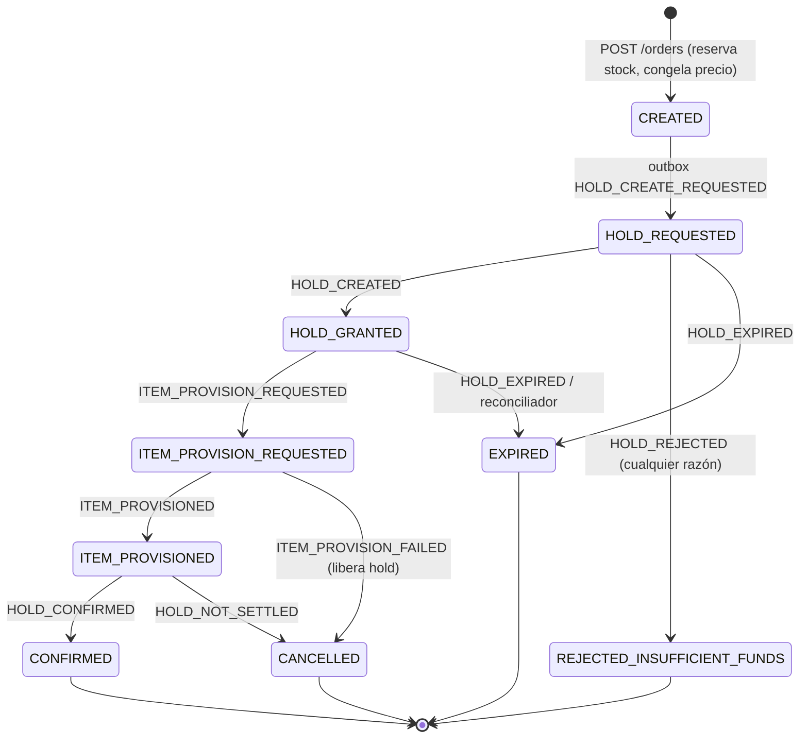

# Compra directa de ítems: estado actual

> **Estado al 29/09/2026** · `tpi-market` `develop` @ `7528610` (PR #73). Todo lo que sigue fue verificado leyendo el código; la app no se ejecutó y el test de integración de Kafka (`KafkaSagaIntegrationTest`, requiere Docker) no se corrió en el análisis.
> Contexto de negocio: [`../../arquitectura/CONTEXTO-MERCADO-SPRINT1.md`](../../arquitectura/CONTEXTO-MERCADO-SPRINT1.md). Contrato con Accounting: [`../../integracion/banco/estado-integracion-mercado-accounting.md`](../../integracion/banco/estado-integracion-mercado-accounting.md).

## 1. En una frase

Un alumno inscripto compra una oferta activa del catálogo de su curso con monedas: Mercado crea la orden de forma idempotente, reserva stock, pide una retención de monedas (hold), acredita el ítem y confirma el cobro. **La saga completa está implementada y testeada con contrapartes simuladas; contra el Accounting real todavía no funciona** (topics, `orderId` y paso de aprovisionamiento no coinciden).

| Aspecto | Estado |
|---|---|
| API REST (crear, consultar, historial) | ✅ Implementada y coincide con el Swagger |
| Máquina de estados de la orden | ✅ Implementada, con transiciones guardadas |
| Idempotencia (doble clic) | ✅ |
| Stock finito bajo concurrencia | ✅ |
| Verificación de matrícula (Cursos) | ⚠️ **Mock en todos los perfiles**, incluido `prod` |
| Retención de monedas (Accounting) | ⚠️ Kafka implementado, no interoperable hoy |
| Aprovisionamiento del ítem | ⚠️ Kafka implementado hacia un contrato que Accounting no tiene |
| Tope de vidas (US-142) | ❌ El rechazo nunca se dispara |
| Timeouts de órdenes trabadas | ❌ Solo cubre `HOLD_GRANTED`, y apagado |

## 2. API (prefijo `/api/market`)

Identidad: llega por los headers del Gateway (`X-User-Id`, `X-User-Roles`); Mercado no valida JWT. Errores en `application/problem+json`, tipos `https://tpi.utn.frc/errors/<slug>`.

| Método y ruta | Roles | Qué hace |
|---|---|---|
| `POST /courses/{courseId}/orders` | STUDENT, ADMIN, GESTOR, MS (`X-User-Id` obligatorio) | Crea la orden. Body `{offerId, idempotencyKey (≤100)}`. Responde **202** con `orderId`, `status`, `sseStreamUrl`, `createdAt` |
| `GET /orders/stream/{orderId}` | dueño (o ADMIN/GESTOR/MS) | SSE: emite **un** evento `order-status` y cierra (no es un stream vivo) |
| `GET /orders?courseId=&page=&size=` | STUDENT | Historial paginado (tope `size` 100, más nuevas primero) |
| `GET /orders/{orderId}` | STUDENT | Detalle; `404` para ajena, inexistente o borrada (indistinguibles) |
| `GET /courses/{courseId}/catalog?itemType=` | STUDENT, ADMIN, GESTOR, MS | Vitrina: solo ofertas activas, no borradas y no vencidas |
| `GET /courses/{courseId}/catalog/{itemId}` | ídem | Detalle de oferta |
| `GET /offers/{id}` (también `/api/v1/market/offers/{id}`) | STUDENT, PROFESSOR, ADMIN, GESTOR, MS | Detalle global de oferta (US-098) |

**Errores relevantes:** `403 student-not-enrolled`, `404 catalog-offer-not-found`, `409 catalog-offer-inactive | catalog-offer-expired | catalog-offer-out-of-stock | idempotency-key-conflict`, `503 course-service-unavailable`. Sin mapear (caen en `500`): `BankHoldUnavailableException`, `InventoryItemProvisionUnavailableException`, conflictos de bloqueo optimista.

## 3. Máquina de estados de la orden

- `PROCESSING` es solo una etiqueta hacia el cliente (para `CREATED`); nunca se persiste.
- Cada transición pasa por `OrderEntity.applyTransition`; un movimiento ilegal lanza `IllegalOrderStateTransitionException` (`409`). Los handlers verifican el estado esperado: un mensaje tardío o duplicado es un no-op con `WARN`.
- Se **libera stock** en rechazo, vencimiento y falla de aprovisionamiento. **No** se libera en `HOLD_NOT_SETTLED` (el ítem ya se entregó): queda log `ERROR` para revisión manual.
- Motivos de cancelación: `ITEM_PROVISION_FAILED`, `HOLD_NOT_SETTLED`. Motivos de rechazo definidos: `LIFE_CAP_REACHED`, `INSUFFICIENT_FUNDS`, `PROVISION_FAILED` (solo el segundo se produce).

## 4. Reglas de negocio implementadas

- **Idempotencia (US-139).** Clave global (`idempotencyKey`) más huella SHA-256 de `(studentId, courseId, offerId)`. Misma clave y misma huella ⇒ devuelve la orden existente (202); misma clave con otro contenido ⇒ `409`. Índice único en `orders.idempotency_key`; la carrera se resuelve capturando la violación. La clave es global (no por alumno) y las órdenes borradas siguen ocupándola. La matrícula solo se valida en la primera ejecución.
- **Stock.** Ofertas con `available_stock = NULL` son ilimitadas. Con stock finito, `UPDATE … SET available_stock = available_stock − 1 WHERE available_stock > 0` atómico dentro de la transacción de creación; `0` filas ⇒ `409 out-of-stock`. Testeado con concurrencia (`OfferStockConcurrencyTest`, `PurchaseStockContentionAcceptanceTest`).
- **Vencimiento de la oferta.** Comprar una oferta con `publicationExpiresAt` pasado ⇒ `409 catalog-offer-expired`.
- **Precio.** Se congela el `coinPrice` de la oferta en `orders.applied_price` al crear.
- **Orden de operaciones al crear:** idempotencia → matrícula (mock) → oferta por id+curso (404) → inactiva (409) → vencida (409) → reservar stock (409) → guardar `CREATED` → responder 202 → pedir el hold en otra transacción. Si el pedido del hold falla tras el commit, el cliente ve `500` y la orden queda en `CREATED` con stock reservado (nada la reconcilia).

## 5. Integraciones

| Puerto | Implementación | Real o mock |
|---|---|---|
| Matrícula (`CourseEnrollmentClient`) | `MockCourseEnrollmentClient` (única, `@Primary`) | **Mock siempre.** Centinelas: `student-not-enrolled`, `COURSE_UNENROLLED` ⇒ no matriculado; `student-timeout`, `COURSE_TIMEOUT` ⇒ 503; el resto ⇒ matriculado |
| Docente del curso (`CourseInstructorClient`) | `MockCourseInstructorClient` | **Mock siempre** |
| Retención de monedas (`BankHoldClient`) | `OutboxBankHoldClient` (Kafka) / `MockBankHoldClient` (loopback) | Kafka solo con `market.messaging.transport=kafka` |
| Consulta de hold (`BankHoldQueryClient`) | solo `MockBankHoldQueryClient` (condicionado a `transport=mock`) | **Solo mock. Sin implementación HTTP** |
| Aprovisionamiento (`InventoryItemProvisionClient`) | `OutboxInventoryItemProvisionClient` / mock | ídem |
| Eventos de orden (`OrderEventPublisher`) | `OutboxOrderEventPublisher` / mock | ídem |
| Users | ninguno (solo canario de JWKS) | n/a |

El `transport` es `mock` en base y dev; `kafka` en los perfiles `docker` y `prod`.

### Kafka (con `transport=kafka`)

**Publica** (outbox transaccional en `outbox_events`, relay cada 2 s, lotes de 20, clave de partición = `studentId`):

| Topic | `eventType` | Campos del payload |
|---|---|---|
| `accounting.holds.commands` | `HOLD_CREATE_REQUESTED` | `orderId`(String), `studentId`, `courseId`, `orderType="DIRECT_PURCHASE"`, `amount` |
| `accounting.holds.commands` | `HOLD_CONFIRM_REQUESTED` | `correlationId`, `holdId` |
| `accounting.holds.commands` | `HOLD_RELEASE_REQUESTED` | `correlationId`, `holdId`, `releaseReason="PURCHASE_NOT_COMPLETED"` |
| `inventory.items.commands` | `ITEM_PROVISION_REQUESTED` | `commandId`, `orderId`, `holdId`, `studentId`, `courseId`, `itemPayload{offerId,itemType,customName,attributes{charges,applicableChallenges,multiplier,boostMode,durationMinutes,attempts,consumptionRule,livesGranted}}` |
| `market.orders.events` | `PURCHASE_CONFIRMED` | `orderId`, `studentId`, `courseId`, `offerId`, `amount`, `holdId`, `confirmedAt` |
| `market.orders.events` | `ITEM_CONFIRMED` (**flag `market.events.item-confirmed.enabled=false`**) | `orderId`, `studentId`, `courseId`, `catalogItemId`, `itemName`, `itemType`, `effect` |

**Consume** (descarte a `<topic>.DLT` tras 2 reintentos con 1 s de espera; `MalformedEventException` no se reintenta):

| Topic | `eventType` | Nota |
|---|---|---|
| `accounting.holds.events` | `HOLD_CREATED`, `HOLD_REJECTED`, `HOLD_EXPIRED`, `HOLD_CONFIRMED`, `HOLD_RELEASED` | correlación: `payload.correlationId` = `eventId` del comando (se resuelve por el outbox); consumer group fijo `market-service` |
| `inventory.items.events` | `ITEM_PROVISIONED`, `ITEM_PROVISION_FAILED` | el `reasonCode` de Inventario **se descarta** |

Envelope: `eventId`, `eventType`, `eventVersion`, `timestamp`, `producer`, `payload`. Idempotencia del consumidor en `processed_events` (misma transacción que la transición). Los strings de `producer` son inconsistentes (`market-service` en comandos, `tema-09-mercado` en eventos de orden).

**Modo mock** (default en dev/tests): una contraparte en memoria contesta después del commit. Centinelas de `studentId`: `student-insufficient-funds`, `student-bank-unknown-code`, `student-bank-timeout`, `student-bank-confirm-unavailable`, `student-bank-confirm-failed`, `student-inventory-failure`, `student-inventory-timeout`.

## 6. Configuración relevante

| Propiedad | Default | Nota |
|---|---|---|
| `market.messaging.transport` | `mock` (base/dev), `kafka` (docker/prod) | |
| `market.messaging.topics.*` | `accounting.holds.*`, `inventory.items.*`, `market.orders.events` | **No coinciden con los topics de la plataforma** |
| `market.events.item-confirmed.enabled` | `false` | pregunta abierta Q5 |
| `bank-hold.reconciliation.enabled` | `false` | el reconciliador está apagado |
| `server.port` / `management.server.port` | `8084` / `8085` | el registro de plataforma declara otro puerto (ver [`arquitectura/flujo-de-una-peticion.md`](../../arquitectura/flujo-de-una-peticion.md#7-inconsistencias-detectadas-a-confirmar-con-identidad--plataforma)) |
| esquema de base | Hibernate `ddl-auto` (`create-drop` dev, `update` docker/prod) | **No hay Flyway/Liquibase** |

## 7. Qué falta / defectos conocidos

**Bloquean una compra real**
1. Topics, `orderId` y paso de aprovisionamiento no coinciden con Accounting → ver [integración](../../integracion/banco/estado-integracion-mercado-accounting.md).
2. Bajo `transport=kafka`, `OrderConfirmationServiceImpl` y `BankHoldReconciliationServiceImpl` requieren un `BankHoldQueryClient` que solo existe con `transport=mock`: por lectura estática, **el contexto de Spring no arranca en docker/prod** (no ejecutado: `KafkaSagaIntegrationTest` nunca corrió en verde).
3. La plantilla `.tpi/platform` pasa `KAFKA_SERVERS`, pero la app lee `SPRING_KAFKA_BOOTSTRAP_SERVERS`; bajo `prod` cae a `localhost:9092`.
4. Matrícula y docente son mocks incluso en `prod` (no hay llamada HTTP a Cursos).

**Robustez**
5. **Órdenes trabadas:** nada vence `HOLD_REQUESTED`, `ITEM_PROVISION_REQUESTED` ni `ITEM_PROVISIONED`; el reconciliador solo cubre `HOLD_GRANTED` y está apagado. Una orden en `CREATED` tras un fallo en `requestHold` tampoco se reconcilia.
6. **Outbox:** el relay se detiene en la primera fila que falla (bloqueo de cabeza de cola), y `outbox_events` y `processed_events` no se purgan ni tienen índice.
7. Excepciones sin mapear (`500`), `producer` inconsistente y `groupId` del listener de holds fijo.

**Producto**
8. **US-142 (tope de vidas):** los issues `#13` y `#15` siguen abiertos. `LIFE_CAP_REACHED` existe como enum y mensaje, pero no se produce: el `reasonCode` de Inventario se descarta y la falla siempre cancela como `ITEM_PROVISION_FAILED`.
9. **Q5 / Q6:** contrato de `ITEM_CONFIRMED` y códigos de `effect` sin confirmar.
10. `openspec/gateway-mesh-integration` tarea 5.7 (prueba negativa de ACL desde otro nodo de la tailnet) pendiente de coordinación externa.

## 8. Tests

~880 pruebas: unitarias por servicio (p. ej. `PurchaseOrderServiceImplTest` 32, `OrderHoldServiceImplTest` 23), integración (saga completa, límites transaccionales, entrega por outbox loopback, SSE), aceptación (matrícula, idempotencia, rechazos, contención de stock), concurrencia (idempotencia) y `KafkaSagaIntegrationTest` (13 casos; Testcontainers; se salta sin Docker).
**Huecos:** el IT de Kafka nunca se vio en verde; no hay pruebas contra contratos reales de Cursos/Accounting; ninguna para el tope de vidas, órdenes trabadas ni retención del outbox. La CI de PRs a `develop` solo valida el nombre de la rama (`mvn verify` corre solo contra `main`/`release`).

## 9. Historias de usuario (según código, no según Taiga)

| US | Estado |
|---|---|
| US-138 comprar un ítem | Saga implementada (T01–T07); integración real pendiente |
| US-139 no pagar dos veces | ✅ |
| US-140 ver el resultado de una compra en proceso | ✅ (consulta puntual y SSE de un solo evento) |
| US-141 recuperar monedas si la compra no se completó | Sin trazas explícitas de la historia en commits/PRs; el comportamiento equivalente existe (libera el hold ante falla de aprovisionamiento) y depende de que Accounting responda |
| US-142 comprar una vida sin pasarse del tope | ❌ No cumple (ver §7.8 y D1 del documento de integración) |
| US-143 revisar compras a medias | Sin evidencia de implementación |
| US-1036 verificar matrícula | Implementada contra un mock |
