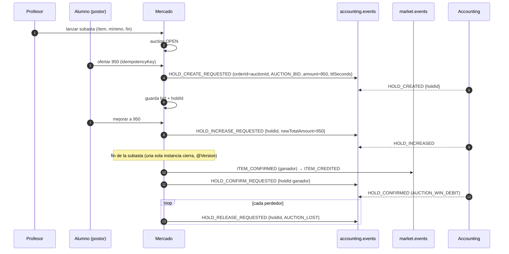

# Subasta de ítems: estado actual y qué falta (Sprint 02)

> **Estado al 29/09/2026** · `tpi-market` `develop` @ `7528610` y `tpi-accounting` `develop` @ `f965420`.
> **Resumen: no hay nada implementado en Mercado.** Existe diseño (documentos de esta carpeta y 12 historias de Taiga) y Accounting ya soporta buena parte del lado de monedas, pero con brechas que conviene cerrar **antes** de empezar el desarrollo.

## 1. Qué existe hoy

**En Mercado (`tpi-market`): nada.** Se buscó `auction`, `subasta` y `puja` en `src`, `openspec`, `docs`, README, AGENTS, COMMANDS, `.compose`, `.tpi`, `.github` y `pom.xml`. No hay entidad, tabla, enum, DTO, controlador, servicio, repositorio, topic ni evento; tampoco cambio de OpenSpec, rama, PR ni issue. Solo quedan rastros de preparación:

- Las constantes `AUCTION_LOST` y `AUCTION_CANCELLED` en `BankHoldReleaseReason` (vocabulario de liberación de Accounting).
- Un comentario que menciona `orderType = AUCTION_BID` (Mercado solo manda `DIRECT_PURCHASE`).
- Notas de OpenSpec que difieren las subastas a la "Fase 3" y dejan fuera `HOLD_INCREASE_REQUESTED`/`HOLD_INCREASED`.

**Diseño disponible:**
- Épica Taiga #577 y 12 historias (US-578 a US-589), exportadas en [`../../gestion/taiga/`](../../gestion/taiga/epics/EPIC-577-subastas-de-items-con-tiempo-limite.md).
- Paquete técnico en [`../subastas/`](../subastas/README.md): opciones de arquitectura (`01`), matriz de fallos y máquina de estados (`02`), contratos de eventos (`03`), diagrama Archify y documento maestro HTML.
- Aviso: el `CONTEXTO-MERCADO-SPRINT1.md` §13 registra que `01`–`03` tienen partes desactualizadas (vocabulario de eventos, orden de liquidación).

## 2. Qué pide el negocio (resumen de la épica #577)

- El **profesor** subasta un ítem de equipamiento (escudos y boosts; **no vidas**) durante un tiempo definido; los alumnos del curso ofertan monedas.
- Cada postor tiene **retenida su oferta completa** hasta el cierre (RF-INT-05). Retener solo al que va ganando queda fuera de alcance.
- Una oferta **solo puede subir**; no se puede bajar ni retirar mientras esté abierta. Las monedas retenidas no sirven para otras compras ni subastas.
- **El cierre lo decide Mercado**; el Banco no libera antes. Cada subasta se cierra **una sola vez**, aunque haya varias instancias de Mercado.
- Al cerrar: el ganador **recibe el ítem primero y se le cobra después**; a los demás se les devuelven las monedas. Si no hay ofertas, se cierra desierta. Si el profesor cancela, nadie recibe el ítem y se devuelve todo.
- Si el **curso se archiva**, las subastas abiertas se cancelan y se devuelve todo; si un **alumno se da de baja**, se le devuelven sus monedas y, si iba ganando, gana la siguiente oferta más alta (US-588).
- Al arrancar, Mercado **retoma cierres a medias** sin cobrar ni entregar dos veces (US-589).
- KPI iniciales: 0 subastas entregadas dos veces con dos instancias, 0 monedas retenidas tras pruebas de falla, cierre de 50 ofertas en < 2 min, cambio de líder visible en < 2 s.
- Datos: tablas nuevas `auction`, `auction_bid` y `auction_pending_refund` (con `version` para concurrencia) y dos feature toggles (activar por ambiente; Banco real o simulado).

| Historia | Título |
|---|---|
| US-578 | Lanzar un ítem a subasta |
| US-579 | Ver las subastas abiertas de mi curso |
| US-580 | Hacer una oferta en una subasta |
| US-581 | Mejorar mi oferta |
| US-582 | Enterarme al instante si me superaron |
| US-583 | No ofertar dos veces por error (idempotencia) |
| US-584 | Entregar el ítem al ganador al cerrar |
| US-585 | Devolver las monedas a quienes no ganaron |
| US-586 | Cerrar una subasta sin ofertas |
| US-587 | Cancelar una subasta |
| US-588 | Cerrar subastas si el curso se archiva o el alumno se da de baja |
| US-589 | Terminar cierres de subasta que quedaron a medias |

## 3. Máquina de estados de diseño (de `02-matriz-fallos…`)

`SCHEDULED → OPEN → CLOSING_IN_PROGRESS → CLOSED`, con `OPEN → CANCELLED` (cancelación del profesor), sub-estados de cierre `RELEASING_LOSERS` y `MARKED_DESERTED`, y `FAILED_SETTLEMENT` (falla crítica del Banco) que vuelve a `CLOSING_IN_PROGRESS` con reintento. El cierre usa bloqueo optimista (`@Version`) para que solo una instancia lo ejecute. Es la máquina propuesta; no hay código.

## 4. Qué soporta hoy Accounting (verificado en código)

Accounting expone las retenciones **solo por Kafka** (`accounting.events`) y ya modela `AUCTION_BID`:

| Necesidad de la subasta | Soporte |
|---|---|
| Retener la oferta del postor | ✅ `HOLD_CREATE_REQUESTED` con `orderType=AUCTION_BID`; `ttlSeconds` **obligatorio** |
| Mejorar la oferta | ✅ `HOLD_INCREASE_REQUESTED {holdId, newTotalAmount}`: reemplaza el total en el lugar; debe ser **estrictamente mayor**; solo `AUCTION_BID`; no extiende el vencimiento |
| Varias subastas/postores a la vez | ✅ Varios holds por cuenta (uno por `orderId`); el bloqueo de fila de la cuenta garantiza que la suma retenida no exceda el saldo disponible |
| Cobrar al ganador | ✅ `HOLD_CONFIRM_REQUESTED {holdId}` → `AUCTION_WIN_DEBIT` por el monto completo |
| Devolver a perdedores / cancelar | ✅ `HOLD_RELEASE_REQUESTED {holdId, AUCTION_LOST \| AUCTION_CANCELLED}`, **un comando por `holdId`** |
| Idempotencia (US-583, US-589) | ✅ por `eventId` del comando (reusar el mismo `eventId` en reintentos) |

**No soportado (brechas para Mercado y Accounting):**

1. **Todo el camino de comandos de hold está apagado** (`app.holds.commands.enabled=false`) y falta el `HoldReplyResender` de producción. Prerrequisito de cualquier compra o subasta ([detalle](../../integracion/banco/estado-integracion-mercado-accounting.md)).
2. **No hay liberación en lote.** `releaseHoldsByOrder` está documentado y **no construido**; Mercado debe emitir un comando por postor perdedor. El diseño `02` asume un único evento `AUCTION_CLOSED` con la lista de `holdIds`: hay que ajustarlo.
3. **Vocabulario de liberación:** el contrato `03` usa `releaseReason: "AUCTION_REFUND"`; Accounting solo acepta `AUCTION_LOST`, `AUCTION_CANCELLED` y `PURCHASE_NOT_COMPLETED` (cualquier otro ⇒ `MALFORMED_COMMAND`).
4. **Un `orderId` es dueño de un hold para siempre** (`UNIQUE(account_id, order_id)`) y queda inutilizable tras un `release`. Consecuencia de diseño: no liberar al postor superado hasta el cierre (coherente con "retención completa") o generar un `orderId` nuevo si se lo libera antes. Usar el mismo `orderId` (el `auctionId`) para todos los postores es válido, porque la unicidad es por cuenta.
5. **No hay ranking ni oferta máxima**: Mercado decide el líder, valida la puja mínima y guarda el `holdId` de cada postor (se obtiene solo de `HOLD_CREATED`; si se pierde esa respuesta, se pierde el acceso para liberar esas monedas: no hay búsqueda por `(studentId, orderId)`).
6. **Sin captura parcial ni bajar la oferta**; el cobro siempre es el monto retenido.
7. **Sin expiración automática** de holds ni `HOLD_EXPIRED`, y `expiresAt` no se valida al confirmar. Al ser "el cierre lo decide Mercado", el vencimiento no debería liberar solo; conviene un `ttlSeconds` holgado (duración restante + margen).
8. **Baja del alumno (US-588):** la desactivación de cuenta necesita liberar holds mediante `AccountCoinReservationsPort`, que **no tiene implementación**: hoy la desactivación falla (va a DLT) y nunca se libera un hold por baja. Mercado tendría que liberarlos por su cuenta al recibir la baja.
9. **Latencia:** las respuestas salen por outbox con relay de 5 s; 50 ofertas y un cierre en < 2 min es alcanzable, pero "líder visible en < 2 s" no puede depender de la respuesta de Accounting (validar la puja en Mercado y confirmar el hold en segundo plano, o mostrar el estado local).
10. **Entrega del ítem:** rige lo mismo que en compra: hoy Accounting solo entiende `ITEM_CONFIRMED` (catálogo placeholder) y no hay evento de error.

## 5. Flujo propuesto (derivado de las capacidades reales de Accounting)

> Propuesta de trabajo, **no decidida**: sirve de base para el diseño del Sprint 02.

Cancelación: `HOLD_RELEASE_REQUESTED {AUCTION_CANCELLED}` por cada `holdId`. Subasta desierta: sin comandos, estado `CLOSED` por `MARKED_DESERTED`.

## 6. Qué habría que construir en Mercado

- Entidades `auction`, `auction_bid` (con `holdId` por postor) y `auction_pending_refund`; máquina de estados con `@Version`.
- Endpoints: lanzar, listar abiertas del curso, ofertar/mejorar (idempotente), cancelar; aviso de superado (`BID_OUTBID` hacia Notificaciones).
- Job de cierre (con bloqueo entre instancias y reanudación al arrancar) y de reintentos de devolución con alerta (> 15 min sin confirmar).
- Reutilizar la infraestructura existente: outbox + relay + `processed_events` + `EventEnvelope` + patrón enum-con-tabla-de-transiciones (`OrderStatus`).
- **Acoplamientos a resolver antes:** `orderId` en Mercado es un `Long` atado a la tabla `orders`; `OutboxEventEntity.aggregateType` está fijo en `"ORDER"`; `SagaCorrelationServiceImpl` asume que el agregado es una orden; `HoldEventDto` no trae `orderType`. Además, cliente de Cursos (matrícula, archivado, bajas) sigue mockeado.
- Extender `BankHoldClient` con `HOLD_INCREASE_REQUESTED`/`HOLD_INCREASED` y el `releaseReason` por postor.

## 7. Decisiones que hay que tomar

| # | Decisión | Nota |
|---|---|---|
| S1 | Liberación en lote en Accounting vs. un comando por postor desde Mercado | Hoy solo la segunda existe |
| S2 | Corregir `03-contratos…` (`AUCTION_REFUND`, `AUCTION_CLOSED` con lista de `holdIds`) según lo que Accounting realmente acepta | Evita rechazos `MALFORMED_COMMAND` |
| S3 | ¿Se libera al postor superado antes del cierre? | Si sí, exige `orderId` nuevo por puja |
| S4 | Vidas fuera de alcance (US en la épica) | Confirmado por el supuesto de la épica; a validar con el PO |
| S5 | Archivado de curso y baja de alumno: cómo se entera Mercado | Depende del cliente/evento de Cursos (hoy mock) |
| S6 | Puja mínima e incremento mínimo | No definidos en Accounting; deben vivir en Mercado |
