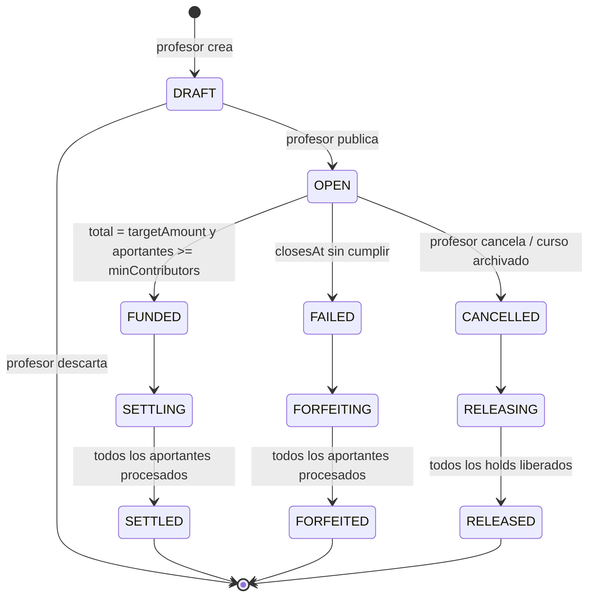

# Meta colectiva ("Colecta"): diseño funcional

> **Estado: diseño, sin código (30/09/2026).** No hay nada implementado en `tpi-market` (`develop` @ `cf988d2`) ni en `tpi-accounting`. Falta la aprobación del PO (§11, M-1).
> Lo que se afirma sobre el código de Mercado se verificó en `tpi-market` `develop` @ `cf988d2`. Lo que se afirma sobre Accounting sale de [`accounting-estado-y-contratos.md`](../../integracion/banco/accounting-estado-y-contratos.md) (verificado sobre `tpi-accounting` `develop` @ `3013f6c`).
> Origen: [`../nuevos-items/propuesta-cofres-metas-y-nuevos-items.md`](../nuevos-items/propuesta-cofres-metas-y-nuevos-items.md) §3. **Este documento lo reemplaza** en todo lo que tenga que ver con la meta colectiva.

## 1. En una frase

El profesor publica una meta en su curso: **un ítem que él define, un monto en monedas y una fecha de cierre**. Los alumnos aportan monedas.

- **Si se llega al monto** antes del cierre, **todos los que aportaron reciben el ítem** y se les cobra lo que aportaron.
- **Si no se llega**, **pierden lo que aportaron** (o el porcentaje que eligió el profesor) y nadie recibe el ítem.

> Ejemplo: *"Escudo x2 para el parcial. Meta: 10 000 monedas. Aporte mínimo: 200. Cierra el viernes 23:59."*

## 2. El profesor define el ítem

El ítem de la meta (`rewardItem`) lo elige el profesor al publicarla. Se puede definir de dos maneras, y las dos terminan en la misma **copia (snapshot) de la configuración**, guardada en la meta:

| Forma | Cómo | Cuándo conviene |
|---|---|---|
| **A. A partir de una oferta del curso** | Se elige una oferta ya publicada en el catálogo del curso (`sourceOfferId`). Mercado copia su plantilla, nombre, descripción y `configuration`, y el profesor puede ajustarlos antes de publicar | El ítem ya existe en la tienda y se quiere el mismo en la meta |
| **B. Desde una plantilla** | Se completa lo mismo que al publicar una oferta: `templateId`, `itemType`, `customName`, `customDescription` y `configuration` | Ítem exclusivo de la meta (por ejemplo, un escudo más fuerte que el de la tienda) |

Reglas:

1. **Tipos permitidos:** `SHIELD`, `BOOST_XP`, `BOOST_COINS`. **No `LIFE`**, porque una vida puede superar el tope de vidas (PAR-12) de cada aportante ([M-4]). **No `CHEST`** hasta que exista ([`propuesta`](../nuevos-items/propuesta-cofres-metas-y-nuevos-items.md) §2).
2. **Misma validación que una oferta.** Se reutiliza el validador que ya existe (`ValidOfferConfigurationValidator`): `SHIELD` exige `charges` y `applicableChallenges`; los boosts exigen `multiplier` y `boostMode`, y además `durationMinutes` si el modo es `TTL`, o `attempts` y `consumptionRule` si es `PER_EXAM`. Los campos salen de `OfferConfigurationRequestDto`, igual que al publicar una oferta.
3. **Es una copia, no una referencia.** Si después se edita o se desactiva la oferta de origen, la meta no cambia. Coincide con la regla actual de que la configuración de una oferta es inmutable después de publicarla.
4. **El ítem no se puede cambiar una vez que alguien aportó.** Antes del primer aporte, el profesor puede editar todo.
5. **Todos los aportantes reciben el mismo ítem:** una unidad por alumno, sin importar cuánto aportó.
6. La meta **no descuenta stock** de la oferta de origen. Es un canal aparte.

## 3. Parámetros de la meta

| Parámetro | Tipo | Validación | Ejemplo |
|---|---|---|---|
| `title` | texto | 1 a 150 caracteres | "Escudos para el parcial" |
| `description` | texto | ≤ 500 caracteres | — |
| `rewardItem` | ver §2 | tipos permitidos y validador de oferta | escudo de 2 cargas, `NO_EXAMS` |
| `targetAmount` | entero | > 0 | 10 000 |
| `closesAt` | fecha y hora | entre 1 h y 14 días desde que se publica | viernes 23:59 |
| `minContribution` | entero | ≥ 1 y ≤ `targetAmount` | 200 |
| `maxContributionPerStudent` | entero \| `null` | ≥ `minContribution` | 2 000 |
| `minContributors` | entero \| `null` | ≥ 1 | 5 |
| `forfeitPercent` | entero | 0 a 100; **por defecto 100** | 100 |

Para qué sirve cada uno:

- `minContribution`: que nadie reciba el ítem aportando 1 moneda.
- `maxContributionPerStudent`: que un solo alumno no pueda completar la meta. Si pudiera, sería una compra individual disfrazada.
- `minContributors`: exigir que participe una cantidad mínima de gente.
- `forfeitPercent`: cuánto se pierde si la meta falla. 100 = todo; 0 = se devuelve todo. Los valores intermedios dependen de [M-3].

## 4. Reglas

### 4.1 Aportar

1. Solo pueden aportar alumnos **inscriptos en el curso** (el mismo chequeo de matrícula que la compra), mientras la meta esté `OPEN`.
2. Cada alumno tiene **un aporte por meta**. Aportar de nuevo **aumenta** ese aporte; no se crea otro.
3. El primer aporte tiene que ser ≥ `minContribution`, y el total del alumno no puede superar `maxContributionPerStudent`.
4. **El último aporte se recorta** a lo que falta: si faltan 300 y el alumno ofrece 500, se retienen 300. La meta nunca se pasa. El recorte se calcula con la fila de la meta bloqueada (o con `@Version`), para que dos aportes simultáneos no la superen.
5. **Un aporte no se puede retirar ni bajar.** Si se pudiera, con la regla de pérdida todos esperarían al último minuto.
6. Cada aporte es **idempotente** (`idempotencyKey`), igual que las órdenes: un doble clic no aporta dos veces.
7. Las monedas aportadas quedan **retenidas** (hold) hasta el cierre. No se pueden usar en otras compras, subastas ni metas.

### 4.2 Cierre

| Situación | Estado | Qué pasa con cada aportante |
|---|---|---|
| Se llega a `targetAmount` y a `minContributors` | `FUNDED`, **en ese momento** (no espera a `closesAt`) | Se le acredita el ítem y **después** se le cobra el hold. Es la misma regla de la compra: ítem primero, cobro después |
| Llega `closesAt` sin monto, o con monto pero sin `minContributors` | `FAILED` | Se le cobra `forfeitPercent` % y se le libera el resto. No recibe ítem |
| El profesor cancela | `CANCELLED` | Se libera todo, **sin pérdida** |
| El curso se archiva | `CANCELLED` | Se libera todo, **sin pérdida** |
| Un alumno se da de baja con la meta abierta | la meta sigue | Se libera su hold **sin pérdida** y su aporte se resta del total |

- **Si falla la acreditación a un aportante** en una meta `FUNDED`: se libera su hold y no se le cobra. La meta sigue contando como cumplida para los demás, y ese alumno queda marcado para revisión (`ITEM_FAILED`).
- Las monedas cobradas (por éxito o por pérdida) **no van a nadie**: salen de la economía del curso, igual que el pago de una compra.

### 4.3 Para que la pérdida sea justa

1. **Aviso explícito al aportar:** "Si la meta no se completa antes del viernes 23:59, perdés estas 500 monedas". En el primer aporte a cada meta, el alumno tiene que tildar una casilla.
2. **El profesor no puede empeorar la meta** una vez que alguien aportó: no puede subir `targetAmount`, adelantar `closesAt`, subir `forfeitPercent`, subir `minContributors` ni cambiar el ítem. **Sí puede** bajar la meta o extender el plazo. El límite de 14 días se mantiene contado desde la publicación.
3. **Progreso visible siempre:** monto, %, cantidad de aportantes, tiempo restante y aporte propio. Además, avisos a las 24 h y a 1 h del cierre (notificación, RF-NOT).
4. **Advertencia al publicar** si la meta parece inalcanzable: `targetAmount > maxContributionPerStudent × inscriptos`, o, sin tope por alumno, un monto muy alto para el tamaño del curso.
5. La tarjeta de la meta aclara que **no llegar a `minContributors` también es un fallo**.
6. **Máximo 3 metas abiertas por curso** ([M-5]).

## 5. Máquina de estados



Cada aporte (`goal_contribution`) tiene su propio estado:

```
HOLD_REQUESTED → HELD → (INCREASE_REQUESTED → HELD)*
HELD → ITEM_REQUESTED → ITEM_CREDITED → CHARGED        (meta cumplida)
HELD → ITEM_REQUESTED → ITEM_FAILED → RELEASED         (falló la acreditación)
HELD → FORFEITED | PARTIALLY_FORFEITED | RELEASED      (meta fallida, según forfeitPercent)
HELD → RELEASED                                        (cancelación o baja)
HOLD_REQUESTED → REJECTED                              (saldo insuficiente u otro rechazo)
```

- El cierre lo ejecuta **una sola instancia** de Mercado (bloqueo optimista sobre `goal`), como en la subasta.
- Un job de Mercado cierra las metas cuyo `closesAt` ya pasó. Accounting no expira holds.
- **Al arrancar, Mercado retoma** las metas en `SETTLING`, `FORFEITING` o `RELEASING`. Cada aporte guarda su estado, así que no se cobra ni se entrega dos veces.

## 6. API propuesta (prefijo `/api/market`)

| Método y ruta | Roles | Qué hace |
|---|---|---|
| `POST /courses/{courseId}/goals` | PROFESSOR (+ chequeo de docente) | Crea la meta en `DRAFT` (o `OPEN` con `publish: true`) |
| `PATCH /courses/{courseId}/goals/{goalId}` | ídem | Edita. Sin aportes: todo. Con aportes: solo bajar la meta o extender el plazo |
| `POST /courses/{courseId}/goals/{goalId}/cancel` | ídem | Cancela y libera todo |
| `GET /courses/{courseId}/goals?status=` | STUDENT, PROFESSOR | Lista las metas con su progreso |
| `GET /courses/{courseId}/goals/{goalId}` | STUDENT, PROFESSOR | Detalle, progreso y aporte propio |
| `POST /courses/{courseId}/goals/{goalId}/contributions` | STUDENT | Body `{amount, idempotencyKey, acceptForfeit}`. `amount` es **lo que se suma** (no el total). Responde `202` con el aporte en `HOLD_REQUESTED` o `INCREASE_REQUESTED` |
| `GET /courses/{courseId}/goals/{goalId}/stream` | STUDENT, PROFESSOR | SSE con el progreso (reutiliza lo que se construya para la subasta) |

Ejemplo de creación (forma A, desde una oferta):

```json
{
  "title": "Escudos para el parcial",
  "description": "Si juntamos 10 000 monedas, todos los que aporten reciben un escudo de 2 cargas.",
  "rewardItem": { "sourceOfferId": 17 },
  "targetAmount": 10000,
  "closesAt": "2026-10-09T23:59:00-03:00",
  "minContribution": 200,
  "maxContributionPerStudent": 2000,
  "minContributors": 5,
  "forfeitPercent": 100,
  "publish": true
}
```

Forma B (desde una plantilla): `rewardItem` lleva `templateId`, `itemType`, `customName`, `customDescription` y `configuration`, con la misma forma que `CatalogOfferPublishDto`.

Errores nuevos: `409 goal-not-open`, `409 goal-already-funded`, `400 contribution-below-minimum`, `400 contribution-above-student-max`, `400 forfeit-not-accepted`, `409 goal-edit-not-allowed`, `409 course-goal-limit-reached`, `400 reward-item-type-not-allowed`.

## 7. Datos (Mercado)

| Tabla | Campos principales |
|---|---|
| `goal` | `id` (UUID), `course_id`, `professor_id`, `title`, `description`, `reward_template_id`, `reward_item_type`, `reward_name`, `reward_description`, `reward_configuration` (JSON, copia), `source_offer_id` (null si es forma B), `target_amount`, `collected_amount`, `contributors_count`, `min_contribution`, `max_contribution_per_student`, `min_contributors`, `forfeit_percent`, `closes_at`, `status`, `version`, `deleted`, auditoría |
| `goal_contribution` | `id` (UUID), `goal_id`, `student_id`, `amount`, `hold_id`, `status`, `forfeit_accepted_at`, `last_idempotency_key`, `version`, auditoría. Único `(goal_id, student_id)` |
| `goal_contribution_request` | idempotencia por `idempotencyKey`: huella de `(studentId, goalId, amount)` y resultado |

Borrado lógico en todas (RF-NFR-01).

## 8. Integración con Accounting: qué ya sirve y qué falta

Según [`accounting-estado-y-contratos.md`](../../integracion/banco/accounting-estado-y-contratos.md) §5 y §8:

| Necesidad | Hoy en Accounting | Qué falta |
|---|---|---|
| Retener el aporte | `HOLD_CREATE_REQUESTED`; `orderType` solo `DIRECT_PURCHASE` \| `AUCTION_BID` | Un `orderType` para la meta ([P-4]) |
| Aumentar el aporte | `HOLD_INCREASE_REQUESTED {holdId, newTotalAmount}`, **solo `AUCTION_BID`** | Habilitarlo para la meta |
| Que el hold dure hasta el cierre | `AUCTION_BID` acepta `ttlSeconds` **sin máximo**; `DIRECT_PURCHASE` tiene 300 s fijos | Mismo trato para la meta (hasta 14 días más un margen) |
| Un hold por alumno y meta | `UNIQUE(account_id, order_id)`: un `orderId` es dueño de un hold para siempre | Nada. Mercado usa `goal_contribution.id` (UUID) como `orderId` |
| Cobrar el aporte (meta cumplida) | `HOLD_CONFIRM_REQUESTED {holdId}`; asienta `DIRECT_PURCHASE_DEBIT` o `AUCTION_WIN_DEBIT` según el `orderType` | Un tipo de movimiento propio (`GOAL_CONTRIBUTION_DEBIT`) |
| Cobrar por pérdida (meta fallida) | igual que el anterior | Un tipo de movimiento `GOAL_FORFEIT_DEBIT`, para que el alumno entienda por qué se le cobró sin ítem |
| Pérdida parcial | ❌ no hay captura parcial ni forma de bajar un hold | Captura parcial ([M-3]) |
| Liberar (cancelación o baja) | `HOLD_RELEASE_REQUESTED {holdId, releaseReason}`, un comando por hold; motivos `AUCTION_LOST` \| `AUCTION_CANCELLED` \| `PURCHASE_NOT_COMPLETED` | Motivos propios (`GOAL_CANCELLED`, `GOAL_STUDENT_UNENROLLED`); no hay liberación en lote |
| Liberar al darse de baja | `AccountCoinReservationsPort` **no tiene implementación**: la baja nunca libera holds | Lo resuelve Accounting (pendiente §10.6 de su documento). Mientras tanto, Mercado libera por su cuenta al enterarse de la baja |
| **Acreditar el ítem a N alumnos** | `ITEM_CONFIRMED` crea **una** instancia por evento | **Pendiente de Banco (§9)** |
| Todo lo anterior | Los comandos de hold están **apagados** y no se pueden encender (falta `HoldReplyResender`) | Bloqueante general, igual que la compra y la subasta |

## 9. PENDIENTE para Banco: acreditar el mismo ítem a varios alumnos

> **Dueño: Banco / Accounting (Grupo 08).** Mercado **no** define cómo se hace. Le pedimos a Banco que averigüe qué le conviene a su servicio y nos diga **qué tenemos que enviar**. Lo que sigue son los datos que Mercado tiene, las opciones que vemos y las preguntas. **Ningún payload de esta sección está acordado.**

### 9.1 Qué tiene Mercado en el momento de acreditar

Cuando la meta pasa a `FUNDED`, Mercado conoce:

- `goalId` (UUID) y `courseId`;
- la lista de aportantes, cada uno con `studentId`, `goalContributionId` (UUID) y `holdId`;
- el ítem (la copia de §2): `templateId`, `itemType`, nombre, descripción y configuración completa (`charges`, `applicableChallenges`, `multiplier`, `boostMode`, `durationMinutes`, `attempts`, `consumptionRule`).

Mercado **no** conoce un `catalogItemId` de Accounting. Hoy Accounting solo acepta los tres `ITEM-PLACEHOLDER-*`.

### 9.2 Opciones que vemos (para que Banco elija u oriente)

**Opción 1: un `ITEM_CONFIRMED` por aportante** (el contrato actual, repetido N veces).

```json
{
  "eventId": "<UUID nuevo por aportante>",
  "eventType": "ITEM_CONFIRMED",
  "eventVersion": 1,
  "timestamp": "2026-10-09T23:59:05Z",
  "producer": "tema-09-mercado",
  "payload": {
    "studentId": "usr-4821",
    "courseId": "COURSE_PROG4_2026",
    "orderId": "<goalContributionId>",
    "catalogItemId": "<¿qué id?>",
    "itemName": "Escudo del parcial",
    "itemType": "SHIELD",
    "effect": "ABSORB_FAILURE"
  }
}
```

- A favor: **ya existe** en Accounting y en Mercado (`ItemConfirmedPayloadDto`).
- En contra: no lleva cargas ni configuración; no hay evento de error; `ITEM_CREDITED` no trae `correlationId`, así que Mercado tendría que correlacionar por `sourceReferenceId` (= `orderId`) y `studentId`. Con 120 alumnos son 120 eventos, lo cual es aceptable.

**Opción 2: un solo comando con la lista de alumnos** (nuevo, por ejemplo `GROUP_ITEM_GRANT_REQUESTED`).

```json
{
  "eventType": "GROUP_ITEM_GRANT_REQUESTED",
  "payload": {
    "grantId": "<goalId>",
    "courseId": "COURSE_PROG4_2026",
    "source": "COLLECTIVE_GOAL",
    "item": { "catalogItemId": "<¿?>", "itemName": "...", "itemType": "SHIELD", "effect": "ABSORB_FAILURE", "maxCharges": 2 },
    "recipients": [
      { "studentId": "usr-4821", "referenceId": "<goalContributionId>" },
      { "studentId": "usr-5530", "referenceId": "<goalContributionId>" }
    ]
  }
}
```

- A favor: un solo mensaje; Accounting puede responder con un resultado por alumno.
- En contra: es un contrato nuevo, y hay que definir qué pasa si falla la acreditación de algunos alumnos y no la de otros.

**Opción 3: que Accounting liquide todo** (acreditar y cobrar en un solo paso por aportante), en la línea del comando único propuesto en [`contrato-integracion-mercado-accounting.md`](../../integracion/banco/contrato-integracion-mercado-accounting.md). Solo tiene sentido si ese contrato se adopta también para la compra.

### 9.3 Preguntas para Banco

1. ¿Qué opción prefieren (1, 2, 3 u otra)? **¿Qué tenemos que enviarles exactamente** (topic, `eventType` y campos)?
2. ¿Qué `catalogItemId` usamos para un ítem que solo existe en la meta y no en el catálogo? ¿Lo derivan del payload, o se lo registramos antes?
3. ¿Cómo nos avisan que **falló** la acreditación de un alumno? (Hoy va a DLT sin aviso.) ¿Y el éxito, con qué correlación?
4. ¿Aceptan `orderId` = `goalContributionId` (UUID) para la acreditación y para el hold del mismo alumno?
5. ¿Pueden guardar la configuración del ítem (cargas, multiplicador, modo, duración) o solo `maxCharges`?
6. Para los holds: ¿un `orderType` nuevo (`GOAL_CONTRIBUTION`) o reutilizar `AUCTION_BID`? ¿Habilitan `HOLD_INCREASE_REQUESTED` para ese tipo?
7. ¿Suman los tipos de movimiento `GOAL_CONTRIBUTION_DEBIT` y `GOAL_FORFEIT_DEBIT`, y los motivos de liberación `GOAL_CANCELLED` y `GOAL_STUDENT_UNENROLLED`?
8. ¿Hay forma de cobrar solo una parte de un hold y liberar el resto (para `forfeitPercent` entre 1 y 99)?

Hasta que Banco responda, Mercado **no implementa** la acreditación de la meta (el paso `ITEM_REQUESTED` de §5).

## 10. Orden de trabajo sugerido

1. Cerrar la compra contra el Accounting real (P0 de [`brechas-y-pendientes.md`](../estado-actual/brechas-y-pendientes.md)). Sin eso, los holds no funcionan.
2. Subasta: construye el mismo núcleo (holds que se pueden aumentar, cierre único, retomar cierres a medias).
3. Meta colectiva, sobre ese núcleo, con la respuesta de Banco a §9.

## 11. Decisiones y pendientes

| Id | Pregunta | Recomendación | Dueño |
|---|---|---|---|
| **M-1** | ¿El PO aprueba una tercera modalidad (RF-INT-03) y perder monedas sin recibir nada (RF-INT-01)? | Presentarla como compra compartida con riesgo; llevar este documento | Mercado → PO |
| **M-2** | ¿Cómo se acredita el mismo ítem a N alumnos? ¿Qué enviamos? | Lo averigua Banco (§9) | **Banco** |
| **M-3** | Pérdida parcial (`forfeitPercent` entre 1 y 99) | Si Banco no suma captura parcial, en el MVP solo 0 o 100 | Banco + Mercado |
| **M-4** | ¿Se permiten vidas como premio? | No, hasta que el tope de vidas funcione de punta a punta | Mercado |
| **M-5** | Máximo de metas abiertas por curso | 3 | Mercado |
| **M-6** | `orderType`, tipos de movimiento y motivos de liberación para la meta | Los de §9.3, preguntas 6 y 7 | Banco |
| **M-7** | ¿Quién libera los holds cuando un alumno se da de baja? | Accounting cuando implemente el puerto; mientras tanto, Mercado | Banco + Mercado |

## 12. Verificado y no verificado

**Verificado en `tpi-market` `develop` @ `cf988d2`:**

- `ItemType` = {`SHIELD`, `BOOST_XP`, `BOOST_COINS`, `LIFE`}.
- `CatalogOfferPublishDto` y `OfferConfigurationRequestDto` tienen los campos que usa §2.
- `ValidOfferConfigurationValidator` exige los campos por tipo que se listan en §2.
- Mercado solo manda `orderType = DIRECT_PURCHASE`.
- `ItemConfirmedPayloadDto` = (`orderId` **Long**, `studentId`, `courseId`, `catalogItemId`, `itemName`, `itemType`, `effect`). Para la meta, `orderId` tendría que ser UUID: es el mismo desajuste que ya está registrado para la compra.
- No hay código de metas ni de subastas.

**Tomado del documento de Accounting (no releído en su código):** todo lo de §8 y §9 sobre holds, `ITEM_CONFIRMED`, `ITEM_CREDITED` y los flags.

**No verificado:** que el broker tenga los topics; el comportamiento con 120 aportantes cerrando a la vez.
